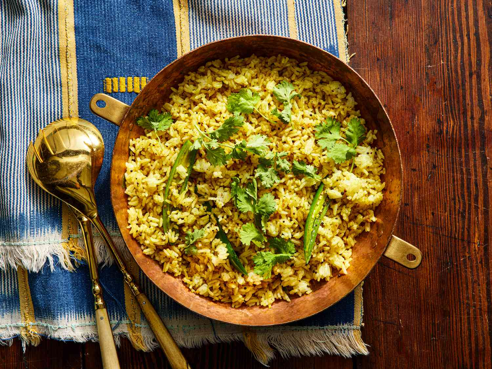

# Restaurant-Style Special Fried Rice

*Wok-tossed basmati with onion, peppers, mushrooms, peas and a quick scrambled egg — the side that turns a single curry into a full takeaway spread.*

**Serves:** 1 to 2

**Prep Time:** 10 minutes

**Cook Time:** 5 minutes

## Overview
A British-Indian-Restaurant standard, built on a base of cold, fully-dried basmati so the grains stay separate under high heat. Cumin seeds bloom in hot oil, then a fast stir-fry of onion, pepper, garlic and mushroom carries kasuri methi and the house mix powder. An egg cracks straight into the pan and scrambles around the vegetables, then the rice goes in for a thorough 90-second toss to coat every grain and pick up the wok edge.

The mix is forgiving: leftover [Pre-Cooked Chicken](Base/pre-cooked-chicken.md), [Pre-Cooked Lamb](Base/pre-cooked-lamb.md), or cooked prawns can be added with the egg to turn the side into a one-pan meal.

---

## Ingredients

### Rice
- 200 g cooked basmati rice (cold, fully dried — see Notes)

### Stir-Fry Base
- 2 tbsp oil or ghee (or a mix)
- 0.5 tsp cumin seeds
- 60 g onion, roughly chopped (about half a medium onion)
- 15 g red pepper, finely chopped
- 2 garlic cloves, finely sliced
- 30 g mushrooms, sliced (about 2 medium)
- 0.5 to 1 tsp kasuri methi
- 1 to 2 tsp fresh green chilli, finely chopped (optional)

### Spice
- 0.5 tsp salt
- 1 tsp [Mix Powder](Spice-Mixes/mixed-powder.md)
- 0.25 tsp turmeric
- 0.25 tsp [Garam Masala](Spice-Mixes/garam-masala.md)

### Finish
- 1 egg
- 25 g peas (defrosted)
- 1 tbsp fresh coriander leaves, finely chopped
- 1 tsp ghee (optional, for richness)

---

## Method

### Stage 1 - Prep the rice
1. Cook the basmati rice ahead of time (the day before is ideal). Spread it on a tray and let it cool fully, then chill uncovered until the grains feel dry to the touch. Damp rice clumps and steams in the pan instead of frying.
2. Pilau rice works just as well in place of plain basmati — bring it to the pan fully cooled.

### Stage 2 - Bloom the spices
1. Set a wok, karahi, or wide high-sided pan over the highest heat your hob will give.
2. Add the oil or ghee. When it shimmers, drop in the cumin seeds.
3. The moment the seeds crackle, add the onion, red pepper, garlic, mushrooms, kasuri methi, and the green chilli if using.
4. Stir-fry for 20 to 30 seconds, tossing constantly so nothing catches on the base.

### Stage 3 - Build the masala
1. Add the mix powder, turmeric, garam masala, and salt.
2. Stir-fry for another 20 to 30 seconds. Keep everything moving — dry spices burn quickly on a hot wok.

### Stage 4 - Egg and peas
1. Add the defrosted peas.
2. Crack the egg straight into the pan. Break the yolk with the spoon and fold everything together for 10 to 20 seconds, until the egg scrambles around the vegetables.

### Stage 5 - Toss the rice
1. Add the cold basmati and the chopped coriander.
2. Toss thoroughly for at least 90 seconds. You want every grain coated and lightly coloured, with the odd hot edge from the wok.
3. Stir in the optional ghee at the very end for a glossy finish.

---

## Notes
- Cold, dry rice really is the single most important thing here. Freshly cooked rice will steam in the pan and turn gluey on you, so if you can plan ahead and cook it the day before, future-you will be grateful.
- If you salted the rice when you cooked it (especially using the absorption method), drop the added salt down to 0.25 tsp and taste at the end. You can always add more.
- Just so you know: all spoon measurements are level. 1 tsp = 5 ml, 1 tbsp = 15 ml.
- Want to turn this into a proper meal? Add 100 to 150 g of [Pre-Cooked Chicken](Base/pre-cooked-chicken.md), some pre-cooked prawns, or a quick shredded omelette in with the peas at Stage 4.
- A wok or karahi will give you the best result. A wide frying pan works too, but you really need to keep that heat aggressive throughout.

---

## Serving
Pair with any BIR curry — it's the natural partner to [Restaurant-Style Chicken Jalfrezi](Restaurant-Style-Chicken-Jalfrezi.md), [Restaurant-Style Madras](Restaurant-Style-Madras.md), or [Restaurant-Style Vindaloo](Restaurant-Style-Vindaloo.md). Also good on its own with raita and lime pickle.

---

## Storage
Eat fresh out of the pan if possible. Leftovers keep 2 days in the fridge in a sealed container; reheat in a hot wok with a splash of water rather than the microwave to revive the texture.
