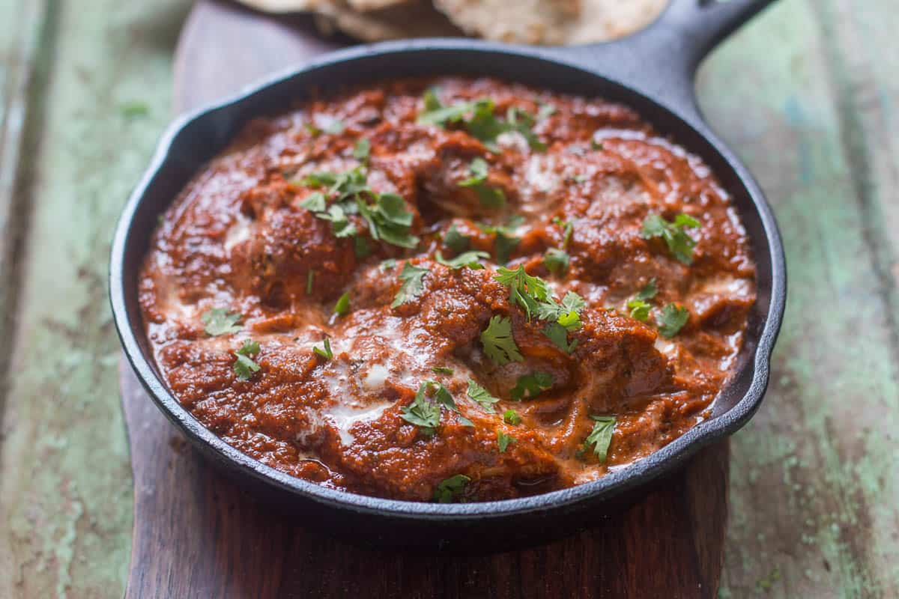

# Restaurant-Style Tikka Masala

*The UK curry-house signature, in its sauce-only form: tandoori-spiced tomato-and-cream masala that wraps any pre-cooked tikka (chicken, paneer, lamb, prawn) in the deep red, sweet-savoury finish.*

**Serves:** 1

**Prep Time:** 5 minutes (assumes the tikka is already prepared)

**Cook Time:** 12 minutes

## Overview
This is the masala. The sauce that turns tikka, the marinated, grilled protein from [Restaurant-Style Tikka](Restaurant-Style-Tikka.md), into the dish that defines a curry-house menu. The build assumes you already have your tikka pre-cooked and just need the sauce to wrap it.

Five tablespoons of tomato paste do most of the colour. Tandoori masala goes in late with the gravy (an unusual position for a dry spice in a BIR build) so the chargrill profile from the tikka carries through the finished sauce. Coconut powder and ground almonds thicken the body and bring rounded sweetness; jaggery completes the sweet-savoury balance; single cream finishes on low heat for the signature richness.

The protein choice is open. Chicken tikka is the default and most familiar; paneer tikka makes a beautiful vegetarian version; prawn tikka brings a sweetness that complements the sauce beautifully; lamb tikka is the richest of the four. Whichever you choose, it goes in pre-cooked — the masala isn't a long enough simmer to bring raw protein safely through.

---

## Ingredients

### Tempering
- 3 tbsp oil or butter ghee (45 ml)
- 10 cm cassia bark
- 1.5 tsp ginger-garlic paste

### Spice
- 1.25 tsp [Mix Powder](Spice-Mixes/mixed-powder.md)
- 0.25 tsp [Garam Masala](Spice-Mixes/garam-masala.md)
- 0.25 to 0.5 tsp salt

### Tomato Base
- 5 tbsp tomato paste (double-concentrated puree diluted 1:3, blended tinned plum tomatoes, or passata)
- 200 g pre-cooked tikka of your choice — see [Restaurant-Style Tikka](Restaurant-Style-Tikka.md)
- 1.5 tsp lemon juice

### Sauce
- 330 ml+ [Curry Base Gravy](Base/curry-base.md), heated through
- 1.5 tbsp [Tandoori Masala](Spice-Mixes/tandoori-masala.md)
- 3 tbsp coconut powder or flour
- 1.5 tbsp ground almonds
- a pinch of red food colour (optional, cosmetic)
- 2 tbsp jaggery or brown sugar

### Finish
- 75 ml single cream, plus extra for garnish
- 1 tbsp finely chopped fresh coriander leaves
- 1 to 2 tsp ghee (optional, for shine)
- 1 tbsp flaked almonds, toasted (optional)

---

## Method

### Stage 1 - Toast the almonds
1. If using the flaked almonds, set a dry frying pan on medium heat.
2. Toast for 1 to 2 minutes, shaking the pan, until lightly browned. Don't wander — they go from golden to burnt fast.
3. Tip out onto a plate and set aside.

### Stage 2 - Temper
1. Return the same pan to medium-high heat and add the oil or ghee.
2. Drop in the cassia bark. Fry for 30 to 40 seconds, stirring frequently, to infuse the oil.
3. Add the ginger-garlic paste. Stir until it starts to brown slightly and the sizzling sound drops.

### Stage 3 - Bloom the spices
1. Add the mix powder, garam masala, and salt. Note: tandoori masala goes in later, not here.
2. Fry for 20 to 30 seconds, stirring diligently.
3. Splash in a little base gravy if the powdered spices start sticking — they need a touch of liquid to cook through properly.

### Stage 4 - Tomato base and tikka
1. Turn the heat up. Add the tomato paste.
2. Stir cautiously until the oil separates and small craters appear around the edges of the pan.
3. Add the pre-cooked tikka and the lemon juice. Mix thoroughly so every piece is coated in the masala.

### Stage 5 - Build the sauce
1. Pour in 150 ml of base gravy along with the tandoori masala, coconut powder, ground almonds, and the optional red food colour.
2. Stir together, then leave to cook for 1 to 1.5 minutes, until the sauce has reduced slightly.
3. Add another 150 ml of base gravy and the jaggery.
4. Stir and scrape the base and sides of the pan once, then leave to cook on high heat for 3 to 4 minutes.
5. The coconut and almond powders will soak up sauce as they hydrate. Add a splash more base gravy if it tightens past where you want it. Avoid stirring or scraping unless the curry is about to burn.

### Stage 6 - Cream finish
1. About 30 seconds before the end, drop the heat to low.
2. Stir in the single cream and the chopped coriander leaves.
3. Taste and adjust: more salt for savouriness, more jaggery for sweetness, more cream for body, a squeeze more lemon for sharpness.
4. Optionally stir in the ghee at the very end for shine.

### Stage 7 - Plate
1. Fish out the cassia bark.
2. Slide into a warm bowl. Drizzle a little extra cream over the top, scatter the chopped coriander, and finish with the toasted flaked almonds if you have them.

---

## Notes
- The tandoori masala goes in with the gravy, not with the dry spices in Stage 3. That's unusual for a BIR build but it's deliberate — the smoky chargrill profile of the tandoori masala wants to come through in the finished sauce, not get cooked out early.
- Brands of tandoori masala vary wildly in salt content, and some are aggressively salted. Do taste a small amount of yours first and dial the added salt down if needed.
- "Tomato paste" here means something medium-bodied: double-concentrated tomato puree mixed with 3 parts water, blended tinned plum tomatoes, or passata. Please don't substitute neat puree directly. It'll be too dense and the sauce won't reduce properly.
- The coconut and almond powders both work to thicken and sweeten, but they aren't interchangeable. Coconut powder gives you a slightly nutty, faintly tropical character; ground almonds give body and rounded sweetness. Use both for the proper dish.
- The cream goes in on low heat to stop it splitting. Whole-milk single cream works best here; double cream pushes the dish into proper korma territory.
- Any pre-cooked tikka works. See [Restaurant-Style Tikka](Restaurant-Style-Tikka.md) for the basic chicken version; paneer, lamb, and prawn tikka all sit cleanly in this sauce.
- And the usual: all spoon measurements are level. 1 tsp = 5 ml, 1 tbsp = 15 ml.

---

## Serving
Pair with [Restaurant-Style Special Fried Rice](Restaurant-Style-Special-Fried-Rice.md), plain basmati, or a peshwari naan (the coconut-almond stuffing plays particularly well with the dish's own coconut-almond base). A side of plain raita and a wedge of lemon round the plate.

---

## Storage
Keeps 2 to 3 days in the fridge in a sealed container. The cream-based sauce thickens noticeably overnight as the coconut and almond powders absorb more liquid. Reheat gently in a pan with a splash of water or extra cream rather than the microwave, which can split the dairy.
