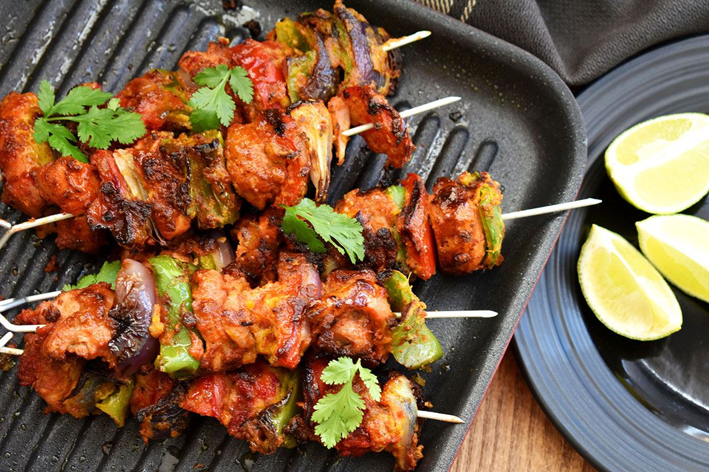

# Restaurant-Style Tikka

*Tandoor-style marinated chicken on skewers: the smoky, char-edged protein that lives inside half the BIR menu, and stands up on its own as a starter.*

**Serves:** 6 to 8 (as a starter); enough pre-cooked tikka for two or three masala curries

**Prep Time:** 15 minutes active + 4 to 48 hours marinade

**Cook Time:** 10 to 15 minutes

## Overview
"Tikka" just means chunks. Bite-sized pieces of marinated protein, traditionally cooked in a tandoor on metal skewers where the radiant heat chars the outside in minutes while the yogurt-based marinade keeps the inside tender. At home, a hot grill, a barbecue or hard-charred pan-searing all give a respectable approximation. Chicken is the standard, but the same marinade works on paneer, lamb, prawns or firm white fish. A finished tikka sits at the intersection of two menu surfaces. As a starter, it goes straight off the skewer with mint chutney, lemon and red onion. As a component, it goes into curries (most famously tikka masala, also butter chicken, tikka saag, jalfrezi-with-tikka), where the chargrill flavour carries through the sauce. A proper marinade has three layers working in concert: the yogurt (tenderises and carries the spices), a freshly toasted ground spice base (the depth pre-ground masala can't match), and tandoori masala for the unmistakable red-orange chargrill colour.

---

## Ingredients

### First Marinade
- 1.5 kg chicken breast or thigh, boneless and skinless, cut into 5 cm chunks
- 1 tbsp ginger-garlic paste
- 1 tbsp lemon juice

### Spice (toast + grind fresh where noted)
- 2 tsp coriander seeds, freshly toasted and ground
- 1 tsp cumin seeds, freshly toasted and ground
- 0.5 tsp fenugreek seeds, ground
- 3.5 tbsp [Tandoori Masala](Spice-Mixes/tandoori-masala.md)
- 1 tsp turmeric
- 1 tsp Kashmiri chilli powder
- 1 tbsp paprika
- 0.25 tsp freshly ground black pepper
- 0.5 tsp elachi (ground seeds from green cardamom pods)
- 2 tsp kasuri methi
- 1.5 tsp dried mint
- 0.5 tsp grated nutmeg (optional)
- 1.5 tsp salt

### Second Marinade
- 2 tbsp mustard oil (or any neutral oil)
- 120 ml natural yoghurt, full fat
- 0.25 tsp orange or red food colour (optional, cosmetic)

### Skewers and Serve
- metal or pre-soaked bamboo skewers
- 1 tbsp ghee, melted (for basting)
- lemon wedges, sliced red onion, fresh coriander, mint chutney

---

## Method

### Stage 1 - Toast and grind the seeds
1. Set a dry frying pan on medium heat. Add the coriander and cumin seeds.
2. Toast for 45 to 60 seconds, shaking the pan, until the seeds darken and the aroma sharpens. Tip into a mortar (or spice grinder) with the fenugreek seeds and grind to a fine powder. Set aside.

### Stage 2 - First marinade
1. Trim the chicken of any excess fat and cut into even 5 cm chunks. Even sizing matters: uneven pieces cook unevenly under the high heat and some end up dry while others stay underdone.
2. Place the chunks in a large bowl with the ginger-garlic paste and lemon juice. Mix thoroughly with your hands.
3. Cover and refrigerate for 30 to 60 minutes. This pre-marinade lets the lemon and ginger-garlic loosen the meat fibres before the main coating goes on.

### Stage 3 - Second marinade
1. Add the freshly ground seed powder, tandoori masala, turmeric, Kashmiri chilli powder, paprika, black pepper, elachi, kasuri methi, dried mint, salt, and optional nutmeg.
2. Pour in the mustard oil, yoghurt, and the optional food colour. Mix thoroughly so every piece is coated in a thick, deep-red marinade.
3. Cover with cling film or foil and refrigerate for a minimum of 4 hours, ideally 24 to 48. Stir at least once during the marinade so the bottom pieces don't sit in pooling liquid.

### Stage 4 - Bring to temperature
1. Remove the bowl from the fridge about an hour before cooking so the chicken comes back to room temperature. Going from fridge-cold to grill-hot makes the outside burn before the inside cooks through.

### Stage 5 - Cook
1. Preheat your grill to its highest setting (or fire up the barbecue, or get a heavy frying pan properly hot).
2. Line a baking tray with aluminium foil and brush lightly with oil.
3. Arrange the chicken on the tray with small gaps between pieces so heat circulates around each one. You'll likely need 2 or 3 batches depending on tray size.
4. Cook under the grill for 5 to 7 minutes, until the tops start blackening at the edges.
5. Brush each piece with a little oil or melted ghee, turn over, brush the other side too.
6. Back under the grill for another 5 to 7 minutes. Cut a large piece in half to check it's cooked through (no pink inside). Give it another minute or two if needed.

### Stage 6 - Serve or store
1. As a starter: slide off any skewers, squeeze a lemon wedge over the top, scatter sliced red onion and coriander, serve with mint chutney.
2. As a component: cool any unused tikka quickly and refrigerate or freeze for use in masala curries.

---

## Notes
- Chicken thigh is genuinely better than breast for tikka. It stays juicier under the high heat and the slight fat content carries the spices better. Breast works fine but you'll need to watch the timing more carefully.
- The freshly toasted-and-ground coriander, cumin, and fenugreek really do make a difference. Pre-ground will work in a pinch, but the depth that the toast layer adds is what lifts a homemade tikka above a shop-bought marinade.
- Mustard oil adds a sharp, nutty layer that's traditional. Don't worry if you can't find it; any neutral oil works.
- The marinade can sit for up to 48 hours, and the longer you go the better the result. If you can plan ahead, do.
- Most of us don't have a tandoor at home. A hot grill (or oven at 240°C with the rack near the top) gives a reasonable approximation. A barbecue is genuinely close to the real thing.
- Always keep raw chicken away from other ingredients, and please give every surface and utensil that has touched it a thorough wash before cooking starts.
- Freezes well in portion-sized bags (4 to 6 pieces per bag). Cool completely before freezing so the bag doesn't sweat.
- And the usual: all spoon measurements are level. 1 tsp = 5 ml, 1 tbsp = 15 ml.

---

## Serving
Eat as a starter with mint chutney, lemon, and red onion. Or build it straight into one of the masala curries on the menu, [Restaurant-Style Tikka Masala](Restaurant-Style-Tikka-Masala.md) is the obvious next step.

---

## Storage
Best eaten straight off the skewer. Leftover tikka keeps 2 days in the fridge in a sealed container; the char texture softens overnight but the flavour holds up. For longer storage, freeze in single-portion bags for up to 2 months. Reheat in a hot pan or under the grill for a minute or two rather than the microwave, which makes the chicken rubbery.
