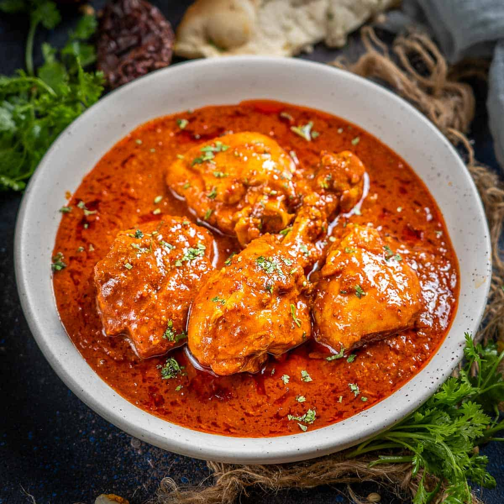

# Restaurant-Style Vindaloo

*Fierce, sharp, deep-red BIR vindaloo: heavy chilli backed by vinegar and a hit of ketchup for the unmistakable sweet-sour edge.*

**Serves:** 1

**Prep Time:** 5 minutes

**Cook Time:** 10 minutes

## Overview
The British restaurant vindaloo descends from Goan vindalho (which itself came from Portuguese carne de vinha d'alhos), and the lineage shows in the two non-negotiables: vinegar and chilli. The Goan original leans on coconut, jaggery, and whole-spice paste; the BIR version simplifies the spice work, swaps in [Curry Base Gravy](Base/curry-base.md), and adds tomato ketchup as a stabiliser for the sweet-sour balance. The result reads as one of the hottest dishes on the menu but should still taste structured, sour from the vinegar, fruity from the Kashmiri chilli, with a baseline of warmth from black pepper and garam masala.

A two-chilli build is what gives this dish its colour. Kashmiri chilli powder carries most of the red and a moderate heat; regular chilli powder layers the bite on top. The three-pour base gravy reduction concentrates everything into a thick, glossy sauce that should cling to the meat rather than pool around it.

---

## Ingredients

### Tempering
- 4 tbsp oil (60 ml)
- 1 whole star anise (optional)
- 2 tsp ginger-garlic paste

### Spice
- 1.25 tsp [Mix Powder](../../base-ingredients/curry-powder/mixed-powder.md)
- 2 tbsp Kashmiri chilli powder
- 2 tsp regular chilli powder
- 0.25 tsp [Garam Masala](../../base-ingredients/curry-powder/garam-masala.md)
- 0.25 tsp ground black pepper
- 0.25 to 0.5 tsp salt
- 1 tsp kasuri methi

### Sauce
- 5 tbsp tomato paste
- 1 tbsp finely chopped fresh coriander stalks
- 330 ml+ [Curry Base Gravy](Base/curry-base.md), heated through
- 200 g [Pre-Cooked Chicken](Base/pre-cooked-chicken.md), [Pre-Cooked Lamb](Base/pre-cooked-lamb.md), beef, prawns, or vegetables

### Finish
- 2 tsp tomato ketchup
- 1.5 tsp vinegar (white, white wine, cider, or malt)
- 1 tsp sugar (optional)
- 1 tbsp finely chopped fresh coriander leaves, to garnish

---

## Method

### Stage 1 - Temper
1. Set a frying pan on medium-high heat and add the oil.
2. When hot, drop in the star anise if using and fry for 30 to 45 seconds, stirring often.
3. Add the ginger-garlic paste. Stir continuously for 30 seconds or so, until the sizzling drops and the paste loses its raw smell.

### Stage 2 - Bloom the spices
1. Add the kasuri methi, mix powder, both chilli powders, garam masala, ground black pepper, and salt.
2. Fry for 30 seconds, working the flat of the spoon across the pan to spread the spices evenly.
3. Splash in a little base gravy the moment the spices start sticking. The liquid stops them scorching and gives them time to cook through properly.

### Stage 3 - Tomato base
1. Stir in the tomato paste and the coriander stalks.
2. Add the pre-cooked chicken (or chosen main) and mix well so every piece is coated.
3. Turn the heat to high. Stir constantly until the oil separates and small craters appear around the edges of the pan.

### Stage 4 - Build the sauce
1. Pour in 75 ml of base gravy. Stir once, then leave undisturbed on high heat until the sauce reduces and the dry craters return.
2. Add a second 75 ml of base gravy. Stir and scrape once when it goes in, then leave to reduce again for 30 to 45 seconds.
3. Pour in the final 150 ml of base gravy along with the tomato ketchup, vinegar, and the optional sugar. Stir and scrape once.
4. Cook on high heat for 4 to 5 minutes, until the sauce hits the consistency you want (a proper vindaloo is on the thick side) and the oil has separated.
5. Add a splash more base gravy if the sauce tightens too far.

### Stage 5 - Finish
1. Fish out the star anise.
2. Spoon off excess oil from the surface if you prefer (BIR practice leaves it on for sheen).
3. Plate up and scatter the chopped coriander leaves over the top.

---

## Notes
- The vinegar really isn't an afterthought, it's the dish. Use one that tastes clean. Malt is the traditional UK restaurant choice, but cider or white wine vinegar will give you a slightly fruitier finish if that appeals more.
- That tablespoon of Kashmiri chilli powder is what gets you the deep red colour without dialling the heat into orbit. Please don't be tempted to swap it for extra regular chilli powder. You'll just end up with a duller, more one-note hot curry.
- Some restaurants throw in a few chunks of pre-boiled potato towards the end of Stage 4. Waxy varieties hold their shape best if you fancy giving them a go. Skip them if you want the classic meat-only version.
- The optional sugar quietly balances the vinegar. If you're using a sharp malt vinegar, I'd really encourage you to add it.
- And the usual: all spoon measurements are level. 1 tsp = 5 ml, 1 tbsp = 15 ml.

---

## Serving
Pair with [Restaurant-Style Special Fried Rice](Restaurant-Style-Special-Fried-Rice.md) or plain basmati and a piece of naan or chapati to mop the sauce. A cooling raita and plenty of cold lager help if you've leaned into the chilli.

---

## Storage
Keeps 2 to 3 days in the fridge in a sealed container. The vinegar mellows overnight and the flavours round out; many cooks rate day-two vindaloo above day-one. Reheat in a pan with a splash of water rather than the microwave to avoid splitting the oil.
