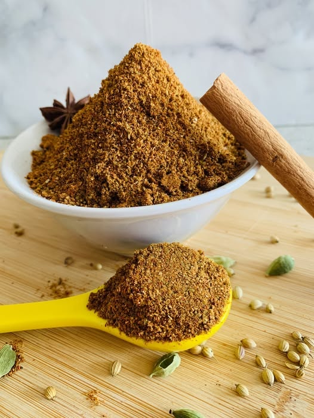

<!-- TODO: hero image undersized, refresh from Pexels or hand-curate -->
# Korma Spice Mix

*A korma spice mix: cardamom, cinnamon, fennel, ground almond and a touch of saffron. The mild, fragrant blend for creamy korma sauces.*

**Prep Time:** 5 minutes

**Makes:** about 25 g

## Overview
The British curry-house korma blend: coriander, cumin, turmeric, ground cardamom and cinnamon mixed together as the foundation for the mild, aromatic, nut-thickened korma. The mix emphasises warm fragrant spices with no chilli at all, which is what gives korma its mild reputation across British curry-house menus (the most common gateway curry for diners who don't want heat). The dish itself has Mughlai roots; the original Persian-Indian korma was a slow-cooked yogurt-and-nut braise for royal kitchens that bore little resemblance to the cream-and-coconut sauce of the modern curry house, but the spice blend stays broadly faithful to the warm-aromatic profile. Cardamom is the traditional lead spice; without it the blend reads as a generic mild curry powder. Keeps two or three months in a sealed jar; the cardamom fades first, so refresh before any important cook.

## Ingredients
- 2 tsp coriander powder
- 1 tsp cumin
- ½ tsp turmeric
- ½ tsp cardamom
- ½ tsp cinnamon

## Method
1. Mix thoroughly.
2. Store airtight.

## Notes
- Mild and fragrant.
- Contains no strong heat; suitable for mild palates.

## Serving
Use 1-2 tsp per korma.

## Storage
- Store in an airtight container in a cool, dry place for up to 6 months
- Keep away from direct sunlight and moisture
