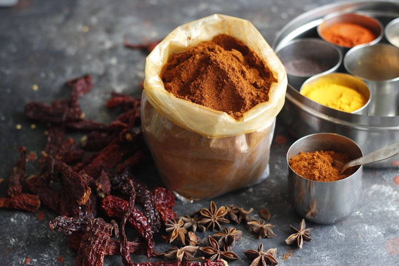

# Madras Spice Mix

*The Madras spice mix: a darker, hotter Tamil-inspired blend of mustard seed, fenugreek, curry leaves and dried chilli.*

**Prep Time:** 5 minutes

**Makes:** about 25 g

## Overview
A medium-hot spice blend with strong chilli and earthy notes, suited to Madras-style curries.

## Ingredients
- 2 tsp [Base Curry Powder](base-curry-powder.md)
- 1 tsp chilli powder
- 1 tsp paprika
- ½ tsp cumin
- ½ tsp coriander

## Method
1. Mix all spices thoroughly.
2. Store airtight.

## Notes
- Medium heat, well-rounded flavour.
- Adjust chilli powder to increase or decrease heat level.

## Serving
Use 2-3 tsp per Madras curry.

## Storage
- Store in an airtight container in a cool, dry place for up to 6 months
- Keep away from direct sunlight and moisture
