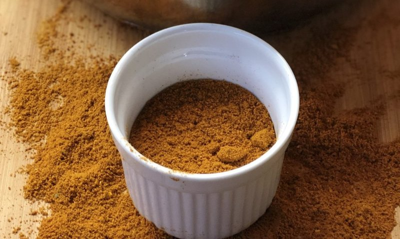

# Mixed Powder

*The BIR mix powder: a custom dry blend of curry powder, garam masala, paprika and turmeric.*

**Makes:** 17 tbsp

**Prep Time:** 5 minutes

## Overview
The British curry-house mixed powder, the custom dry spice blend that goes into almost every curry on a curry-house menu: a built-up combination of ground cumin, ground coriander, base curry powder, paprika, turmeric and garam masala mixed together into one jar. The blend is the bridge between the simpler base curry powder and the finished curry; each spoonful carries multiple layers of flavour rather than a single dimension, and chefs use it as a one-spoon shortcut where a less efficient kitchen would reach for half a dozen separate jars. Most British curry-house kitchens keep a big container of mixed powder on the hot line and stir spoonfuls into curries to taste. Made from either commercial or homemade base powders depending on the kitchen; freshly mixed is sharper and more aromatic than the bagged supermarket equivalent. Keeps two months in a sealed jar.

## Ingredients
### Ground spices
- 3 tbsp ground cumin
- 3 tbsp ground coriander
- 4 tbsp [Curry Powder](curry-powder.md)
- 3 tbsp paprika
- 3 tbsp ground turmeric
- 1 tbsp [Garam Masala](garam-masala.md)

## Method

### Stage 1 - Mix ingredients
1. Combine all ingredients in a bowl.
1. Mix thoroughly until well blended.

### Stage 2 - Store
1. Store in an airtight container.

## Notes
- High yield recipe; lasts up to 4 months.
- For smaller batches, use parts instead of tbsp.
- Use in B.I.R. curries for authentic taste.

## Serving
- Not served directly; used as spice base in curries.

## Storage
- Store in airtight container in cool, dark place up to 4 months.
- Keep away from moisture and heat.
