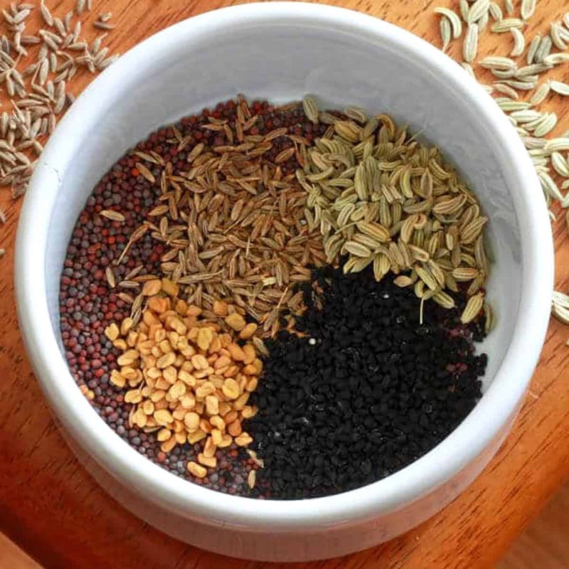

# Panch Poran (Indian Five Spice)

*Bengal's five-spice: whole cumin, fennel, mustard, fenugreek and nigella seeds in equal parts.*

**Prep Time:** 2 minutes
**Cook Time:** 2 minutes

## Overview
Bengal's distinctive five-spice blend (panch = five, poran = spices) and the canonical Bengali tempering: whole cumin, fennel, mustard, fenugreek and nigella seeds in equal parts, bloomed in hot oil at the start of a curry or sprinkled into hot ghee as a tadka over a finished dish. The blend is the unmistakable aromatic signature of Bengali cooking, the way South Indian cooks reach for mustard-seed-and-curry-leaf tempers; one whiff of panch poran in hot oil tells you the food is Bengali. The five spices stay whole rather than being ground, so they pop and crackle as they hit the oil. The fenugreek seed is what marks the blend out from any other Indian spice combination; it gives a faint bitter-maple back-note that takes some getting used to but ends up loved. Sold pre-mixed at most South Asian grocers; mixing your own is five minutes of work and lets you scale up or down.

**Makes:** 5 tablespoons
## Ingredients
- 1 tbsp cumin seeds
- 1 tbsp fenugreek seeds
- 1 tbsp brown mustard seeds
- 1 tbsp fennel seeds
- 1 tbsp nigella seeds (black onion seeds)

## Method

### Stage 1 - Roast & Use
1. For best results, roast the spices in a dry frying pan over medium-high heat until fragrant.
2. Use immediately while warm for maximum flavour release.

## Notes
- **Fenugreek adjustment:** Some cooks prefer to use less fenugreek as the seeds can be quite bitter, experiment to find your preference.
- **Whole spice blend:** Unlike ground masalas, panch poran is traditionally used whole for textural contrast and flavour bursts.
- **Pre-made option:** Available ready-mixed in most Asian spice shops if you prefer convenience.

## Storage
- Store in an airtight container in a cool, dark place
- Use within 3 months for optimal flavour
- Roast just before using for fresher taste
