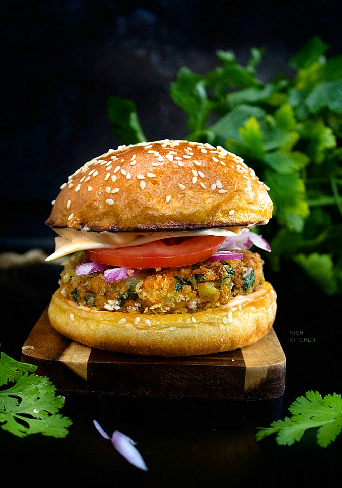

# Aloo Tikki Burger

*India's vegetarian potato burger: a crispy pan-fried patty of spiced mashed potato, peas, ginger, green chilli and fresh coriander, served on a soft bun with mint-coriander chutney, tamarind sauce, sliced red onion, tomato and cucumber. The McAloo Tikki of the Indian McDonald's menu reimagined - the vegetarian burger that anchors Indian fast food.*

**Serves:** 4

**Prep Time:** 25 minutes (plus 30 min potato cooling)

**Cook Time:** 20 minutes

## Overview
The aloo tikki burger is one of India's most iconic fast-food creations and the dish that made the McDonald's India menu workable for a country that's largely vegetarian: a crispy pan-fried patty (called aloo tikki, the same potato cutlet that's served as a chaat street food across northern India) made of boiled-and-mashed potato seasoned with garam masala, cumin, fresh ginger, green chilli, chopped fresh coriander and a handful of green peas for texture, bound with breadcrumbs (or roasted gram flour), shaped into burger-sized patties and pan-fried in oil till deeply crispy outside and soft inside. Built on a soft white bun with the traditional chaat condiments scaled to burger format: a green mint-coriander chutney (the bright sharp-fresh herb sauce), a tamarind-date chutney (the sweet-sour finishing sauce), thinly sliced red onion, tomato slices, a cucumber slice or two, and a smear of mayonnaise. McDonald's India launched the McAloo Tikki in 1998 and it's become the most-sold vegetarian burger in the country; the home version is fresher, crispier and more boldly spiced.

## Ingredients

### Aloo tikki patty
- 1 kg starchy potatoes (Russet or Maris Piper; peeled, cubed)
- 200 g frozen peas (defrosted)
- 1 thumb (3 cm) fresh ginger (grated)
- 2 fresh green chillies (very finely chopped; deseeded for milder)
- 1 small bunch fresh coriander (chopped fine)
- 1 small bunch fresh mint (chopped fine)
- 2 teaspoons garam masala
- 1 teaspoon ground cumin
- 1 teaspoon ground coriander
- 1 teaspoon amchur (dried mango powder; or substitute lemon juice + zest)
- 1 teaspoon chaat masala
- 1 ½ teaspoons fine sea salt
- 1 teaspoon ground black pepper
- 100 g panko breadcrumbs (or roasted gram flour for gluten-free)
- 2 tablespoons rice flour (for outer coating; gives the crisp)

### Mint-coriander chutney
- 1 large bunch fresh coriander (leaves and tender stems)
- 1 small bunch fresh mint (leaves only)
- 2 fresh green chillies
- 1 thumb (3 cm) fresh ginger
- 4 garlic cloves
- Juice of 2 limes
- 1 teaspoon caster sugar
- 1 teaspoon fine sea salt
- 4 tablespoons cold water (or more for blending)

### Tamarind-date chutney
- 80 g tamarind pulp (or 4 tablespoons tamarind concentrate)
- 100 g pitted dates
- 200 ml hot water
- 2 tablespoons jaggery (or brown sugar)
- 1 teaspoon ground cumin
- 1 teaspoon ground ginger
- ½ teaspoon Kashmiri chilli powder (or paprika)
- ½ teaspoon black salt (kala namak; or fine sea salt)

### Build
- 4 soft white burger buns
- 4 tablespoons mayonnaise
- 1 small red onion (very thinly sliced into rings)
- 1 large tomato (sliced)
- ½ cucumber (sliced thin)
- 1 cos lettuce heart (leaves separated)
- Fresh coriander sprigs

### Frying
- 6 tablespoons vegetable oil

### To serve
- Masala chips (chips sprinkled with chaat masala)
- Cold mango lassi or Thums Up cola

## Method

### Stage 1 - Cook and dry the potatoes
1. Boil the cubed potatoes in salted water 15 minutes till tender.
2. Drain very thoroughly.
3. Return to the empty hot pot; let steam off 5 minutes (this is essential - wet potato gives a soggy patty).
4. Mash thoroughly; cool 15 minutes.

### Stage 2 - Make mint-coriander chutney
1. Blitz coriander, mint, green chillies, ginger, garlic, lime juice, sugar, salt and cold water till smooth.
2. Should be a bright green pourable sauce.

### Stage 3 - Make tamarind-date chutney
1. Soak tamarind in hot water 10 minutes; press through a sieve to extract the pulp (or use concentrate directly).
2. Blitz with dates, jaggery, cumin, ground ginger, chilli powder, black salt till smooth.
3. The sauce should be thick and glossy, deep brown.
4. Cool.

### Stage 4 - Mix patty
1. To the cooled mashed potato, add peas, ginger, chopped chillies, chopped coriander and mint, garam masala, cumin, coriander, amchur, chaat masala, salt, pepper, and panko breadcrumbs.
2. Mix gently till combined; don't overmix or the potato turns gluey.
3. Form into 4 thick patties about 11 cm wide and 2 cm thick.
4. Dust each patty in rice flour on both sides.
5. Refrigerate 15 minutes (helps them hold together for frying).

### Stage 5 - Pan-fry the patties
1. Heat the oil in a wide pan over medium-high heat.
2. Cook patties 4-5 minutes per side till deep golden and crispy.
3. Drain briefly on paper towels.

### Stage 6 - Toast the buns
1. Lightly toast the bun cut sides in a dry pan 60 seconds.

### Stage 7 - Build the burgers
1. Spread mayonnaise on the bottom bun.
2. Lettuce, tomato, cucumber slices.
3. The aloo tikki patty.
4. A generous spoon of mint-coriander chutney over the patty.
5. A spoon of tamarind chutney drizzled on top.
6. Sliced red onion.
7. A few sprigs of fresh coriander.
8. Close.

### Stage 8 - Serve
1. Press gently to settle.
2. Cut in half if you like.
3. Masala chips and lassi alongside.

## Notes
- **Dry the potatoes:** the most important step. Wet mash gives a patty that won't crisp.
- **Both chutneys:** the green is fresh-sharp; the tamarind is sweet-sour. Together they're the chaat-flavour signature.
- **Rice flour outer coating:** the secret to a properly crispy exterior. Standard flour gives a softer crust.
- **Pan-fry, not deep-fry:** shallow oil gives the proper texture.

## Variations
**McAloo style:** McDonald's India version uses a sweet-spicy tomato mayo (mix mayo + ketchup + chilli powder + sugar) in place of the chutneys.
**With paneer:** add 100 g crumbled paneer to the patty.
**With cheese slice:** add a slice of cheddar on top of the patty.
**Spicier:** double the green chillies + a teaspoon of red chilli powder in the patty.
**Without peas (smoother patty):** omit; gives a denser texture.
**Sweet potato tikki:** swap half the potato for boiled mashed sweet potato.

## Serving
At a Mumbai street stall reimagined. At a Delhi fast-food joint. At home with masala chips and lassi.

## Storage
- Patties (uncooked): refrigerate 1 day; freeze 2 months.
- Patties (cooked): refrigerate 2 days; reheat in oven at 180°C for 8 minutes.
- Mint-coriander chutney: refrigerated 3 days (darkens but tastes the same).
- Tamarind chutney: refrigerated 2 weeks.
