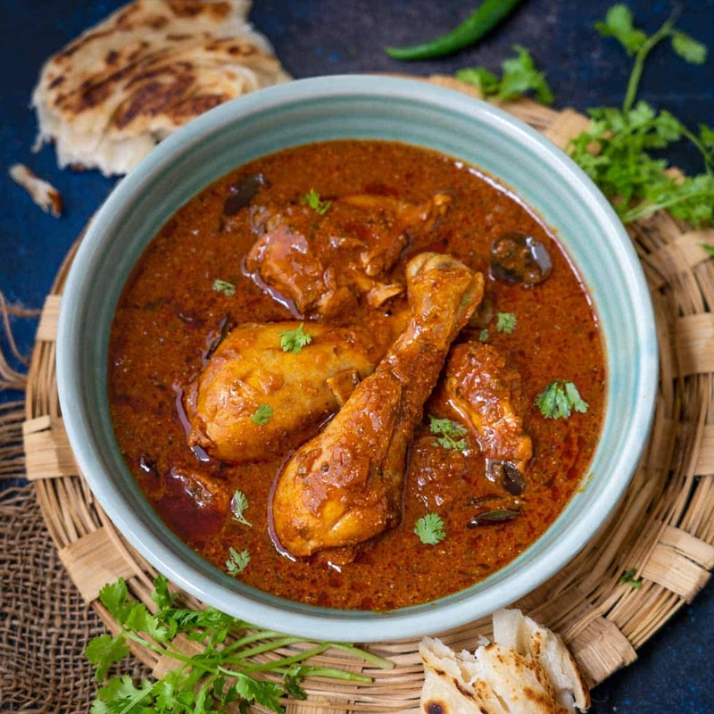

# Andhra Chicken Curry

*Andhra Pradesh chicken curry: properly hot, dried-red-chilli forward, simmered in a coconut-and-poppy-seed gravy. The South Indian heat-bomb that still tastes nuanced underneath.*

**Serves:** 4-6

**Prep Time:** 20 minutes (plus 30 minutes marinade)

**Cook Time:** 45 minutes

## Overview
Andhra chicken curry is the heat-bomb of South India: a fiercely chilli-forward curry from the dry inland plains of Andhra Pradesh, simmered in a coconut-and-poppy-seed gravy that still tastes nuanced underneath all the fire. The dish belongs to the wider South Indian tradition where dried red chillies do most of the heat work (rather than the fresh green chillies of the north), and where the masala paste itself is roasted dry before grinding so the spices toast and bloom. Two things separate a great Andhra curry from a punishing one. The dry-roast of the spice paste is non-negotiable; raw spices give a flat one-note hot curry where toasted ones give layered warmth that scaffolds the chilli. And tamarind at the end is what stops the dish tipping into pure burn; the sour edge balances the heat and lets the dish read as complex rather than aggressive. Yogurt in the chicken marinade tenderises and helps the masala cling. Eat with hot steamed rice, a bowl of plain dal and a wedge of lime.

## Ingredients

### Marinade
- 1 kg chicken thighs (skinless, boneless, cut into 4 cm pieces)
- 1 tablespoon ginger-garlic paste
- 1 teaspoon turmeric
- 100 g natural yogurt
- 1 teaspoon Kashmiri chilli powder
- 1 teaspoon salt

### Andhra masala paste
- 2 tablespoons white poppy seeds (khus khus; substitute desiccated coconut if unavailable)
- 1 tablespoon white sesame seeds
- 1 tablespoon coriander seeds
- 1 teaspoon fennel seeds
- 6-8 dried Kashmiri chillies (mild, for colour)
- 2-4 dried byadgi (or guntur chillies, for the heat; adjust to taste)
- 40 g fresh grated coconut (or 30 g desiccated)
- 4 garlic cloves
- 25 g fresh ginger

### Curry
- 3 tablespoons sesame oil (or vegetable oil)
- 1 teaspoon black mustard seeds
- 1 teaspoon cumin seeds
- 20 fresh curry leaves
- 2 onions (finely chopped)
- 2 ripe tomatoes (chopped)
- 1 tablespoon tamarind paste (or a walnut-sized lump of tamarind in 100 ml hot water, strained)
- 600 ml water
- 1 teaspoon salt (to taste)

### To finish
- A handful of fresh coriander (chopped)
- ½ lime (juice)

## Method

### Stage 1 - Marinate
1. Combine the chicken with the ginger-garlic paste, turmeric, yogurt, Kashmiri chilli and salt.
1. Set aside for 30 minutes.

### Stage 2 - Toast and grind the masala
1. Dry-toast the poppy seeds, sesame, coriander and fennel in a pan over medium-low heat for 1-2 minutes until fragrant.
1. Add the dried red chillies and toast for 30 seconds (they'll darken and puff slightly).
1. Add the fresh coconut and toast for another 2 minutes until pale gold.
1. Cool, then grind with the garlic and ginger in a spice grinder with 3 tablespoons of water to a coarse paste.

### Stage 3 - Temper and build the base
1. Heat the sesame oil in a wide pan over medium heat.
1. Add the mustard seeds; when they pop, add the cumin and curry leaves.
1. Add the chopped onions and a pinch of salt.
1. Cook for 10 minutes until deep golden.

### Stage 4 - Brown the chicken
1. Lift the chicken out of the marinade, scraping off and reserving the excess.
1. Add the chicken to the pan in two batches; brown for 4-5 minutes a batch.
1. Return all the chicken to the pan with any reserved marinade.

### Stage 5 - The masala
1. Stir in the andhra masala paste.
1. Cook for 5-6 minutes, stirring, until the oil starts to separate from the masala at the edges.
1. Add the chopped tomato, tamarind paste, water and salt.
1. Bring to a gentle simmer.
1. Cover partially and cook for 20-25 minutes, stirring occasionally, until the chicken is tender and the gravy has thickened.

### Stage 6 - Finish
1. Taste and adjust salt; add the lime juice.
1. Scatter the coriander.
1. Serve with steamed rice, dosa or roti.

## Notes
- **Choose the chillies:** Andhra cooking uses 8-12 dried chillies in one curry. Kashmiri for colour, guntur or byadgi for the heat. Adjust the ratio to your tolerance; the dish should be hot but not burn the tongue raw.
- **Poppy seeds for body:** Khus khus thickens the gravy and gives the dish its slightly creamy texture without dairy. If you can't find them, desiccated coconut is a substitute, though the dish ends up sweeter.
- **Don't skip the dry-toast:** The toasting is what brings out the fennel and sesame; raw-blend gives a flat masala.

## Storage
- Refrigerate up to 4 days; tastes better on day two.
- Freezes well for 2 months.
