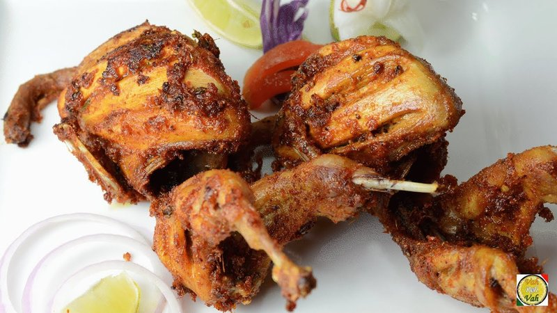

# Angry Bird

*A fiery Indian chicken curry: bone-in chicken in a chilli-heavy gravy of onion, tomato, dried chillies and Kashmiri red.*

**Serves:** 4

**Prep Time:** 5 minutes

**Cook Time:** 40 minutes

## Overview
A fierce British-Indian restaurant curry born in the same gastropub-curry-house tradition as the phaal and the vindaloo: bone-in chicken thighs in a chilli-forward gravy built from onion, tomato, dried Kashmiri chillies and a heavy hand of fresh red chilli, marinated first in yogurt with garam masala and lemon to tenderise the meat. The name (a 2010s playful reference to the Angry Birds video game) puts the dish squarely in the modern curry-house joke-menu tradition, but the recipe sits in a real Indian cooking lineage: yogurt-and-spice marinades go back centuries in North Indian tandoor cookery, and the Kashmiri-chilli-heavy gravy belongs to the Mughlai school. Kashmiri red chilli is essential; it gives the deep red colour without the front-of-mouth heat of a regular chilli, and substituting plain hot chilli powder turns the dish punishingly hot rather than properly fiery. Eat with naan, plain basmati and a cooling raita.

## Ingredients
### Protein
- 8 skin-on, bone-in chicken thighs

### Marinade
- 500 g (1 lb 2 oz/2 cups) plain yogurt
- ½ tsp ground turmeric
- ½ tsp chilli powder
- 1 green chilli (large), deseeded and finely sliced
- 2 tsp ground cumin
- 2 tsp ground coriander
- 1 tsp ground cinnamon
- 2 tbsp paprika
- ½ tsp ground cloves
- 5 cm (2 inch) piece fresh root ginger, peeled and grated
- 3 garlic cloves, minced
- ½ tsp salt
- ½ lemon (juice)

## Method

### Stage 1 - Marinate chicken
1. In large mixing bowl, combine all marinade ingredients.
1. Add chicken thighs; cover and refrigerate at least 4 hours, preferably overnight.

### Stage 2 - Roast chicken
1. Preheat oven to 220°C (430°F/Gas 7).
1. Remove chicken from marinade; wipe off excess.
1. Lay in single layer on roasting pan.
1. Roast 35-40 mins until golden, cooked through, and tender.
1. Serve immediately.

## Notes
- Use mild paprika for flavor and color; chilli powder for heat.
- Marinate longer for deeper flavor.
- Suitable for thighs, drumsticks, or other meats/fish.

## Serving
- Serve with rice, naan, or salad.
- Garnish with lemon wedges and fresh coriander.

## Storage
- Refrigerate marinated chicken up to 24 hours.
- Cooked chicken refrigerates 2-3 days.
- Reheat in oven at 180°C.
- Freeze marinated uncooked chicken up to 1 month.
