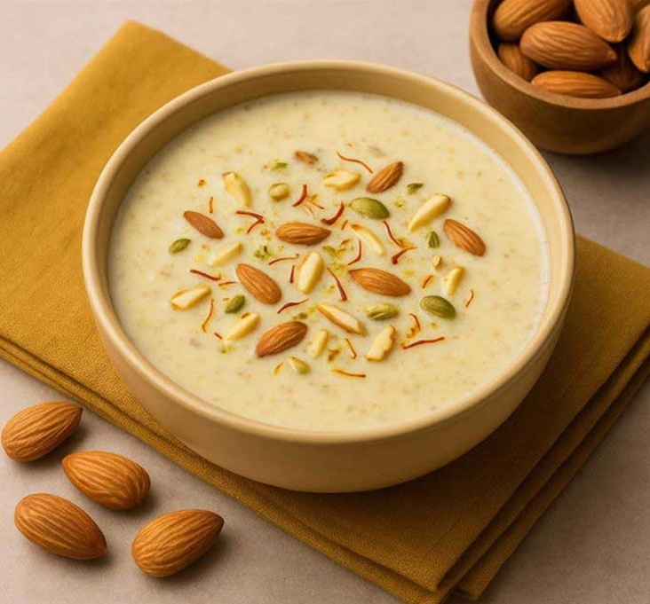

# Badam Kheer

*A pale-gold almond pudding, scented with saffron and cardamom and finished with slivered pistachios. The kind of dessert that's spooned warm into small bowls on Diwali night, or chilled for a hot afternoon. Both work; both are right.*

**Serves:** 6

**Prep Time:** 20 minutes (plus almond soaking)

**Cook Time:** 40 minutes

## Overview
Almonds blanched, peeled, ground to a smooth paste, then folded into milk that's been reduced to two-thirds of its volume. Sugar to taste, saffron bloomed in warm milk for the colour, cardamom for the warmth. Simmered gently — never boiled — until the consistency thickens to a pourable cream, then garnished with pistachio slivers and a drift of rose petals.

## Ingredients

### The kheer
- 100 g almonds
- 1 litre whole milk
- 100 g caster sugar (or to taste)
- A pinch of saffron threads
- 1 tablespoon warm milk (to bloom the saffron)
- 1/2 teaspoon ground cardamom
- 1 teaspoon rose water (optional)

### To finish
- 2 tablespoons pistachios (slivered)
- 1 teaspoon dried rose petals (optional)
- A few extra saffron threads

## Method

### Stage 1 - Blanch and peel the almonds
1. Bring a small pan of water to the boil and add the almonds. Boil for 60 seconds, drain into a sieve, then run cold water over them. The skins should now peel off with a gentle squeeze; pop each almond out of its skin between thumb and forefinger.
1. Pat the peeled almonds dry.

### Stage 2 - Grind to a paste
1. Tip the almonds into a small blender or spice grinder. Add 4 tablespoons of milk taken from the litre measured out for the kheer.
1. Blitz for 60-90 seconds, scraping down twice, until you have a smooth, pale paste — the texture of single cream with very fine grain. Set aside.

### Stage 3 - Reduce the milk
1. Bloom the saffron: crush the threads between your fingers into a small cup and pour over the warm milk. Leave to steep for 10 minutes.
1. Pour the remaining milk into a heavy, wide pan and bring to a gentle simmer over medium-low heat. From here you want it bubbling lazily around the edges, never a rolling boil.
1. Simmer for 20-25 minutes, stirring every couple of minutes and scraping the bottom and sides with a wooden spoon (the milk caramelises onto the pan otherwise). The volume should reduce by about a third and the colour should deepen to a faint cream.

### Stage 4 - Combine and finish
1. Stir in the almond paste; the kheer will thicken visibly. Cook for another 5 minutes, stirring continuously.
1. Add the sugar a little at a time, tasting as you go — almond pastes vary in sweetness and a more lightly-sweetened kheer is closer to the traditional taste.
1. Pour in the saffron milk and stir; the kheer should take on a pale gold colour.
1. Add the cardamom and rose water (if using). Stir once and remove from the heat.
1. Pour into 6 small bowls. Scatter pistachios, rose petals and a few saffron threads over the top.

## Notes
- Don't boil the kheer hard after adding the almond paste — it can split or seize. Gentle simmer only.
- For a richer, more festive version, fold in 2 tablespoons of khoya (milk solids) along with the almond paste. Adds depth at the cost of an extra trip to the Indian grocer.
- If you have a high-speed blender, you can skip the almond-grinding step and blitz everything together in one go at the end. The texture is slightly less refined.

## Serving
Hot from the pan into shallow bowls on Diwali night. Equally good chilled the next day, with a thinner pour of cream over the top.

## Storage
Refrigerated, up to 3 days. It will thicken further — loosen with a splash of milk when reheating.
