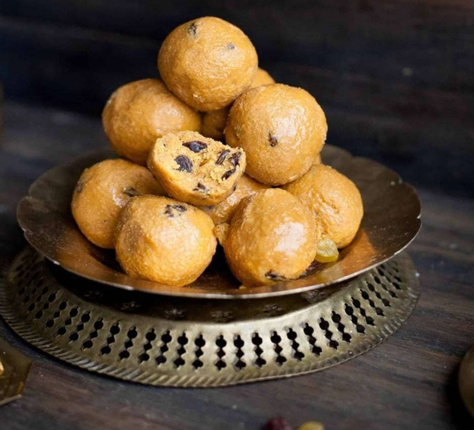

# Besan Ladoo

*The Diwali sweet that fills the house with the smell of roasted gram flour and ghee. Patience is the recipe: the besan must roast slowly, low and dark, until it tastes nutty rather than raw. Sugar goes in once the mixture is properly cool; otherwise it melts and the ladoos won't hold.*

**Serves:** 12 (makes about 16 ladoo)

**Prep Time:** 15 minutes

**Cook Time:** 30 minutes

## Overview
Coarse besan toasted in ghee for a long, slow half-hour, until the colour deepens from pale yellow to a warm honey-brown and the smell turns from raw to roasted-cashew. Off the heat, cooled to barely-warm, then folded with powdered sugar, cardamom and slivered pistachios. Rolled into walnut-sized balls and left to set. The result is dense, fudgy, faintly grainy — the texture is part of the charm.

## Ingredients

### The base
- 250 g besan (gram flour, coarse "ladoo" grade if you can find it)
- 150 g ghee
- 200 g icing sugar (sifted)
- 1 teaspoon ground cardamom
- A small pinch of fine sea salt

### To finish
- 2 tablespoons pistachios (slivered)
- 1 tablespoon almonds (slivered)
- A pinch of saffron threads (optional)
- 1 teaspoon warm milk (optional, to bloom the saffron)

## Method

### Stage 1 - Bloom the saffron
1. If using saffron, crush the threads between your fingers into a small cup and pour over the warm milk. Leave to steep for 15 minutes while you start the besan.

### Stage 2 - Roast the besan
1. Melt the ghee in a heavy, wide pan (a kadai or deep frying pan) over a medium-low heat until it pools and just shimmers.
1. Add the besan and stir with a wooden spoon to combine. The mixture will look like wet sand. Keep the heat low: this is a 25 minute job that you cannot rush.
1. Stir continuously for the first 5 minutes to break up any lumps, then settle into a slower rhythm — every 30 seconds or so — for the next 20 minutes. The mixture will go through four colour stages: pale yellow, sandy beige, light gold, then warm honey-brown. It should never go to dark brown. The kitchen will smell strongly of roasted gram by the end.
1. Pinch out a tiny piece, cool it on the back of a spoon, and taste: it should taste nutty and toasted, not raw. If it tastes raw, give it another 5 minutes.
1. Tip the roasted besan onto a wide plate or shallow tray, drizzle in the saffron milk if using, and spread it out so it cools quickly. A film of ghee will rise to the surface — leave it.

### Stage 3 - Mix and shape
1. When the mixture is cool enough to touch comfortably (about 15 minutes), tip it into a wide mixing bowl. If you mix the sugar in while it's hot, the sugar melts and the ladoos won't hold their shape.
1. Sift in the icing sugar a tablespoon at a time and rub it through the besan with your fingertips. Keep going until the mixture is uniform.
1. Add the cardamom, salt, pistachios and almonds and rub through once more.
1. Squeeze a small amount in your fist — it should hold together when pressed and crumble when prodded. If it crumbles when pressed, add another tablespoon of warm ghee.
1. Take walnut-sized pieces and roll between your palms into firm balls. Press each one decisively so it holds; loose ladoos crack as they set.
1. Arrange on a tray, leave uncovered for 30 minutes to firm up, then transfer to an airtight tin.

## Notes
- Coarse besan ("ladoo besan") gives the granular bite that defines the sweet. Fine besan works too but the result is smoother, more like a barfi.
- A spoonful of grated jaggery rubbed in alongside the sugar gives a darker, deeper sweetness if you want a less-polished, country-style ladoo.
- The mixture firms up considerably overnight; ladoos made on Day 1 are softer than on Day 2. Both eat well.

## Serving
On a brass or steel plate at the start of the festive meal, with chai. One per person is the polite serving; the box on the counter keeps disappearing through the evening.

## Storage
Airtight tin at room temperature, up to 2 weeks. Don't refrigerate — the cold makes them seize and lose their tender crumble.
