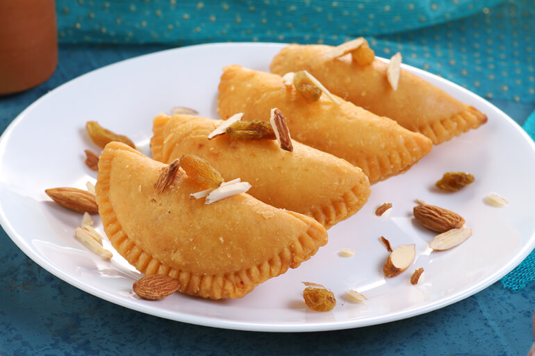

# Gujiya

*The Holi sweet. Half-moon pastry parcels filled with sweetened khoya, coconut and dried fruit, sealed with a fluted crimp, deep-fried until crisp and dusted with sugar. Eat by the trayful through the afternoon, crumbs collected on a paper napkin.*

**Serves:** 8 (makes about 20 gujiya)

**Prep Time:** 1 hour (plus 30 minutes resting)

**Cook Time:** 30 minutes

## Overview
Gujiya is the Holi sweet of North India, the half-moon pastry parcel filled with sweetened khoya, coconut and dried fruit that turns up by the tray-load on every Holi morning from Mathura to Lucknow and gets eaten through the colour-throwing afternoon. The dish is a Hindi-belt cousin of the Bengali pithe and the Goan nevri, all variants on the same sealed-pastry-with-sweet-filling idea that runs across India under different regional names. The dough is short and tender (maida, ghee and milk), rolled thin enough that the fried gujiya crackles when bitten through, and the filling is the heart of the dish: khoya (reduced milk solids) or thickened condensed milk as the binder, with desiccated coconut, semolina, chopped nuts and cardamom folded through for textural interest. The fluted crimp around the edge is the visual signature and the practical seal; a loose edge opens in the oil and the filling escapes. Deep-fried low and slow till pale gold (rushed gujiya brown outside before the inside cooks through), dusted warm with icing sugar. Eat through Holi afternoon with masala chai.

## Ingredients

### The dough
- 300 g maida (plain flour)
- 60 g ghee (melted)
- A small pinch of fine sea salt
- About 100 ml whole milk (lukewarm)

### The filling
- 200 g khoya (grated)
- 50 g fine semolina (sooji)
- 30 g desiccated coconut
- 100 g caster sugar
- 1 teaspoon ground cardamom
- 30 g cashews (chopped)
- 30 g almonds (chopped)
- 30 g raisins
- 1 tablespoon ghee
- A small pinch of fine sea salt

### To finish
- Sunflower or vegetable oil (for deep-frying)
- 30 g icing sugar (for dusting)

## Method

### Stage 1 - Make the dough
1. Tip the maida and salt into a wide bowl. Pour in the melted ghee and rub through with your fingertips for 2-3 minutes. The mixture should feel like damp sand and a fistful should hold together briefly when squeezed. If not, add another tablespoon of ghee.
2. Add the warm milk a little at a time, mixing with a spoon, until the dough comes together in a firm, slightly stiff ball. You may not need all the milk.
3. Knead for 2 minutes on the worktop, just until smooth. Cover with a damp cloth and rest for 30 minutes.

### Stage 2 - Make the filling
1. Warm the tablespoon of ghee in a wide pan over a medium-low heat. Add the semolina and toast for 3-4 minutes, stirring, until pale gold and toasty. Tip onto a plate to cool.
2. In the same pan, add the grated khoya and stir for 4-5 minutes until it loosens and turns pale and crumbly. Take off the heat.
3. Stir in the toasted semolina, coconut, sugar, cardamom, salt, chopped nuts and raisins. Let it cool completely before filling, or the dough goes soggy.

### Stage 3 - Shape the gujiya
1. Divide the dough into walnut-sized pieces (about 20). Keep them under the damp cloth as you work.
2. Roll a piece into a thin round about 10 cm across, lightly flouring as needed. Aim for a 1.5-2 mm thickness.
3. Place a generous tablespoon of filling on one half of the round. Brush the edge lightly with water, fold the empty half over, and press to seal.
4. Crimp the curved edge: pinch the corner, fold a tiny piece inward, pinch the next, and continue along the seam. This is the gujiya's signature finish and also the seal that keeps the filling in. If your hands are not up for the crimp, press hard with a fork.
5. Set on a lightly floured tray, covered with a cloth. Repeat with the rest of the dough.

### Stage 4 - Fry and dust
1. Heat 5 cm of oil in a deep pan to 150°C (low; a small pinch of dough should sizzle gently). The oil must be moderate; hot oil colours the gujiya before the dough cooks through.
2. Slide in 4-5 gujiya at a time, turning them gently, and fry for 6-7 minutes until pale gold all over. Lift out with a slotted spoon and drain on a wire rack.
3. While still warm, dust generously with icing sugar.

## Notes
- Khoya (mawa) is reduced milk solids; find it in the freezer section of South Asian grocers. To approximate, simmer 400 ml whole milk with 30 ml double cream until it reduces to a sticky paste, then cool.
- The fluted crimp looks intimidating; in practice ten minutes' practice on the first few teaches your fingers the rhythm. A fork-pressed seal works and tastes the same.
- For a sugar-syrup finish (gujiya dunked briefly in one-string syrup), make a syrup with 200 g sugar and 100 ml water boiled to a sticky single thread, and dip each warm fried gujiya in for 30 seconds before lifting onto a rack to set.

## Serving
On a tray with chai, between rounds of Holi colour-throwing. A glass of thandai alongside.

## Storage
In an airtight tin at room temperature for up to 5 days. Do not refrigerate; the pastry loses its snap.
