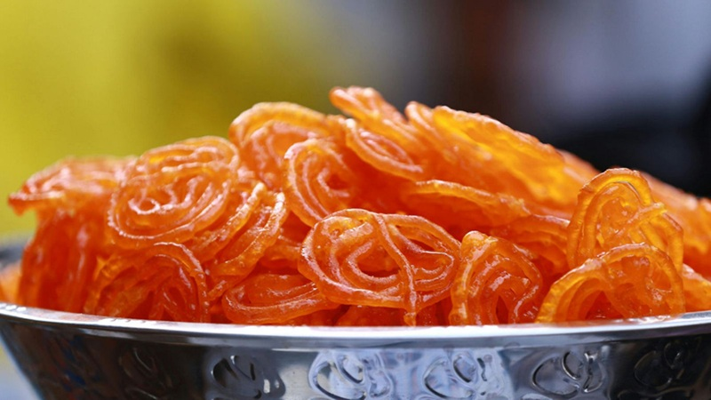

# Jalebi

*India's spiral sweet: a fermented yogurt batter piped into hot oil in interlocking loops, fried briefly crisp, then soaked in saffron-cardamom syrup.*

**Serves:** 6 (makes about 20 jalebis)

**Prep Time:** 15 minutes (plus 8-12 hours fermentation)

**Cook Time:** 25 minutes

## Overview
A loose batter of plain flour, gram flour, yoghurt and water ferments 8-12 hours at room temperature (or 24 hours in the fridge), the slight tang from the yoghurt and the bubbles from the fermentation give the characteristic crisp-shattering bite. A 1-thread sugar syrup is scented with saffron, cardamom and a squeeze of lemon. The batter goes into a piping bag (or squeezy bottle); piped into hot oil in spirals from the centre outwards; fried for 30-40 seconds per side; lifted out and dropped straight into warm syrup for 30 seconds; lifted again. Eaten immediately while still hot and crisp.

## Ingredients

### Batter
- 200 g plain flour
- 30 g gram flour (besan)
- 1 tablespoon cornflour
- 2 tablespoons plain yoghurt
- ¼ teaspoon ground turmeric (for the orange colour; or a tiny pinch of saffron)
- 200 ml warm water (approximately)
- A pinch of bicarbonate of soda (added just before frying)

### Sugar syrup
- 400 g caster sugar
- 250 ml water
- A generous pinch of saffron strands
- 6 green cardamom pods (bashed)
- 1 teaspoon lemon juice
- 1 teaspoon rose water (optional)

### To fry
- 1 litre vegetable oil (or ghee, or a mix for richness)

### To garnish
- 1 tablespoon pistachios (slivered)
- A few saffron strands

## Method

### Stage 1 - Batter (the night before)
1. Whisk the plain flour, gram flour, cornflour and turmeric in a wide bowl.
2. Add the yoghurt and the warm water gradually, whisking, to a smooth lump-free batter the consistency of single cream.
3. Cover loosely; rest at warm room temperature 8-12 hours (or in the fridge 24 hours).
4. The batter should be slightly bubbly and smell faintly sour.

### Stage 2 - Syrup
1. Combine the sugar, water and cardamom in a wide pan; bring to a boil.
2. Simmer 5-6 minutes to a 1-thread consistency (a drop between thumb and finger pulled apart gives a single thread that doesn't break).
3. Stir in the lemon juice and saffron.
4. Off the heat, add the rose water (if using).
5. Keep warm but not hot (about 50°C).

### Stage 3 - Final batter mix
1. Whisk the rested batter; it should still be the consistency of pouring cream. Add a tablespoon of warm water if too thick.
2. Add the bicarbonate of soda; whisk in.
3. Transfer to a piping bag with a 4 mm round nozzle (or a squeezy ketchup bottle, or a sealed plastic bag with a small corner snipped).

### Stage 4 - Fry
1. Heat the oil to 175-180°C in a wide shallow pan (8-9 cm deep is ideal; a wok or kadhai is traditional).
2. Working over the oil, pipe spirals: start at the centre, make a small circle, then 2-3 interlocking loops around it (the classic shape; perfection isn't needed - rough is right).
3. Fry 30-40 seconds; flip; another 30-40 seconds until golden and crisp.
4. The jalebi should be hard and rigid when lifted; if it's still floppy it's not crisp enough.
5. Lift onto a slotted spoon; drain 5 seconds.

### Stage 5 - Soak
1. Lower the hot jalebi straight into the warm syrup.
2. Submerge with the back of the spoon for 30 seconds.
3. Lift onto a wire rack or plate.
4. Repeat with the rest, frying in batches of 2-3.

### Stage 6 - Serve
1. Scatter slivered pistachios and saffron strands on top.
2. Eat hot, within 10 minutes - the texture is at its absolute best on the first bite from the syrup.

## Notes
- **Fermentation:** Don't skip it. The slight sour tang and the air bubbles are what give jalebi its character. Warm room overnight; if your kitchen is cold (under 18°C), use the inside of an oven with the light on.
- **Pipe over the oil:** Hold the bag 2 cm above the surface. Too high and the spirals break up; too low and the bag melts.
- **Hot jalebi, warm syrup:** Crisp hot jalebi into 50°C syrup absorbs in 30 seconds without going soggy. Cold syrup makes them tough; boiling syrup splits them.
- **Don't fry too dark:** Deep gold is right. Browned jalebi taste bitter and the syrup can't penetrate.

## Variations
**Imarti (jangiri):** South Indian cousin - thicker batter (urad dal-based) piped in concentric flower shapes; deeper orange.
**Khova jalebi:** Add 50 g khoya (milk solids) to the batter for a richer, paler version popular in Rajasthan.
**Without fermentation (quick):** Add ¼ teaspoon yeast and rest the batter 1 hour at warm room temperature. Acceptable shortcut; the depth of flavour is less.

## Serving
Serve: hot, with cold rabri spooned alongside (the classic Old-Delhi breakfast); or with a scoop of vanilla ice cream; or plain with masala chai.
Temperature: hot, just out of the syrup.
Occasion: Diwali, Holi, weddings, festival breakfasts.

## Storage
- Best within 30 minutes of frying.
- Reheat at 200°C oven for 4 minutes to recrisp (the syrup stays absorbed).
- The unfermented batter doesn't keep; mix the night before only.
