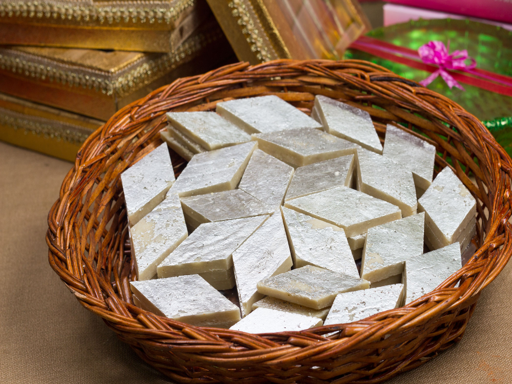

# Kaju Barfi

*Indian cashew fudge: ground cashews cooked with a one-string sugar syrup until they form a soft dough, rolled flat, dusted with rose petals, cut into diamonds. The kind of sweet that comes in a silver-leafed box for Diwali and disappears in two days.*

**Serves:** 16 (makes about 20 diamonds)

**Prep Time:** 15 minutes

**Cook Time:** 25 minutes

## Overview
Cashews soaked briefly to soften, ground to a fine pale powder, then folded into a sugar syrup that's been taken to the right consistency — one-string, which means a thread should form when you pinch a drop between thumb and forefinger and pull them apart. Stirred over a low heat until the mixture pulls cleanly from the pan, then kneaded warm, rolled to 5 mm, cut. Edible silver leaf is the traditional finish; rose petals are the home-cook substitute.

## Ingredients

### The fudge
- 250 g cashews (raw, unsalted)
- 150 g caster sugar
- 75 ml water
- 1/4 teaspoon ground cardamom
- 1 teaspoon ghee (for greasing your hands and the tray)

### To finish
- Edible silver leaf (vark), 2 small sheets (optional)
- 1 tablespoon dried rose petals (optional)

## Method

### Stage 1 - Grind the cashews
1. Soak the cashews in cold water for 10 minutes. Drain and pat dry with kitchen paper — the surface needs to be dry, but a touch of residual moisture in the nut helps the grinding stay smooth rather than oily.
1. Pulse in a food processor or spice grinder in 2-3 batches, scraping down between bursts. You're after a fine, pale powder; stop the moment it starts to clump or release oil. About 20-30 seconds per batch, no more.
1. Pass through a sieve onto a large plate. Re-grind any large pieces. Set aside.

### Stage 2 - Make the syrup
1. Combine the sugar and water in a heavy, wide pan. Stir once to dissolve, then leave alone on a medium heat.
1. Once the sugar has fully dissolved (about 4 minutes), let it bubble gently for 4-5 more minutes. Test for one-string consistency: dip a clean teaspoon, let it cool for 5 seconds, then pinch a drop between thumb and forefinger and pull apart — a single soft thread should form before breaking. This is roughly 105-110°C if you're using a thermometer.

### Stage 3 - Combine
1. Off the heat, tip in the ground cashews all at once. Stir vigorously with a wooden spoon to fold them through the syrup; it will look impossibly dry at first, then come together into a soft, pale dough.
1. Return to a low heat and stir continuously for 2-3 minutes until the mixture pulls cleanly from the side of the pan when pushed — it should leave the surface mostly clean and form a soft, slightly sticky ball.
1. Add the cardamom and stir once.

### Stage 4 - Roll and cut
1. Tip the warm dough onto a sheet of parchment lightly greased with ghee. Cover with a second sheet of parchment and roll out, rotating the parchment as you go, to about 5 mm thick.
1. Peel off the top sheet. If using silver leaf, gently lay the sheets directly onto the warm surface — they will adhere to the fudge as it cools.
1. Scatter the rose petals across the top.
1. Leave to cool for 20 minutes, then cut into 3 cm diamonds with a sharp knife. Wipe the blade between cuts so the edges stay clean.

## Notes
- If the syrup goes past one-string and reaches two-string (hard ball), the barfi will be brittle rather than fudgy. Add a tablespoon of warm milk and stir to slacken before adding the cashews.
- A pinch of saffron bloomed in a teaspoon of warm milk and folded in alongside the cardamom gives the classic Diwali colour and a faint floral edge.
- Some recipes call for milk powder (khoya) for richness; this version is dairy-free other than the ghee.

## Serving
Stacked in a square arrangement on a brass plate with the diamonds slightly overlapping, alongside besan ladoo and rasmalai for a proper Diwali sweet tray.

## Storage
Airtight tin at room temperature, up to a week. The texture stays best for 2-3 days; after that the surface starts to dry. Don't refrigerate.
