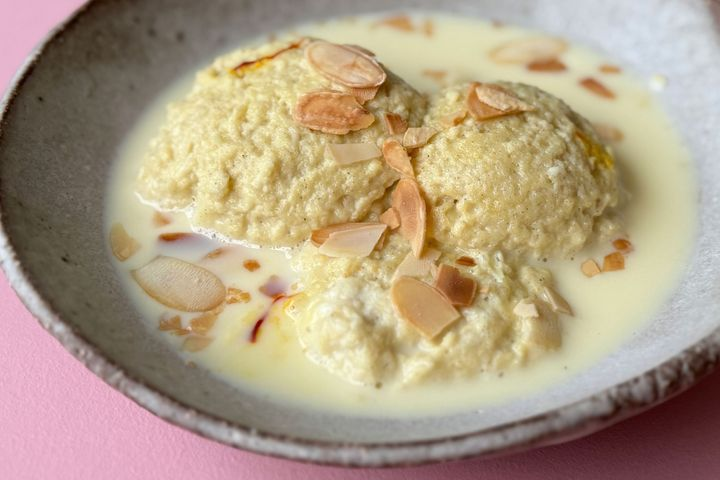

# Rasmalai

*Bengal's milky sweet: spongy paneer dumplings poached in sugar syrup, then floated in thickened saffron-and-cardamom rabri. Topped with pistachios.*

**Serves:** 6

**Prep Time:** 1 hour

**Cook Time:** 1 hour 15 minutes

## Overview
Whole milk boils, then curdles with lemon juice; the curds drain to chhana (fresh paneer). The chhana kneads for 8-10 minutes until smooth and lump-free, this is what gives the dumpling its sponge. Small flattened discs poach gently in sugar syrup; they double in size. A separate pan reduces a second batch of milk by half with cardamom, saffron, almonds and sugar to a rich rabri. The squeezed dumplings float in the cool rabri to absorb the spiced milk overnight.

## Ingredients

### Chhana (for the dumplings)
- 2 litres whole milk
- 3 tablespoons lemon juice (or 2 tablespoons white vinegar)
- 1 tablespoon plain flour (or semolina, optional; helps the texture)

### Sugar syrup
- 250 g caster sugar
- 1 litre water
- 4 green cardamom pods (bashed)

### Rabri (spiced milk)
- 1 litre whole milk
- 100 g caster sugar (or to taste)
- A generous pinch of saffron strands (soaked in 1 tablespoon warm milk)
- ½ teaspoon ground cardamom
- 2 tablespoons pistachios (finely chopped)
- 2 tablespoons almonds (blanched, slivered)
- 1 teaspoon rose water (optional)

### To garnish
- 1 tablespoon pistachios (slivered)
- A pinch of saffron strands
- A few dried rose petals (optional)

## Method

### Stage 1 - Make the chhana
1. Bring the 2 litres of milk to a rolling boil in a heavy wide pan.
2. Take off the heat; add the lemon juice slowly, stirring gently.
3. The milk should split into white curds and pale watery whey within 30 seconds. If not, add another tablespoon of lemon juice.
4. Once split, line a sieve with muslin or a clean fine cloth; pour through.
5. Rinse the curds with cold water for 30 seconds (removes the sour edge).
6. Tie up the cloth; squeeze gently; hang for 30-40 minutes to drain (don't squeeze bone-dry; a slight moisture is right).

### Stage 2 - Knead and shape
1. Tip the chhana onto a clean dry surface.
2. Add the flour or semolina.
3. Knead with the heel of your hand for 8-10 minutes - the curds break down, then come together as a smooth, slightly oily, lump-free dough. This is the most important step; under-kneaded chhana makes hard, dense dumplings.
4. Divide into 12 equal balls.
5. Roll each between your palms until perfectly smooth.
6. Flatten gently into a 4 cm disc, about 1 cm thick (they will double in size).

### Stage 3 - Poach the dumplings
1. Combine the sugar, water and cardamom in a wide deep pan; bring to a boil.
2. Once at a rolling boil, lower the discs in gently (they need plenty of room - cook in two batches if the pan isn't wide).
3. Cover; cook 12-15 minutes at a steady boil; the discs should double in size and look soft, glossy and spongy.
4. Lift carefully with a slotted spoon onto a tray.
5. Cool 10 minutes.

### Stage 4 - Rabri
1. While the dumplings poach, bring the 1 litre milk to the boil in a wide heavy pan.
2. Reduce the heat; simmer gently, stirring often and scraping the cream off the sides back into the milk, for 25-30 minutes until reduced by half and visibly thickened.
3. Add the sugar; stir to dissolve.
4. Add the saffron with its milk, cardamom, pistachios and almonds.
5. Simmer 2 minutes more.
6. Off the heat, stir in the rose water (if using).
7. Cool completely.

### Stage 5 - Soak
1. Gently squeeze each poached disc to remove excess syrup (just press between your palms; don't crush).
2. Lower the discs into the cool rabri.
3. Cover; chill at least 4 hours, ideally overnight. The dumplings absorb the spiced milk.

### Stage 6 - Serve
1. Spoon 2 dumplings per bowl with plenty of rabri.
2. Scatter slivered pistachios, a few strands of saffron and rose petals on top.
3. Serve cold.

## Notes
- **Knead, knead, knead:** 8-10 minutes minimum. Under-kneaded chhana gives rubbery, dense dumplings. Properly kneaded chhana gives the spongy, almost cake-like texture that defines rasmalai.
- **Whole milk only:** Skimmed or semi-skimmed milk doesn't give enough curd; the chhana is too small and the dumplings collapse.
- **Reduce the milk slowly:** Stirring every 2-3 minutes prevents a skin forming and a scorched bottom. Watch the rim; the cream creeps up and needs scraping back.
- **The squeeze before the rabri:** Important. Syrup-heavy dumplings dilute the rabri and the flavour is muddled.

## Variations
**Mango rasmalai:** Add 4 tablespoons mango pulp to the cool rabri for a summer version.
**Pistachio rasmalai:** Stir 50 g pistachio paste into the rabri; the colour pales green.
**Quick version:** Use shop-bought rasgulla in syrup; squeeze gently; float in homemade rabri. Cuts an hour off and the result is still very good.

## Serving
Serve: chilled in small bowls, with plenty of rabri.
Occasion: Diwali, Eid, weddings, celebratory family meals.
Temperature: cold (the rabri should be fridge-cold, not just cool).

## Storage
- Keeps 3 days refrigerated in the rabri.
- Doesn't freeze well; the chhana texture coarsens.
- Best on the day after making (the dumplings absorb the rabri overnight).
