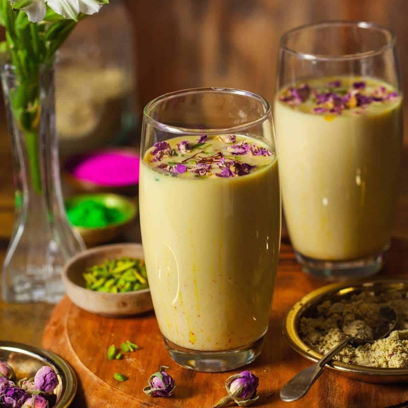

# Thandai

*The Holi drink. Cold milk infused with a ground paste of almonds, cashews, fennel, cardamom, peppercorn, poppy seeds, rose petals and saffron. Sweet, perfumed, lightly spiced, and traditionally served by the jug as colour flies.*

**Serves:** 4

**Prep Time:** 10 minutes (plus 1 hour soaking, 2 hours chilling)

**Cook Time:** None

## Overview
Thandai is the Holi drink of North India, the perfumed cold milk that gets served by the jug as colour-powder flies on Holi morning in Mathura, Vrindavan and across the Hindi belt. The name simply means "cooling" (thanda = cool), and the drink does literal work as a body-cooler at the end of a hot Holi afternoon while also functioning as the ritual centrepiece of the festival itself. A nut-and-spice paste is the soul of the drink: almonds and cashews soaked soft and ground with green cardamom, fennel, white peppercorns, poppy seeds, dried rose petals and saffron into a smooth pale paste, then whisked into cold sweetened milk and strained. The strain is non-negotiable; an unstrained thandai gives a gritty mouthful where the proper version slips silky over the tongue. The spice profile reads cool and complex: sweet from sugar and saffron, perfumed from rose and cardamom, with a faint warmth from fennel and pepper underneath. Eat from tall glasses over ice, garnished with rose petals and slivered pistachios.

## Ingredients

### The thandai paste
- 30 g whole almonds
- 30 g cashews
- 1 tablespoon poppy seeds (khus khus)
- 2 teaspoons fennel seeds
- ½ teaspoon white peppercorns
- 8 green cardamom pods (seeds only)
- 2 tablespoons dried rose petals (edible)
- A pinch of saffron threads
- 1 tablespoon warm water (to bloom the saffron)

### The base
- 1 litre whole milk
- 120 g caster sugar (adjust to taste)
- 1 teaspoon rose water

### To serve
- Ice cubes
- A small pinch of slivered pistachios
- A few rose petals

## Method

### Stage 1 - Soak and bloom
1. Tip the almonds, cashews and poppy seeds into a small bowl, cover with warm water and leave to soak for 1 hour. Drain.
2. Bloom the saffron in the tablespoon of warm water for 15 minutes.

### Stage 2 - Make the paste
1. In a small grinder or mortar, combine the soaked nuts and poppy seeds, the fennel, white peppercorns, cardamom seeds, rose petals and the bloomed saffron with its soaking water.
2. Add 3-4 tablespoons of the milk to loosen and blitz to a smooth, slightly grainy paste. Scrape down the sides once or twice. The paste should be the consistency of thick double cream.

### Stage 3 - Build the drink
1. Pour the rest of the milk into a large jug. Whisk in the sugar until dissolved.
2. Add the thandai paste and rose water. Whisk vigorously to combine. The drink will look opaque and pale, with flecks of green and gold.
3. Cover and chill for at least 2 hours, or overnight. The flavours deepen and the paste hydrates.

### Stage 4 - Strain and serve
1. Pour through a fine sieve into a clean jug, pressing the solids with the back of a spoon to extract every drop. Discard the solids (or stir them through warm milk for a thicker breakfast version).
2. Pour over ice into tall glasses. Top with slivered pistachios and a rose petal or two.

## Notes
- A traditional thandai is left slightly grainy; a strained version is cleaner and easier to drink quickly through a Holi afternoon.
- For a chocolate-thandai twist, whisk 2 tablespoons of cocoa powder into the warm milk before chilling.
- To prepare ahead, make the paste 2 days early and store in a jar in the fridge; the milk goes in the morning of serving.

## Serving
- In tall glasses with plenty of ice, alongside trays of gujiya, jalebi and pakora. By the jug at the Holi table; refilled often.

## Storage
The strained drink keeps in a sealed jug in the fridge for 24 hours, but tastes brightest within the first 6 hours.
