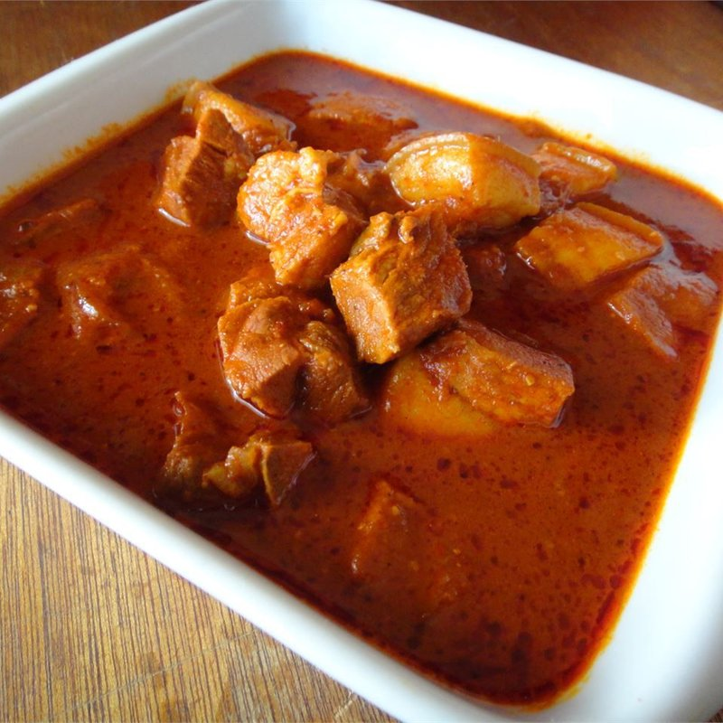

# Goan Pork Vindaloo

*The original Goan vindaloo: pork shoulder marinated overnight in a thick paste of Kashmiri chillies, vinegar and garlic, slow-cooked dark.*

**Serves:** 4

**Prep Time:** 25 minutes (plus 12 hours marinating)

**Cook Time:** 1 hour 30 minutes

## Overview
Whole Kashmiri red chillies soak in white wine vinegar; ground with garlic, ginger, cumin, peppercorns, cinnamon, cloves and mustard into a thick wet paste. Pork shoulder cubes marinate overnight in the paste. Browned in oil; cooked with onions, tomato and reserved marinade until the pork is tender and the gravy is glossy. Salt last. A small spoonful of jaggery balances the vinegar.

## Ingredients

### Paste
- 15 dried Kashmiri red chillies (de-stemmed)
- 4 dried bird's-eye chillies (for heat)
- 250 ml white wine vinegar (or palm vinegar)
- 1 tablespoon cumin seeds
- 1 teaspoon black peppercorns
- 6 cloves
- 1 stick cinnamon (broken)
- 1 teaspoon black mustard seeds
- ½ teaspoon cardamom seeds (from green pods)
- 8 garlic cloves
- 1 thumb fresh ginger
- 1 teaspoon caster sugar (or jaggery)

### Pork
- 1 kg pork shoulder (cut into 4 cm cubes)
- 4 tablespoons vegetable oil
- 3 onions (medium, finely chopped)
- 2 fresh tomatoes (grated)
- 400 ml hot water
- 1 tablespoon palm jaggery (or brown sugar)
- 1 ½ teaspoons salt (added later)

## Method

### Stage 1 - Soak and grind the paste
1. Soak the dried chillies in the vinegar 2 hours or until soft (or 30 minutes if you crush them slightly).
1. Toast cumin, peppercorns, cloves, cinnamon, mustard and cardamom in a dry pan 30 seconds until aromatic.
1. Grind the toasted spices to a fine powder.
1. Tip soaked chillies (with vinegar), spices, garlic, ginger and 1 teaspoon sugar into a blender.
1. Blitz to a thick smooth paste, adding a splash more vinegar if needed.

### Stage 2 - Marinate
1. Pat the pork dry. Rub all over with two thirds of the paste; reserve the rest.
1. Cover; refrigerate 12 hours minimum, ideally 24.

### Stage 3 - Cook
1. Heat the oil in a heavy pot over medium-high.
1. Lift the pork from the marinade (reserve the marinade); brown in batches, 4-5 minutes per side. Set aside.
1. In the same pot, soften the onions 10 minutes until deep gold.
1. Stir in the grated tomato; reduce 5 minutes.
1. Return the pork; add all reserved marinade.
1. Pour in the hot water; bring to a simmer.
1. Cover; cook on low 1 hour 15 minutes, until the pork is tender and the gravy is thick.

### Stage 4 - Season
1. Stir in the salt and jaggery.
1. Taste; balance vinegar (add lime juice if too sweet, jaggery if too sharp).
1. Simmer uncovered 10 minutes if the gravy is too thin.

### Stage 5 - Serve
1. Rest 15 minutes. Vindaloo improves on resting.
1. Serve over plain basmati rice or with pao (Goan bread).

## Notes
- **Real vindaloo is not the BIR phaal:** This is the authentic Goan dish, mild-to-medium hot, defined by vinegar and garlic. The British curry-house "vindaloo" is a separate creation and uses chilli powder for shock heat.
- **Kashmiri chillies:** Deep red, mild-medium heat, fruity. They give the colour without overwhelming heat. Use bird's-eye to lift the heat where you want it.
- **Make a day ahead:** The flavours deepen significantly overnight. Refrigerate the cooked curry and reheat the next day for best results.

## Storage
- Refrigerate 4 days. Better on day 2 and 3.
- Freezes 3 months.
