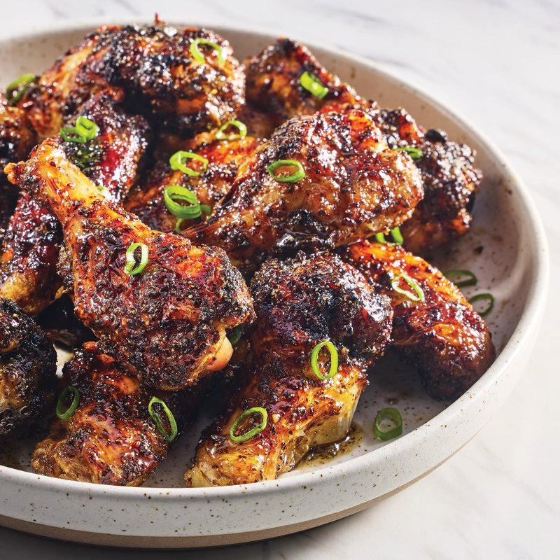

# Gunpowder Chicken

*A South Indian gunpowder chicken: bone-in chicken stir-fried hot with idli podi, a fiery dry blend of toasted lentils and chillies.*

**Serves:** 4

**Prep Time:** 10 minutes

**Cook Time:** 20 minutes

## Overview
The Indian-takeaway answer to fried chicken: tender chicken-breast pieces marinated in garlic, cumin, coriander and lemon, dredged in gram-flour batter and deep-fried gold, then tossed warm with tamarind chutney, green chilli pickle, sliced fresh chilli and red onion. The gram flour gives a naturally gluten-free crust that crisps deeper and stays crisper than a wheat-flour coating; the toppings push the dish from a plain snack into something closer to a Mumbai street-food bowl. The crust must be properly thick, with the gram-flour coating pressed firmly onto each piece before the oil hits, or the batter sloughs off in the fryer. Cinnamon in the marinade is the canonical Indian touch that distinguishes this from generic popcorn chicken; the warm spice carries through the bite of the chicken and underneath the punchier tamarind and chilli toppings.

## Ingredients
### Protein
- 2 chicken breasts (large), chopped into 2 cm (¾ inch) pieces

### Aromatics
- 2 tsp crushed garlic

### Spices
- 1 tbsp ground cumin
- 1 tbsp ground coriander
- 2 tsp ground cinnamon
- ½ tsp salt (plus extra for tossing)

### Acid
- ½ lemon (juice)

### Binder
- 1 egg, beaten

### Coating
- 380 g (generous 3 cups) gram (chickpea) flour

### Oil
- Vegetable oil, for deep frying

### Toppings
- 1 red chilli (large), finely sliced
- ½ red onion, finely sliced
- 1 tbsp chopped fresh coriander (fresh coriander)
- 2 tbsp [Tamarind Chutney](sauces-pickles/tamarind-chutney.md)
- 2 tbsp Green Chilli Pickle

## Method

### Stage 1 - Marinate chicken
1. In mixing bowl, toss chicken with garlic, cumin, coriander, cinnamon, ½ tsp salt, and lemon juice.

### Stage 2 - Coat with batter
1. Add beaten egg; mix well.
1. Toss chicken in gram flour, coating fully; knock off excess.

### Stage 3 - Fry chicken
1. Heat deep-fat fryer to 180°C (350°F) or saucepan with 4 cm (1 ½ inches) oil over medium-high.
1. Test oil with small batter piece; should float.
1. Fry in small batches 6-8 mins until golden and cooked through.
1. Drain on paper towels.

### Stage 4 - Toss and serve
1. In large bowl, toss fried chicken with red chilli, onion, coriander, tamarind chutney, green chilli pickle, and extra salt.
1. Serve immediately.

## Notes
- Use chicken thighs for tender, rich version as in India.
- Ensure oil is hot enough to avoid soggy coating.
- Gluten-free due to gram flour.

## Serving
- Serve as appetizer or snack with extra chutneys.
- Garnish with more coriander.

## Storage
- Best eaten fresh; refrigerate cooked chicken 1-2 days.
- Reheat in oven at 180°C to crisp up.
- Freeze uncooked coated chicken up to 1 month; fry from frozen, adding 2 mins.
