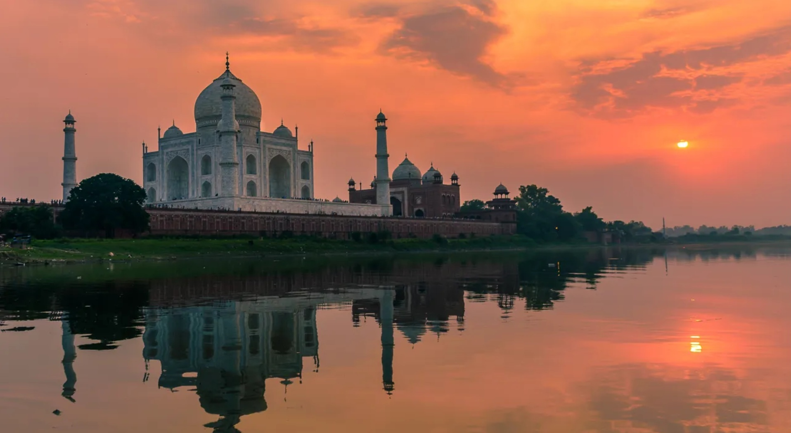

# Indian Cuisine

A vast, regional cuisine where spice work is the defining art. Blends like garam masala, panch phoron and individual masala mixes layer warmth, heat and aromatics across curries, rice, breads and pickles. Tandoor cooking, slow-simmered gravies, dum-style steaming and the British curry-house BIR method (pre-cooked meat finished in seconds in spiced base gravy) all sit here.
