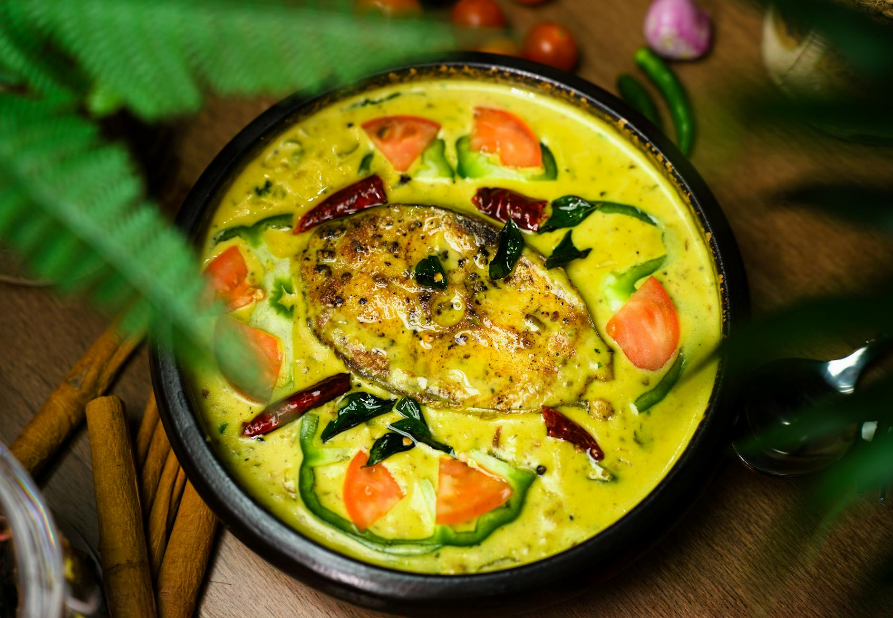

# Kerala Fish Curry

*Coastal Kerala fish curry: firm white fish simmered in a coconut-and-tamarind gravy fragranced with curry leaves, fenugreek and shallots. Bright red, sharp and rich at once.*

**Serves:** 4

**Prep Time:** 15 minutes

**Cook Time:** 25 minutes

## Overview
Kerala fish curry is the coastal South Indian fish dish that lands beside steamed red rice in every Malayali home from Kochi to Trivandrum, a vivid red-orange gravy of coconut milk and tamarind perfumed with curry leaves, fenugreek and shallots, with firm white fish poached just to set in the sauce. The dish belongs to the wider South Indian curry-leaf-and-coconut tradition but distinguishes itself with kudampuli (Malabar tamarind, a smoked variety the locals call "fish tamarind"), the sour edge that defines Kerala's seafood cooking and that no other tamarind quite replaces. Coconut oil for the temper is the second non-negotiable detail; the oil carries the dish's distinct aromatic signature in a way that sunflower or vegetable oils can't. Mustard seeds and fenugreek bloom in the hot oil with curry leaves at the start, the masala paste of shallot, ginger, garlic and red chilli follows, then coconut milk and tamarind water build the gravy. The fish goes in last and barely cooks; over-stirring breaks the pieces. Eat with hot red rice and a side of avial.

## Ingredients

### Fish
- 600 g firm white fish (kingfish, sea bream, hake or pollock; cut into 4 cm pieces)
- ½ teaspoon turmeric
- ½ teaspoon salt
- ½ lime (juice)

### Curry
- 3 tablespoons coconut oil
- 1 teaspoon black mustard seeds
- ½ teaspoon fenugreek seeds
- 20 fresh curry leaves
- 6 shallots (thinly sliced) (or 1 small red onion)
- 25 g fresh ginger (finely chopped)
- 6 garlic cloves (finely chopped)
- 2-3 green chillies (slit)
- 2 teaspoons Kashmiri chilli powder (mild, for colour)
- 1 teaspoon ground coriander
- ½ teaspoon turmeric
- 1 tomato (chopped)
- 2 tablespoons tamarind paste (or 1 walnut-sized lump of tamarind soaked in 100 ml hot water and strained)
- 400 ml coconut milk
- 200 ml water
- 1 teaspoon salt (to taste)

### To finish
- 10 fresh curry leaves
- 1 tablespoon coconut oil

## Method

### Stage 1 - Marinate the fish
1. Rub the fish pieces with turmeric, salt and lime juice.
1. Set aside for 10 minutes.

### Stage 2 - Temper
1. Heat the coconut oil in a wide, heavy pan over medium heat.
1. Add the mustard seeds; when they pop, add the fenugreek seeds and curry leaves.
1. Sizzle for 30 seconds.

### Stage 3 - Build the masala
1. Add the sliced shallots and a pinch of salt.
1. Cook for 6-8 minutes until soft and lightly browned.
1. Stir in the ginger, garlic and green chilli; cook for 1 minute.
1. Add the Kashmiri chilli, ground coriander and turmeric; cook for 30 seconds.

### Stage 4 - The gravy
1. Add the chopped tomato; cook for 4-5 minutes until soft.
1. Pour in the tamarind paste and water; bring to a simmer for 5 minutes.
1. Add the coconut milk and salt.
1. Bring to a gentle simmer.

### Stage 5 - Poach the fish
1. Slide the fish into the curry in a single layer.
1. Cover and simmer over very low heat for 6-8 minutes, until the fish is just cooked through (don't stir; tilt the pan to baste).
1. Taste the gravy and adjust salt.

### Stage 6 - Final tempering
1. In a small pan, heat the second tablespoon of coconut oil.
1. Add the second batch of curry leaves; once they crisp, pour the oil over the curry.

### Stage 7 - Serve
1. Rest the curry off the heat for 10 minutes (the gravy thickens and the fish settles).
1. Serve with steamed rice or appam.

## Notes
- **Coconut oil is the dish:** Vegetable oil works but Kerala fish curry is built around the perfume of coconut oil. The first temper bloom is where the flavour starts.
- **Don't stir the fish:** Once the fish is in, you tilt the pan, not stir. Stirring breaks the pieces and makes the gravy cloudy.
- **Tamarind matters:** It's the counter-balance to the coconut milk. Kerala curries are bright with acid; without it the gravy tastes flat.

## Storage
- Refrigerate up to 2 days. The flavour improves overnight.
- Don't freeze; the coconut milk separates and the fish gets rubbery.
