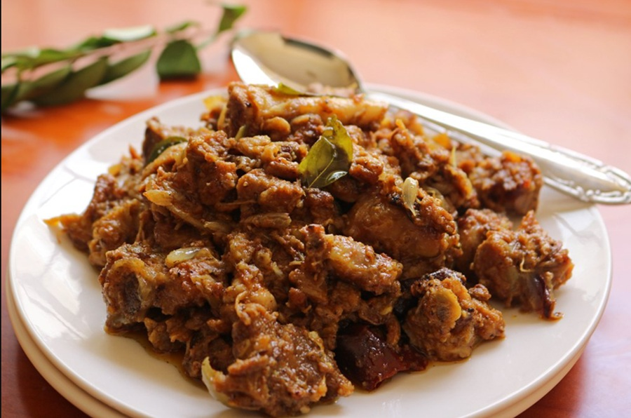

# Mutton Sukka

*Tamil-style dry mutton: lamb (or goat) braised tender then finished hard with a black-pepper, fennel and coconut masala. The Chettinad-region answer to a thick stew, served bone-dry with rice or roti.*

**Serves:** 4

**Prep Time:** 20 minutes

**Cook Time:** 1 hour 30 minutes

## Overview
Lamb chunks are braised gently with turmeric, ginger-garlic paste and a small handful of whole spices until tender. A separate pan toasts a Chettinad-style spice blend (black pepper, fennel, coriander, cumin, dried red chillies, fresh grated coconut) and grinds it to a coarse paste. The braised lamb is folded into a base of fried onion and curry leaves, the masala paste added, and the dish cooked uncovered until all the liquid has gone and the spice has caked onto the meat.

## Ingredients

### Lamb braise
- 800 g lamb shoulder (cut into 3 cm cubes, on or off the bone)
- 1 teaspoon turmeric
- 1 tablespoon ginger-garlic paste (or 1 tablespoon each finely grated ginger and garlic)
- 1 teaspoon salt
- 1 cinnamon stick (small)
- 4 cloves
- 2 green cardamom pods
- 600 ml water

### Sukka masala
- 1 tablespoon coriander seeds
- 1 teaspoon cumin seeds
- 1 teaspoon fennel seeds
- 1 tablespoon black peppercorns
- 4 dried Kashmiri chillies (or 2 Kashmiri + 1 hotter)
- 30 g fresh grated coconut (or 25 g desiccated coconut, rehydrated in 2 tablespoons of warm water)
- 2 cloves
- 1 cinnamon stick (small)

### To finish
- 3 tablespoons coconut oil (or sesame/gingelly oil)
- 2 onions (finely sliced)
- 20 fresh curry leaves
- 25 g fresh ginger (cut into matchsticks)
- 6 garlic cloves (sliced)
- 2 green chillies (slit)
- ½ teaspoon salt (to adjust)
- A handful of coriander (chopped)
- ½ lime (juice)

## Method

### Stage 1 - Braise the lamb
1. Place the lamb in a pot with the turmeric, ginger-garlic paste, salt, whole spices and water.
1. Bring to a boil; skim any foam.
1. Reduce to a low simmer.
1. Cover partially and cook for 1 hour to 1 hour 15 minutes, until the lamb is tender.
1. Lift the lamb out and reserve the braising liquor (about 300 ml).

### Stage 2 - Make the sukka masala
1. In a dry pan over medium-low heat, toast the coriander, cumin and fennel for 30 seconds.
1. Add the peppercorns, dried red chillies, fresh coconut, cloves and cinnamon.
1. Toast for 2-3 minutes, stirring, until the coconut darkens to medium brown and the kitchen smells of toasted spice (don't let it burn).
1. Cool, then grind to a coarse paste in a spice grinder (or pestle and mortar) with 2 tablespoons of the reserved braising liquor.

### Stage 3 - Build the base
1. Heat the coconut oil in a wide pan over medium heat.
1. Add the curry leaves; sizzle for 10 seconds.
1. Add the sliced onions and a pinch of salt.
1. Cook for 8-10 minutes until deep golden.
1. Stir in the ginger matchsticks, sliced garlic and green chilli; cook for 2 minutes.

### Stage 4 - Combine and dry-fry
1. Add the cooked lamb and any clinging spice.
1. Pour in the masala paste.
1. Stir to coat every piece.
1. Add 150 ml of the reserved braising liquor.
1. Cook uncovered over medium-high heat for 10-12 minutes, stirring often, until the liquid has all but evaporated and the masala has caked onto the lamb (this is the sukka stage, where the dish dries out).
1. Taste and adjust salt.

### Stage 5 - Finish
1. Squeeze the lime juice over and stir.
1. Scatter the coriander.
1. Serve with steamed rice, chapati or paratha.

## Notes
- **Sukka means dry:** The defining stage is the dry-fry at the end. Pull it before the spice caramelises so thoroughly that it burns, but don't stop it while there's still gravy in the pan.
- **Toast the coconut:** Browning the fresh coconut is what gives the masala its deep, dark, faintly bitter quality. Pale coconut gives a one-note dish.
- **Mutton or lamb:** Indian "mutton" is usually goat. Lamb shoulder is the home cook's substitute and works well; expect a sweeter, milder finish than goat.

## Storage
- Refrigerate up to 4 days; the flavour intensifies overnight.
- Freezes well for 2 months.
