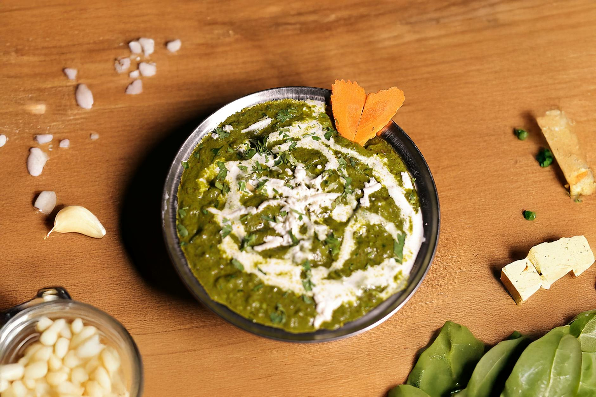

# Palak Paneer

*Spinach and paneer in a smooth, deeply green gravy. A Punjabi staple where the spinach is blanched briefly to hold its colour and pureed for a silky finish.*

**Serves:** 4

**Prep Time:** 15 minutes

**Cook Time:** 30 minutes

## Overview
Spinach is blanched for one minute then plunged into iced water (a step that locks the colour bright green). The drained spinach is blended with green chilli into a smooth puree. A masala of onion, ginger, garlic and tomato is built and the puree stirred in. Cubes of paneer, lightly pan-fried, are added at the end so they sit on top of the gravy rather than dissolving into it. Finished with cream and kasuri methi.

## Ingredients

### Spinach puree
- 500 g fresh spinach (or 350 g frozen, thawed and squeezed)
- 1-2 green chillies (chopped)
- A small handful of fresh coriander (stems included)

### Paneer
- 300 g paneer cheese (cut into 2 cm cubes)
- 2 tablespoons oil
- ¼ teaspoon turmeric

### Masala
- 2 tablespoons ghee (or oil)
- 1 teaspoon cumin seeds
- 1 onion (large, finely chopped)
- 4 garlic cloves (finely chopped)
- 30 g fresh ginger (finely grated)
- 2 ripe tomatoes (chopped, or 1 tablespoon tomato paste plus 100 ml water)
- 1 teaspoon ground coriander
- 1 teaspoon Kashmiri chilli powder
- ½ teaspoon turmeric
- 1 teaspoon [Garam Masala](Spice-Mixes/garam-masala.md)
- 1 teaspoon salt (to taste)

### To finish
- 80 ml double cream
- 1 teaspoon kasuri methi (crushed between palms)
- ½ teaspoon [Garam Masala](Spice-Mixes/garam-masala.md)
- A knob of butter

### To serve
- A drizzle of cream
- Naan, roti (or basmati rice)

## Method

### Stage 1 - Blanch the spinach
1. Bring a pot of salted water to a boil and prepare a large bowl of iced water.
1. Drop the spinach into the boiling water for 1 minute (the leaves will collapse).
1. Lift out with tongs and plunge into the iced water; leave for 1 minute.
1. Drain and squeeze hard to remove excess water.

### Stage 2 - Blend the puree
1. Place the drained spinach in a blender with the green chilli and coriander.
1. Blend to a smooth bright-green puree (a little water if needed to keep the blade turning).

### Stage 3 - Fry the paneer
1. Heat the 2 tablespoons of oil in a frying pan over medium heat.
1. Toss the paneer cubes with the ¼ teaspoon of turmeric.
1. Fry for 1-2 minutes a side until golden on the edges; lift out and set aside.
1. If the paneer feels firm, soak the fried cubes in warm salted water for 5 minutes to keep them tender (a chef's trick).

### Stage 4 - Build the masala
1. In a wide pan, heat the ghee over medium heat.
1. Add the cumin seeds and let them sizzle for 15 seconds.
1. Add the chopped onion and a pinch of salt; cook for 8-10 minutes until golden.
1. Stir in the garlic and ginger; cook for 1 minute.
1. Add the chopped tomato, ground coriander, Kashmiri chilli, turmeric and salt.
1. Cook for 6-8 minutes until the tomato breaks down and the oil separates at the edges.

### Stage 5 - Combine
1. Lower the heat (high heat kills the green colour).
1. Pour the spinach puree into the masala.
1. Stir to combine; add 100 ml hot water to loosen if very thick.
1. Cook for 4-5 minutes (no longer, or the spinach turns olive).
1. Stir in the drained paneer, the cream, the kasuri methi and the garam masala.
1. Simmer gently for 3 minutes.
1. Taste and adjust salt; finish with a knob of butter.

### Stage 6 - Serve
1. Ladle into a serving bowl, drizzle with cream and serve with naan, roti or rice.

## Notes
- **Blanch and ice for the colour:** Cooked spinach turns olive within 10 minutes of heat. The blanch-and-ice step is what keeps palak paneer bright green; skipping it gives a grey-green dish.
- **Don't cook the puree long:** Stir the puree in over low heat for just enough time to warm through. Long simmering darkens it.
- **Paneer water trick:** Soaking fried paneer in warm salted water rehydrates it back to soft. Restaurants do this; home cooks rarely know.

## Storage
- Refrigerate up to 3 days; the colour dulls but the flavour holds.
- Freezing turns the paneer rubbery; not recommended.
