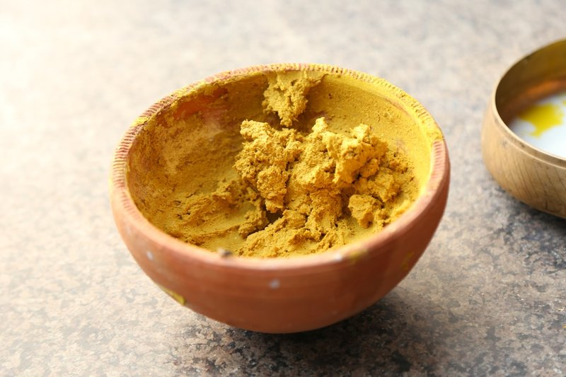

# Chasni Paste

*The wet chasni paste: mango chutney, ketchup, yogurt and lemon whisked with toasted spices.*

**Makes:** About 1 cup

**Prep Time:** 5 minutes

## Overview
The wet sweet-and-tangy paste that anchors the British curry-house chasni and pathia: mango chutney, tomato ketchup, lemon juice and a touch of red food colouring blended smooth into a thick orange-pink paste that goes into the curry pan to give the dish its signature creamy sweet-sour profile. Chasni is one of the curry-house inventions of the 1980s Glasgow Indian restaurants, where Punjabi chefs and Glaswegian palates met in the middle to produce dishes sweeter and milder than anything actually eaten in India. Mango chutney is non-negotiable; the traditional brand is Patak's, and supermarket alternatives never quite match the proper sweetness. Ketchup is the curry-house secret that every chef will deny but every kitchen actually uses; it gives the paste its red colour and a quiet sweet-savoury depth. The paste keeps a fortnight refrigerated, so it's worth making a jar to keep on hand.

## Ingredients
### Sweeteners
- 175 g [Mango Chutney](../sauces-pickles/mango-chutney.md)

### Sauces
- 4 tbsp tomato ketchup

### Acid
- 4 tbsp lemon juice

### Color
- 2 tsp red food colouring

## Method

### Stage 1 - Combine ingredients
1. Place all ingredients in a bowl.

### Stage 2 - Blend
1. Blend into a smooth paste using a blender or immersion blender.

## Notes
- Adjust lemon juice for desired tanginess.
- Store in an airtight container to maintain freshness.
- Used as a base for curries; adds sweetness and color.

## Serving
- Not served directly; incorporated into curries.

## Storage
- Refrigerate in airtight container up to 2 weeks.
- Freeze in small portions up to 3 months; thaw before use.
