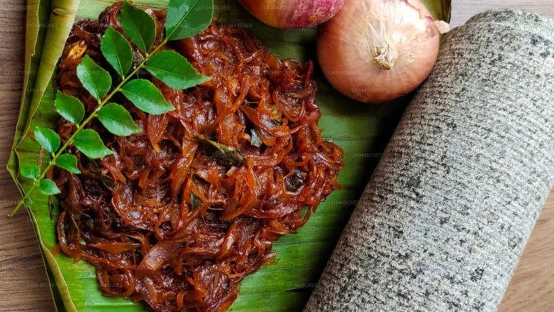

# Fried Onion Paste

*A pre-made fried-onion paste: onions slow-fried till deep brown and almost-burnt, blitzed to a sticky dark paste.*

**Makes:** About 1 cup paste

**Prep Time:** 5 minutes

**Cook Time:** 5 minutes

## Overview
The make-ahead fried-onion paste that gives professional North Indian and Mughlai cooking its depth: sliced onions deep-fried in plenty of oil till light brown (they darken further as they cool), then blitzed with a splash of water or yogurt into a sticky dark paste that keeps a week in the fridge or freezes for a month. The paste is the secret behind every restaurant biryani, every dopiaza, every nihari and every korma. The onion has done all its sweet caramelised work in advance and stirs straight into the curry in seconds, where it would otherwise need 20 to 25 minutes of stove time. Pulling the onions when light brown is critical; they keep cooking on their own heat after coming out of the oil and overshoot to bitter dark if pulled too late. The frying oil should be saved and reused; it carries a beautiful sweet onion flavour straight into the next curry.

## Ingredients
### Fat
- Rapeseed oil, for deep-frying (enough to cover onions)

### Vegetables
- 2 onions (large), finely sliced

### For paste
- Water (or yoghurt), as needed for blending

## Method

### Stage 1 - Fry onions
1. Heat oil in large heavy-based pan over high heat.
1. Test oil by dropping a piece of onion; it should sizzle and float.
1. Add sliced onions; fry until light brown, about 5 mins.
1. Remove with wire mesh spoon to paper-lined plate to drain.

### Stage 2 - Make paste
1. Once cool, add a little water or yoghurt.
1. Blend to smooth paste.

## Notes
- Onions will darken further after frying, so remove when light brown.
- Reuse the oil in curries for enhanced flavor.
- Store paste in fridge for up to 1 week.

## Serving
- Not served directly; used as ingredient in curries and marinades.

## Storage
- Refrigerate paste in airtight container up to 1 week.
- Freeze up to 1 month; thaw before use.
- Store fried onions separately if not making paste immediately.
