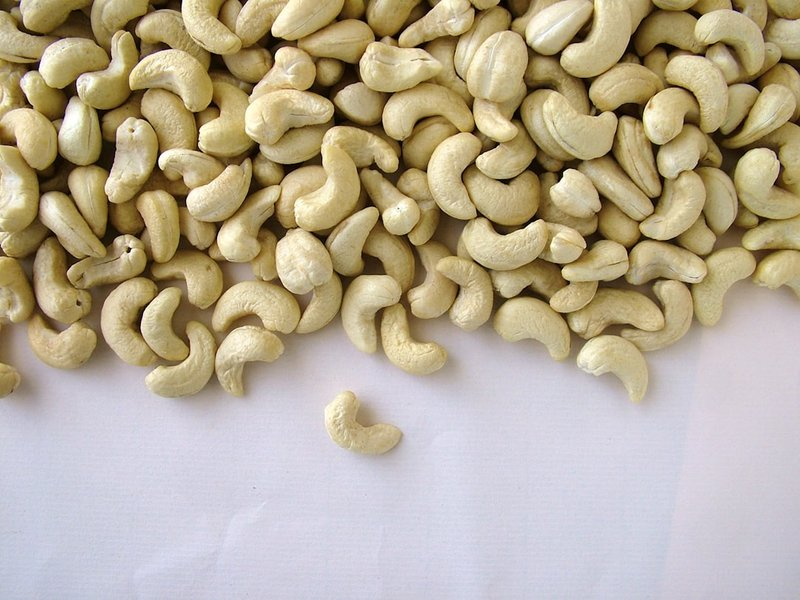

# Raw Cashew Paste

*A raw cashew paste: cashews soaked till tender and blended smooth with a little water.*

**Makes:** Variable (as needed)

**Prep Time:** 35 minutes

## Overview
The smooth ivory paste that thickens and enriches a thousand Indian and Mughlai dishes: raw cashews soaked till tender then blended with just enough cold water to make a silky purée that goes into kormas, butter chicken, malai dishes and creamy biryani gravies. The cashew is the canonical Mughlai-Indian thickener (alongside almond and poppy seed), the way South Indian cooks reach for coconut and Western cooks reach for cream; it adds body and a quiet sweetness without dairy. Raw cashews are essential, not roasted or salted; roasted cashews give a brown nutty colour where you want pale ivory, and the cooked nuts blend grainy rather than silky. The soak is non-negotiable; without it, the paste comes out gritty and never quite smooths into a sauce. Keeps three days in the fridge, freezes a month in small portions for instant curry thickening.

## Ingredients
### Nuts
- Raw cashews, quantity as needed

### Liquid
- Cold water, for soaking and blending (enough to cover cashews and blend)

## Method

### Stage 1 - Soak cashews
1. Soak raw cashews in cold water for about 30 minutes.

### Stage 2 - Blend to paste
1. Drain cashews.
1. Place in spice grinder or blender.
1. Add just enough fresh water to blend to smooth paste.

## Notes
- Use in curries for thickening and flavor.
- Adjust water for desired consistency.
- Raw cashews provide a fresh, nutty taste.

## Serving
- Not served directly; incorporated into curries.

## Storage
- Refrigerate in airtight container up to 3 days.
- Freeze up to 1 month; thaw before use.
