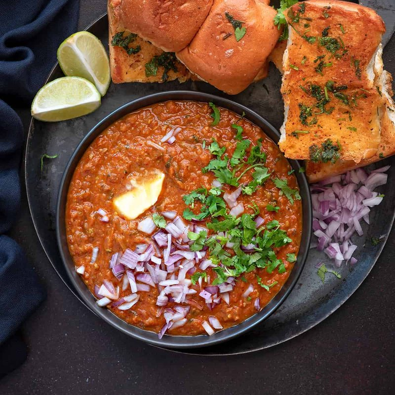

# Pav Bhaji

*Mumbai's night-market plate: a thick spiced mash of vegetables, scooped with butter-griddled pav rolls. Built around pav bhaji masala.*

**Serves:** 4

**Prep Time:** 20 minutes

**Cook Time:** 35 minutes

## Overview
Potatoes, cauliflower, peas boil until tender. A masala base softens onions and tomatoes in butter with ginger-garlic paste, then chilli powder, turmeric and pav bhaji masala. Capsicum joins. Boiled vegetables mash in roughly; everything cooks together 10-15 minutes, mashing as you go, until the bhaji turns a deep orange-red and the consistency is thick-spreadable. Finishes with extra butter, lemon juice, coriander. Pav rolls split horizontally, griddle-fry in butter with a sprinkle of pav bhaji masala till the cut sides char. Serve bhaji in shallow bowls topped with diced raw onion, lemon wedges, a coriander shower; pav on the side.

## Ingredients

### Boiled vegetables
- 2 potatoes (large, about 350 g, peeled, cubed 2 cm)
- 200 g cauliflower florets
- 100 g frozen peas
- 1 carrot (small, peeled, diced)
- 1 teaspoon salt
- Water to cover

### Bhaji
- 80 g unsalted butter (plus more to finish)
- 2 tablespoons vegetable oil
- 1 onion (large, finely diced)
- 1 tablespoon ginger-garlic paste
- 2 green chillies (finely chopped)
- 1 green capsicum (deseeded, finely diced)
- 4 ripe tomatoes (finely chopped, or 400 g tinned chopped tomatoes)
- 2 tablespoons pav bhaji masala (the dedicated blend, MDH / Everest / Catch - substitute: 1 tablespoon garam masala + 1 teaspoon amchur + ½ teaspoon kasuri methi if unavailable)
- 1 teaspoon Kashmiri chilli powder (gives colour without scorching heat)
- 1 teaspoon ground cumin
- ½ teaspoon turmeric
- 1 ½ teaspoons salt (or to taste)
- 2 tablespoons lemon juice
- 30 g fresh coriander (chopped)

### To serve
- 8 pav rolls (soft milk bread; substitute: brioche buns or soft hot-dog rolls)
- 40 g butter (for griddling the pav)
- 1 teaspoon pav bhaji masala (for the pav)
- 1 red onion (small, very finely diced)
- 2 lemons (cut into wedges)
- Extra coriander (chopped)

## Method

### Stage 1 - Boil vegetables
1. In a saucepan, combine potatoes, cauliflower, peas, carrot, salt and enough water to cover.
1. Bring to a boil; cook 10 minutes until everything is fork-tender.
1. Drain (reserve a cup of the cooking water).
1. Mash roughly with a potato masher (leave some texture, not pure paste).

### Stage 2 - Aromatic base
1. Heat the butter and oil in a wide heavy pan over medium-high heat.
1. Add the diced onion; cook 6 minutes until soft and translucent.
1. Stir in the ginger-garlic paste and green chillies; cook 1 minute.
1. Add the capsicum; cook 4 minutes till softened.

### Stage 3 - Tomato simmer
1. Add the chopped tomatoes; cook 8-10 minutes, mashing with the back of a wooden spoon, until the tomatoes break down completely and the mixture turns a deep red.
1. Stir in the pav bhaji masala, Kashmiri chilli powder, cumin, turmeric and salt.
1. Cook 1 minute till the spices bloom.

### Stage 4 - Combine
1. Tip the mashed boiled vegetables into the masala.
1. Pour in 200 ml of the reserved cooking water.
1. Mash and stir continuously over medium heat 10-12 minutes.
1. The bhaji should darken to a deep orange and thicken to a spreadable consistency.
1. Add more cooking water if it gets too thick.

### Stage 5 - Finish
1. Stir in another knob of butter (about 20 g) at the end.
1. Off heat; squeeze in the lemon juice; fold in half the chopped coriander.

### Stage 6 - Griddle the pav
1. Split each pav roll horizontally without cutting all the way through.
1. Heat 40 g butter in a wide flat pan with the 1 teaspoon pav bhaji masala swirled in.
1. Lay the pav split-side-down in the spiced butter; press lightly.
1. Cook 1-2 minutes till the cut surface is golden and the butter has soaked in.

### Stage 7 - Serve
1. Ladle the bhaji into shallow bowls.
1. Top with a generous pile of diced red onion, more coriander, and a small cube of butter melting on top.
1. Pav on the side; lemon wedges.
1. Eat by tearing the pav and using it to scoop bhaji.

## Notes
- **Pav bhaji masala is the soul:** the dedicated commercial blend (with kokum, dried fenugreek, dry mango) is what makes this dish distinct from a generic vegetable curry. Indian grocers stock several brands; MDH is the most common. The substitute works but is noticeably different.
- **Mash, don't blend:** bhaji wants visible vegetable texture. A blender turns it into baby food.
- **Generous butter, both ways:** Mumbai street stalls famously cook bhaji in shallow lakes of butter. Don't skimp; the dish doesn't work lean.
- **Pav is non-negotiable:** soft, slightly sweet milk-bread rolls - not crusty bread. Indian groceries sell pav rolls; brioche buns are the best substitute.

## Storage
- Bhaji keeps 4 days refrigerated; reheat with a splash of water in a pan over low heat.
- Don't pre-griddle pav - do it to order; reheated griddled pav is leathery.
- Freezes 2 months without the pav; thaw overnight and reheat.
