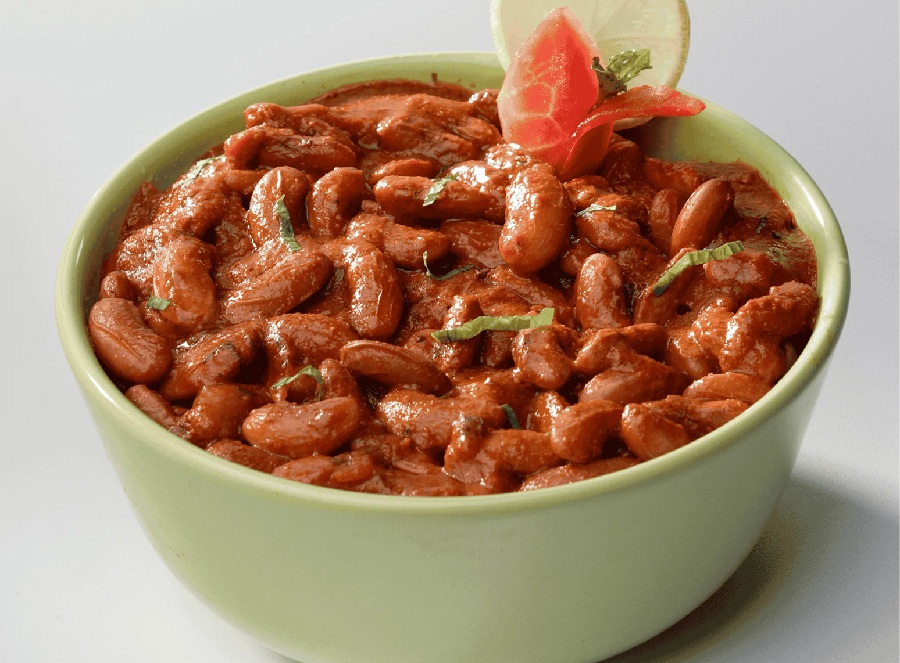

# Rajma

*Punjabi red kidney bean curry, simmered in a deeply spiced tomato-onion gravy. Served the traditional way: rajma-chawal, with steamed basmati rice.*

**Serves:** 4-6

**Prep Time:** 15 minutes (plus overnight soak)

**Cook Time:** 1 hour 30 minutes

## Overview
Rajma is the Punjabi household red-kidney-bean curry and the comfort dish every North Indian eats with rice on a Sunday afternoon, plain spiced beans in a deep tomato-onion gravy that takes its time and rewards the patience. The dish belongs to the same lentils-and-pulses Punjabi tradition as dal makhani but stays leaner: no cream, no butter swirl at the end, just slowly simmered beans in a properly built masala. The bean soak overnight is non-negotiable. Dried kidney beans need a long rest in cold water to soften the skins, and using tinned beans gives a thinner less satisfying curry that misses what makes rajma worth the wait. The masala wants to be cooked down until the oil separates from the tomato-onion base; this oil-separation stage is the home-cook's test that the masala is properly developed, where a rushed sauce stays watery and one-dimensional. A few beans mashed against the pan thicken the gravy without needing flour or starch. The dish pairs traditionally with steamed basmati as rajma-chawal, a meal so loved that "rajma-chawal Sunday" is shorthand for home across the Punjab.

## Ingredients

### Beans
- 300 g dried red kidney beans (soaked overnight in plenty of cold water)
- 1.2 litres water (for cooking)
- 1 teaspoon salt
- 1 bay leaf

### Whole spices
- 3 tablespoons ghee (or oil + butter)
- 1 teaspoon cumin seeds
- 1 cinnamon stick (small)
- 2 black cardamom pods (or 3 green if unavailable)
- 4 cloves
- 1 bay leaf

### Masala
- 2 onions (finely chopped)
- 6 garlic cloves (finely chopped)
- 30 g fresh ginger (finely grated)
- 2 green chillies (slit)
- 4 ripe tomatoes (pureed, or 400 g tinned chopped tomatoes blended smooth)
- 1 tablespoon tomato paste
- 1 teaspoon Kashmiri chilli powder
- 1 teaspoon ground coriander
- 1 teaspoon ground cumin
- ½ teaspoon turmeric
- 1 teaspoon [Garam Masala](Spice-Mixes/garam-masala.md)
- 1 teaspoon salt (to taste)

### To finish
- 1 teaspoon [Garam Masala](Spice-Mixes/garam-masala.md)
- 1 teaspoon kasuri methi (crushed between palms)
- A knob of butter

### To serve
- A handful of coriander
- Steamed basmati rice

## Method

### Stage 1 - Cook the beans
1. Drain the soaked kidney beans and rinse.
1. Place in a large pot with 1.2 litres of water, the salt and bay leaf.
1. Bring to a boil; skim the foam.
1. Reduce to a low simmer and cook for 1 hour 30 minutes to 2 hours, until completely tender (a pressure cooker reduces this to 25-30 minutes).
1. Test by pressing a bean between your fingers; it should crush with no resistance.

### Stage 2 - Build the whole spice base
1. Melt the ghee in a wide pan over medium heat.
1. Add the cumin seeds, cinnamon, black cardamom, cloves and bay; let them sizzle for 30 seconds.
1. Add the chopped onions and a pinch of salt.
1. Cook for 12-15 minutes, stirring, until the onions are deep golden brown (the colour of the gravy depends on this).

### Stage 3 - Build the masala
1. Add the garlic, ginger and green chilli; cook for 2 minutes.
1. Stir in the tomato paste, Kashmiri chilli, ground coriander, ground cumin, turmeric and 1 teaspoon garam masala; cook for 1 minute.
1. Pour in the tomato puree and salt.
1. Cook for 10-12 minutes, stirring, until the oil separates from the masala at the edges (this means the tomato has cooked through; rajma made before this point tastes raw).

### Stage 4 - Combine
1. Tip the cooked kidney beans and 400 ml of their cooking liquor into the masala.
1. Bring to a gentle simmer.
1. Mash about ¼ of the beans against the side of the pan with the back of a spoon (this thickens the gravy and gives the dish its body).
1. Simmer for 30 minutes, stirring occasionally, until the gravy thickens to coat the back of a spoon.

### Stage 5 - Finish
1. Stir in the remaining 1 teaspoon of garam masala, the kasuri methi and the knob of butter.
1. Cook for 3 minutes.
1. Taste and adjust salt.

### Stage 6 - Serve
1. Scatter coriander and serve with steamed basmati rice and a wedge of lime.

## Notes
- **Cook the beans through:** Undercooked kidney beans are tough and can cause stomach upset (kidney beans contain a toxin destroyed only by full cooking). Boil hard for the first 10 minutes, then drop to simmer.
- **Mash some beans:** This step thickens the gravy without adding flour or cream. It's the difference between rajma and a thin bean stew.
- **The colour:** Properly browned onions and properly cooked tomatoes give a deep mahogany-red gravy. Pale rajma is undercooked rajma.

## Storage
- Refrigerate up to 4 days; the flavour deepens overnight.
- Freezes well for 2 months.
