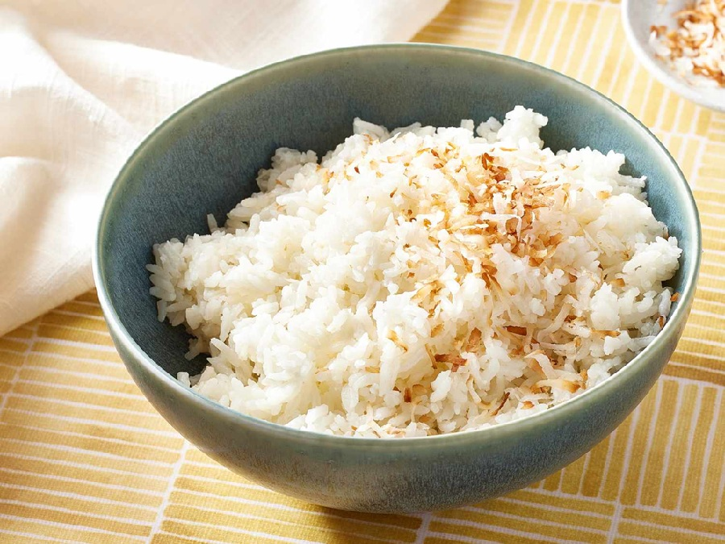

# Coconut Rice

*South Indian coconut rice: steamed rice tossed with a coconut, mustard-seed and curry-leaf temper, finished with cashews and roasted gram. A breakfast staple in Tamil Nadu; a quick lunchbox staple everywhere.*

**Serves:** 4

**Prep Time:** 10 minutes

**Cook Time:** 15 minutes (plus 25 minutes if cooking rice from scratch)

## Overview
Plain steamed rice (often last night's leftovers) is the base. A hot temper of mustard seeds, urad dal, chana dal, cashews, dried red chilli and curry leaves is bloomed in coconut oil, then fresh grated coconut is folded in and warmed through. The rice is tossed through everything off the heat, so the grains stay separate and pick up flavour rather than soften.

## Ingredients

### Rice
- 250 g basmati (or sona masuri rice, cooked and cooled, about 600 g cooked weight)

### Temper
- 3 tablespoons coconut oil
- 1 teaspoon black mustard seeds
- 1 teaspoon urad dal (split black gram, white)
- 1 teaspoon chana dal (split bengal gram)
- 30 g raw cashews (whole or halves)
- 2 dried red chillies (broken in half)
- 1 teaspoon grated fresh ginger (optional)
- 20 fresh curry leaves
- A pinch of asafoetida (hing)

### Coconut
- 120 g fresh grated coconut (or 90 g desiccated, rehydrated in 4 tablespoons of warm water)
- 1 teaspoon salt (to taste)

### To serve
- A handful of coriander (chopped)
- A wedge of lime

## Method

### Stage 1 - Prepare the rice
1. If cooking from scratch, rinse the rice in cold water until clear, then steam covered with a 1:2 rice-to-water ratio for 15 minutes; rest covered for 10 minutes; fluff and spread on a tray to cool.
1. Leftover, fridge-cold rice works just as well; let it come close to room temperature.
1. Separate the grains gently with a fork.

### Stage 2 - Temper
1. Heat the coconut oil in a wide pan or wok over medium heat.
1. Add the mustard seeds; when they pop, add the urad dal and chana dal.
1. Cook for 30 seconds until the dals turn golden.
1. Add the cashews and dried red chillies; cook for 1 minute until the cashews are pale gold.
1. Add the ginger (if using), curry leaves and asafoetida; sizzle for 5 seconds.

### Stage 3 - Coconut
1. Tip in the grated coconut.
1. Stir for 1 minute until the coconut warms through and just starts to take on the faintest gold (no browning; the dish stays white).
1. Sprinkle in the salt.

### Stage 4 - Combine
1. Pull the pan from the heat.
1. Add the cooked rice in two batches, folding gently with a spatula to avoid breaking the grains.
1. Taste and adjust salt.

### Stage 5 - Serve
1. Scatter the coriander over.
1. Serve at room temperature with a wedge of lime and a side of pickle or a yogurt curry.

## Notes
- **Cold rice is best:** Hot rice from the pot turns gummy when tossed. South Indian rice dishes use cooled, leftover rice precisely for this reason; the grains separate cleanly.
- **Don't brown the coconut:** Coconut rice is white. Toasting the coconut would make a different dish (thengai sadam vs. coconut chutney rice).
- **Cashews and dals together:** The cashew gives soft crunch, the dals give hard crunch. Both are non-negotiable for the texture.

## Storage
- Refrigerate up to 2 days; eat at room temperature.
- Doesn't freeze well (the coconut goes oily on thaw).
