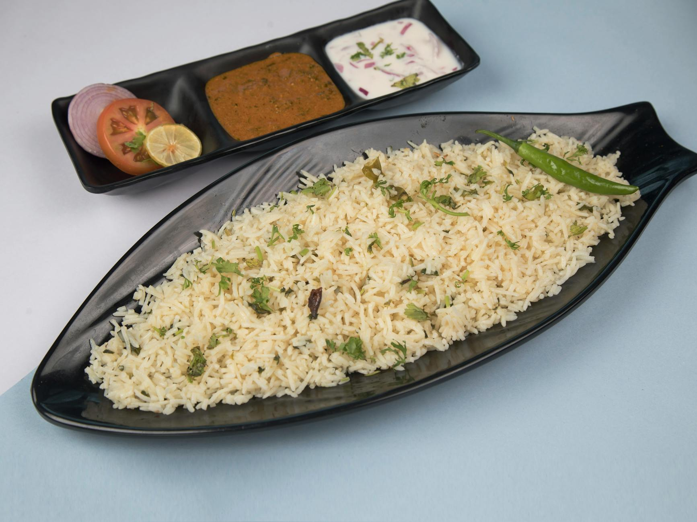

# Jeera Rice

*Basmati rice fragranced with cumin seeds and whole spices, finished with ghee. The North Indian everyday rice; pairs with everything from dal to butter chicken.*

**Serves:** 4

**Prep Time:** 5 minutes (plus 30 minutes soak)

**Cook Time:** 25 minutes

## Overview
Aged basmati rice is rinsed and soaked for 30 minutes (a step that helps the grains elongate during cooking). Ghee is heated and cumin seeds are bloomed with a small cluster of whole spices, the rice is added to coat in the spiced fat, then water is poured in and the pot covered to steam. The grains finish long, separate and fragrant.

## Ingredients
- 300 g aged basmati rice (rinsed until the water runs clear, soaked for 30 minutes)
- 600 ml water (or 550 ml if your rice is freshly bought)
- 2 tablespoons ghee (or oil + butter)
- 1 tablespoon cumin seeds
- 1 cinnamon stick (small)
- 4 cloves
- 3 green cardamom pods (lightly crushed)
- 1 bay leaf
- 1 teaspoon salt
- A small handful of coriander (chopped, to finish)

## Method

### Stage 1 - Soak the rice
1. Rinse the basmati rice in cold water 4-5 times until the water runs clear.
1. Cover with fresh cold water and soak for 30 minutes.
1. Drain well in a sieve and leave to dry briefly.

### Stage 2 - Bloom the spices
1. Heat the ghee in a saucepan with a tight-fitting lid over medium heat.
1. Add the cumin seeds and let them sizzle for 15-20 seconds (the seeds should darken but not blacken).
1. Add the cinnamon, cloves, cardamom and bay; sizzle for 30 seconds (the spices should perfume the ghee but not burn).

### Stage 3 - Coat the rice
1. Tip in the drained rice.
1. Stir gently for 1 minute to coat every grain in the spiced ghee.

### Stage 4 - Steam
1. Pour in the water and salt.
1. Bring to a boil.
1. Reduce to the lowest heat, cover with a tight-fitting lid.
1. Cook for 12-14 minutes (don't lift the lid).
1. Pull from the heat and rest, still covered, for 10 minutes.

### Stage 5 - Fluff and serve
1. Lift the lid and fluff the rice with a fork.
1. Discard the bay leaf (and the bigger whole spices if you like).
1. Scatter the coriander and serve.

## Notes
- **Soak the basmati:** Soaking lets the grains absorb water gently. They cook through evenly and elongate during cooking, giving the long, slender restaurant grain.
- **Aged basmati:** The label "aged" or "2-year-old" is worth seeking out. Aged grains hold their shape and develop a stronger aroma.
- **Don't peek:** Lifting the lid releases steam and gives uneven cooking. The 10-minute rest after cooking is just as important as the cooking itself.

## Storage
- Refrigerate up to 3 days; reheat covered with a tablespoon of water.
- Freezes well in portions for 2 months.
