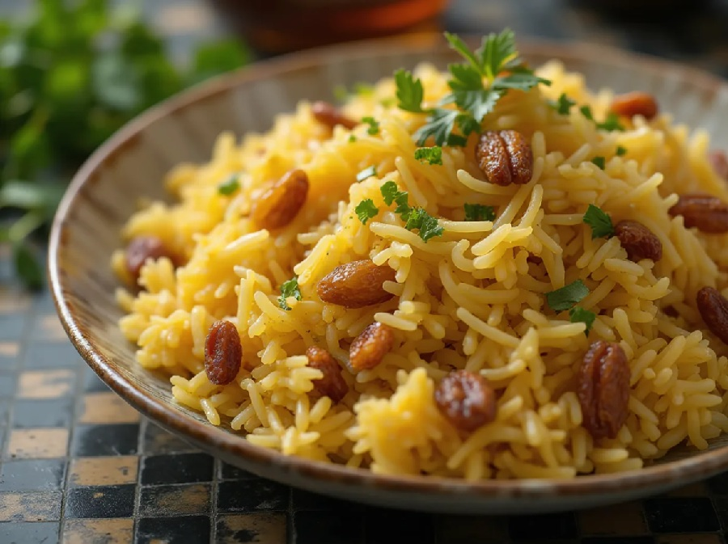

# Kashmiri Pulao

*Saffron rice studded with nuts, dried fruit and pomegranate. The fragrant Kashmiri counterpart to a biryani; sweet, floral, gentle on the heat.*

**Serves:** 4-6

**Prep Time:** 15 minutes (plus 30 minutes soak)

**Cook Time:** 30 minutes

## Overview
Saffron is bloomed in warm milk to draw the colour and aroma. Basmati is rinsed, soaked and drained. Whole spices, sliced almonds and cashews are toasted in ghee, then sultanas and pomegranate seeds are folded through. The toasted rice goes on top with milk-spiked water and the saffron milk, and the pot is covered to steam. Finished with a scatter of more nuts, fried onions and pomegranate seeds.

## Ingredients
- 300 g aged basmati rice (rinsed, soaked for 30 minutes)
- ¼ teaspoon saffron threads
- 3 tablespoons warm milk
- 3 tablespoons ghee
- 30 g flaked almonds
- 30 g cashews (broken in half)
- 30 g sultanas (or raisins)
- 1 cinnamon stick (small)
- 4 green cardamom pods (lightly crushed)
- 1 black cardamom pod
- 4 cloves
- 1 bay leaf
- ½ teaspoon fennel seeds
- ½ teaspoon caraway seeds (or cumin seeds)
- 1 teaspoon salt
- 1 tablespoon sugar
- 500 ml water
- 100 ml whole milk
- 50 g pomegranate seeds

### To finish
- 30 g fried onions (store-bought is fine, or use the recipe from matar pulao)
- A handful of extra pomegranate seeds
- A few extra toasted almonds

## Method

### Stage 1 - Bloom the saffron
1. Warm 3 tablespoons of milk in a small bowl.
1. Crumble the saffron threads in and leave to steep for 10 minutes.

### Stage 2 - Toast the nuts
1. Heat the ghee in a saucepan with a tight-fitting lid over medium heat.
1. Add the flaked almonds and cashews; toast for 2-3 minutes until pale gold.
1. Add the sultanas; cook for 30 seconds (they'll puff up).
1. Lift the nuts and sultanas out with a slotted spoon and reserve.

### Stage 3 - Bloom the whole spices
1. To the same ghee, add the cinnamon, green and black cardamom, cloves, bay, fennel and caraway.
1. Sizzle for 30 seconds.

### Stage 4 - Coat the rice
1. Drain the soaked rice well.
1. Tip into the pan and stir gently for 2 minutes to coat.
1. Stir in the salt and sugar.

### Stage 5 - Steam
1. Pour in the water and the 100 ml of milk.
1. Drizzle the saffron milk over.
1. Bring to a boil.
1. Reduce to the lowest heat and cover with a tight-fitting lid.
1. Cook for 12-14 minutes (don't lift the lid).
1. Pull from the heat and rest, still covered, for 10 minutes.

### Stage 6 - Combine and serve
1. Lift the lid and fluff with a fork.
1. Fold in two-thirds of the reserved nuts and sultanas, and half the pomegranate seeds.
1. Transfer to a serving dish.
1. Scatter the remaining nuts, sultanas, fried onion and pomegranate seeds on top.

## Notes
- **Saffron-in-milk:** Crumbling the threads into warm milk extracts the colour properly. Adding them whole to the pot gives streaky golden patches but pale rice overall.
- **Sugar with salt:** The pinch of sugar emphasises the saffron and balances the sweet fruit; without it the dish feels unfinished.
- **Pomegranate seeds:** Add as a garnish only. Cooking them turns the seeds bitter and stains the rice red.

## Storage
- Refrigerate up to 3 days; reheat covered with a splash of milk.
- Don't add the pomegranate until serving.
