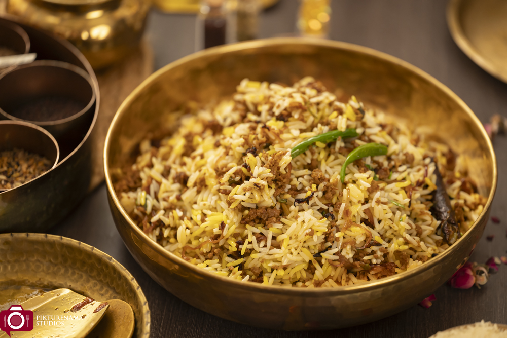

# Keema Rice

*Pilau base with spiced minced lamb folded through. A rice that eats as a meal on its own; the curry-house version of meat-and-rice in one bowl.*

**Serves:** 4

**Prep Time:** 15 minutes

**Cook Time:** 35 minutes

## Overview
Keema rice is pilau rice with cooked minced lamb stirred through at the end. The two components are cooked separately (pilau in its own pan, keema in another) and combined in the final minutes so the rice grains stay separate and the meat keeps its texture. The result is substantial: a single bowl is enough as a main, with maybe a small raita and a few slices of cucumber on the side.

This is not biryani (which layers raw meat and rice, sealed and cooked together). Keema rice is faster, simpler and easier to get right; biryani is its weekend cousin.

## Ingredients

### Pilau base
- 300 g basmati rice (rinsed and soaked 20 minutes; see [Plain Basmati Rice](plain-basmati.md))
- 450 ml hot chicken or vegetable stock
- 1 small onion (finely sliced)
- 2 tbsp ghee
- 1 cinnamon stick (5 cm)
- 4 green cardamom pods (cracked)
- 4 whole cloves
- 1 bay leaf
- ½ tsp salt
- Pinch of saffron threads in 1 tbsp warm milk (or ¼ tsp turmeric for colour)

### Keema
- 350 g minced lamb (or beef; 15-20% fat)
- 1 small onion (finely chopped)
- 3 garlic cloves (minced)
- 15 g fresh ginger (grated)
- 1 green chilli (finely chopped)
- 1 tsp ground cumin
- 1 tsp ground coriander
- ½ tsp [garam masala](../../../base-ingredients/curry-powder/garam-masala.md)
- ½ tsp ground turmeric
- ½ tsp Kashmiri chilli powder
- 1 tsp salt
- 1 tbsp tomato paste
- 1 tbsp neutral oil
- 50 g frozen peas (optional)

### To finish
- Small handful fresh coriander (chopped)
- 1 tbsp fried onion (crisp shop-bought, for garnish)

## Method

### Stage 1 - Start the pilau
1. Heat the ghee in a heavy lidded saucepan over medium heat. Add the cinnamon, cardamom, cloves and bay leaf. Stir 30 seconds; the spices should crackle and become aromatic.
1. Add the sliced onion and cook 5-6 minutes, until soft and just gold.
1. Drain the soaked rice and add it to the pan with the salt. Stir gently to coat each grain in the spiced ghee for 30-45 seconds.
1. Pour in the hot stock. Stir once. Bring to a boil, then drop the heat to its lowest setting and clamp the lid on.
1. Cook 12 minutes without lifting the lid.

### Stage 2 - Cook the keema (parallel)
1. While the rice cooks, heat the oil in a wide pan over medium heat. Add the chopped onion and cook 5-6 minutes, until soft.
1. Add the garlic, ginger and green chilli. Cook 1 minute.
1. Add the cumin, coriander, garam masala, turmeric, chilli powder and salt. Stir 30 seconds.
1. Add the minced lamb and break it up with a wooden spoon. Cook 7-8 minutes, stirring, until the meat is no longer pink and any liquid has evaporated.
1. Stir in the tomato paste and cook 1 more minute. The keema should be dry and well-spiced.
1. If using peas, stir them in during the final minute of cooking. Off the heat.

### Stage 3 - Combine
1. When the rice has rested 5 minutes off the heat, lift the lid.
1. Drizzle the saffron milk (or sprinkle turmeric) over the rice. Run a fork gently through to fluff and incorporate the colour.
1. Add the cooked keema in two or three additions, folding gently with the fork. The grains of rice should stay separate; the keema becomes flecks of meat throughout the rice, not a stew.
1. Scatter fresh coriander and crisp fried onion over the top.

## Notes
- **Cook the components separately.** Trying to cook keema and rice in one pan gives gluey rice and over-cooked meat. The two-pan parallel method takes 35 minutes total and produces both correctly.
- **Keep the keema dry.** Wet keema makes the rice soggy. Cook off all the liquid before combining.
- **Fold, do not stir.** Stirring breaks rice grains. A few gentle folds with a fork distributes the keema without damaging the rice.
- **Saffron is the flag of a proper pilau.** A few threads bloomed in warm milk give the rice its yellow streaks and a perfumed background note. Turmeric is the cheaper substitute.

## Variations
- **Vegetarian:** swap the lamb for 200 g grated paneer plus 50 g frozen peas; cook for half the time (paneer toughens with too much heat).
- **With egg:** scramble 2 beaten eggs into the keema during its final minute, breaking them up with the spoon. Adds richness.
- **With whole spice tarka on top:** heat 1 tbsp ghee with a few cumin seeds and a dried red chilli until aromatic, and pour over the assembled rice as a final flourish.

## Serving
- Keema rice is a one-bowl meal. Serve with a small bowl of [Mint Raita](../sauces-pickles/mint-raita.md), a few slices of cucumber and a wedge of lemon. As a side to a curry, half a bowl per person is enough.

## Storage
- Refrigerates 2 days. Reheat on the hob with a tablespoon of water, covered, on low heat for 5-6 minutes.
- Freezes 1 month. Defrost overnight in the fridge and reheat as above; the rice texture suffers slightly but the dish is still pleasant.
