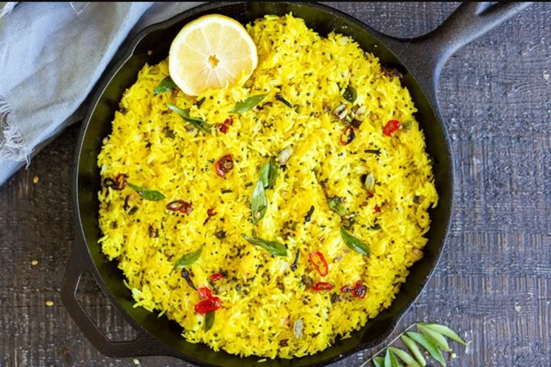

# Lemon Rice

*South Indian lemon rice (chitra anna): steamed rice tossed with a turmeric-curry-leaf temper, finished with lemon juice and roasted peanuts. Bright yellow, citrus-tart, quick to make.*

**Serves:** 4

**Prep Time:** 10 minutes

**Cook Time:** 15 minutes

## Overview
Lemon rice (chitra anna in Tamil, nimbu chawal in Hindi) is the bright South Indian variety-rice that turns up in lunchboxes, temple offerings and quick weeknight meals across Tamil Nadu, Karnataka and Andhra Pradesh: cooled steamed rice tossed with a turmeric-curry-leaf temper and finished with a sharp squeeze of lemon. The dish sits in the same Tamil variety-rice family as coconut rice and tamarind rice, all built on the same template of cold cooked rice plus a vivid temper, but lemon rice keeps the lightest touch and reads the brightest on the palate. Lemon goes in off the heat at the very end, which is the technique home cooks new to the dish most often get wrong; lemon juice cooked into the hot pan turns dull and slightly bitter, where lemon added off the heat keeps its sharp clean acidity. Turmeric in the temper does the colour work, and roasted peanuts fold through for crunch and protein. Cold rice rather than warm rice is essential for separate grains; warm rice clumps under the spoon. Eat at room temperature with a spoon of yogurt and a hot pickle.

## Ingredients

### Rice
- 250 g basmati (or sona masuri rice, cooked and cooled, about 600 g cooked weight)

### Temper
- 3 tablespoons sesame oil (or vegetable oil)
- 1 teaspoon black mustard seeds
- 1 teaspoon chana dal
- 1 teaspoon urad dal
- 50 g raw peanuts (skinless if possible)
- 2 dried red chillies (broken in half)
- 1 green chilli (slit)
- 25 g fresh ginger (finely grated)
- 25 fresh curry leaves
- A pinch of asafoetida (hing)

### Seasoning
- 1 teaspoon turmeric
- 1 teaspoon salt (to taste)

### To finish
- 2 lemons (about 5 tablespoons, juice)
- A handful of fresh coriander (chopped)

## Method

### Stage 1 - Prep the rice
1. Spread the cooked, cooled rice on a tray and separate the grains gently with a fork.

### Stage 2 - Temper
1. Heat the sesame oil in a wide pan or wok over medium heat.
1. Add the mustard seeds; when they pop, add the chana dal and urad dal.
1. Cook for 30 seconds until the dals turn golden.
1. Add the peanuts; cook for 2-3 minutes until pale gold.
1. Add the dried red chillies, green chilli and ginger; cook for 30 seconds.
1. Add the curry leaves and asafoetida; sizzle for 5 seconds.

### Stage 3 - Turmeric
1. Sprinkle the turmeric over the temper.
1. Add 2 tablespoons of water to bloom the turmeric (it cooks off the rawness and prevents scorching).
1. Cook for 30 seconds until the water has evaporated and the temper is yellow.
1. Sprinkle in the salt.

### Stage 4 - Combine
1. Pull the pan from the heat (this is essential; lemon juice on hot heat turns bitter).
1. Add the cooked rice in two batches, folding gently with a spatula.
1. Drizzle the lemon juice over and fold through.
1. Taste and adjust salt and lemon.

### Stage 5 - Serve
1. Scatter the coriander over.
1. Serve warm or at room temperature with a side of yogurt or potato fry.

## Notes
- **Lemon off the heat:** The cardinal rule of lemon rice. Adding lemon to a hot pan boils off the volatile citrus oils and leaves a flat, mildly bitter rice.
- **Two chillies, two roles:** The dried red chilli gives a roasted, mellow heat; the fresh green chilli gives a sharp, raw bite. Both are needed.
- **Use cold rice:** Hot rice from the pot turns gummy when tossed. Cooled or leftover rice keeps its shape.

## Storage
- Refrigerate up to 2 days; eat at room temperature.
- The lemon flavour fades over time; refresh with a fresh squeeze before serving.
