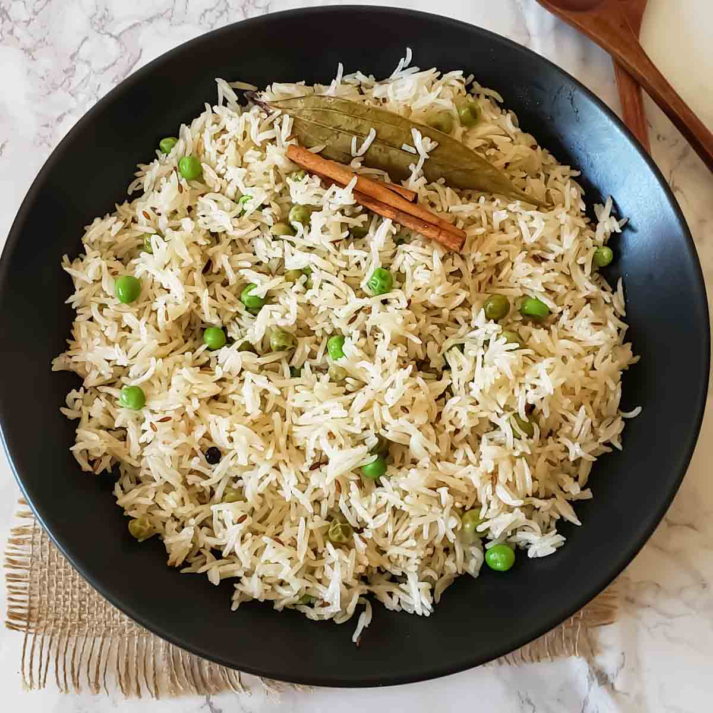

# Matar Pulao

*Basmati pulao with peas, fried onion and whole spices. The North Indian wedding-table standard; sweet from the peas and warming from the cardamom.*

**Serves:** 4-6

**Prep Time:** 10 minutes (plus 30 minutes soak)

**Cook Time:** 30 minutes

## Overview
Sliced onions are fried into golden-brown crisps and lifted out. Basmati is rinsed, soaked for ½ hour and drained. A whole-spice tempering of cumin, bay, cardamom, cinnamon and cloves is bloomed in the ghee left from the onions, the drained rice goes in to toast, then water and peas join the pot for a covered steam. The fried onions go back on top before serving.

## Ingredients
- 300 g aged basmati rice (rinsed, soaked for 30 minutes)
- 200 g peas (fresh or frozen)
- 1 onion (large, thinly sliced)
- 3 tablespoons ghee (or oil + butter)
- 1 teaspoon cumin seeds
- 1 bay leaf
- 1 cinnamon stick (small)
- 4 green cardamom pods (lightly crushed)
- 4 cloves
- 1 black cardamom pod (optional, for depth)
- 2 garlic cloves (finely chopped)
- 25 g fresh ginger (finely grated)
- 1 green chilli (slit, optional)
- 1 teaspoon salt (to taste)
- 600 ml water (or 550 ml for freshly bought rice)
- A handful of coriander (or mint, chopped, to finish)

## Method

### Stage 1 - Fry the onion
1. Heat the ghee in a saucepan with a tight-fitting lid over medium heat.
1. Add the sliced onion with a pinch of salt.
1. Cook for 10-12 minutes, stirring, until deep golden brown and crisp at the edges.
1. Lift two-thirds of the fried onion out with a slotted spoon and set aside on kitchen paper; leave a third in the pan with the ghee.

### Stage 2 - Bloom the whole spices
1. Add the cumin seeds, bay, cinnamon, green and black cardamom and cloves to the pan.
1. Sizzle for 30 seconds.
1. Add the garlic, ginger and green chilli; cook for 1 minute.

### Stage 3 - Toast the rice
1. Drain the soaked rice well.
1. Tip into the pan and stir gently for 2 minutes to coat in the spiced ghee.

### Stage 4 - Steam
1. Pour in the water and salt.
1. Scatter the peas over.
1. Bring to a boil, then reduce to the lowest heat.
1. Cover with a tight-fitting lid and cook for 12-14 minutes (don't lift the lid).
1. Pull from the heat and rest, still covered, for 10 minutes.

### Stage 5 - Fluff and serve
1. Lift the lid and fluff with a fork.
1. Discard the bay (and any whole spices you prefer not to bite).
1. Top with the reserved fried onion and the chopped coriander.

## Notes
- **The fried onion:** Half goes in the pulao, half goes on top. The crisp brown pieces are the contrast against the soft rice.
- **Black cardamom is optional:** Big smoky pod, lifts the whole dish. Worth seeking out for any North Indian rice work.
- **Peas in last:** Going in on top of the water (not stirred through the rice) keeps the rice grains clean and the peas at the top of the finished pulao.

## Storage
- Refrigerate up to 3 days; reheat covered with a splash of water.
- Freezes well in portions for 2 months.
