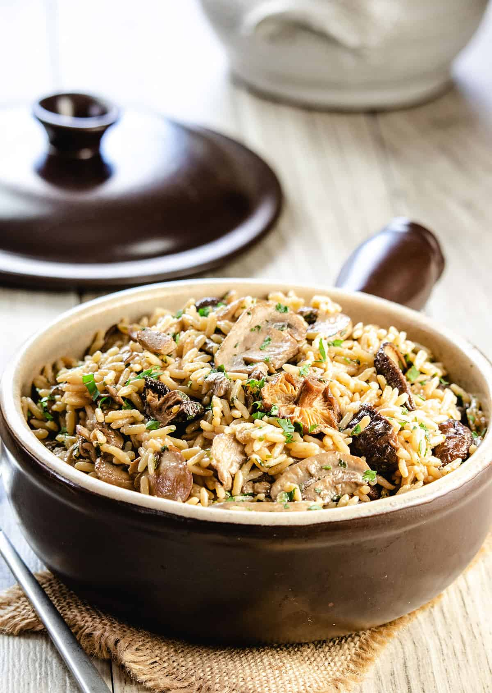

# Mushroom Pilau

*Pilau base with sliced mushrooms folded in for the final five minutes. The curry-house upgrade from plain rice.*

**Serves:** 4

**Prep Time:** 10 minutes

**Cook Time:** 20 minutes

## Overview
Mushroom pilau is exactly what the name suggests: a standard pilau with sliced mushrooms cooked through in the final minutes of the rice's simmer. The trick is timing. Mushrooms release a lot of liquid; added too early, they make the rice soggy. Added too late, they are raw and squeaky. Five minutes in the steam, folded through after the rice has done its initial bulk-cook, is the sweet spot. The mushroom flavour permeates the rice, and the mushroom slices stay soft but distinct.

This works with any mushroom that can be sliced; button mushrooms are the curry-house default. Chestnut mushrooms give more flavour. Wild mushrooms (porcini, shiitake) push the dish toward an Italian register; stick with the standard for a takeaway-style pilau.

## Ingredients
- 300 g basmati rice (rinsed and soaked 20 minutes; see [Plain Basmati Rice](plain-basmati.md))
- 450 ml hot chicken or vegetable stock
- 1 small onion (finely sliced)
- 250 g button or chestnut mushrooms (sliced 5 mm thick)
- 2 tbsp ghee
- 1 cinnamon stick (5 cm)
- 4 green cardamom pods (cracked)
- 4 whole cloves
- 1 bay leaf
- ½ tsp salt
- Pinch of saffron in 1 tbsp warm milk (or ¼ tsp turmeric)
- Small handful fresh coriander (chopped)

## Method

### Stage 1 - Start the pilau
1. Heat the ghee in a heavy lidded saucepan over medium heat. Add the cinnamon, cardamom, cloves and bay leaf. Stir 30 seconds.
1. Add the sliced onion and cook 5-6 minutes, until soft and just gold.
1. Drain the soaked rice. Add to the pan with the salt and stir gently for 30 seconds to coat the grains in ghee.
1. Pour in the hot stock. Stir once. Bring to a boil, then drop to the lowest heat and clamp the lid on.
1. Cook 7 minutes (not the full 12); the rice should still have a slight bite and there will be visible liquid.

### Stage 2 - Add the mushrooms
1. Lift the lid quickly. Scatter the sliced mushrooms evenly over the surface of the rice. Do not stir them in.
1. Clamp the lid back on. Cook another 5 minutes on lowest heat.

### Stage 3 - Rest and fluff
1. Off the heat. Leave the pan covered for 5 minutes so the residual steam finishes the rice and the mushrooms.
1. Lift the lid. Drizzle the saffron milk over the surface.
1. Run a fork gently through the rice, lifting from the bottom, folding the mushrooms through the rice as you go. The grains should stay separate, the mushrooms distributed throughout.
1. Scatter fresh coriander over the top.

## Notes
- **Sliced, not chopped.** Mushroom slices look right in a pilau; chopped pieces look like an afterthought.
- **Steam, do not stir.** Stirring mushrooms into a part-cooked pilau breaks the rice and releases too much liquid. Layering them on top and letting steam cook them is the technique.
- **The shorter initial simmer matters.** Mushrooms add cooking time at the end; if you cook the rice the full 12 minutes first, the final result is over-cooked.
- **Pre-saute the mushrooms** if you want deeper flavour: dry-fry the slices in a hot pan with a small knob of butter for 4-5 minutes until browned at the edges, then add them in stage 2. Slightly more work, noticeably better result.

## Serving
Mushroom pilau is the rice for a rich, sauce-heavy curry: korma, pasanda, butter chicken. The mushrooms add their own savoury layer that fights with anything too spice-forward, so save it for the milder end of the menu.

## Storage
- Refrigerates 2 days. Reheat on the hob with 1 tbsp water in a covered pan on low heat.
- Freezes 1 month. The mushroom texture suffers slightly on thawing but the dish is still good.
