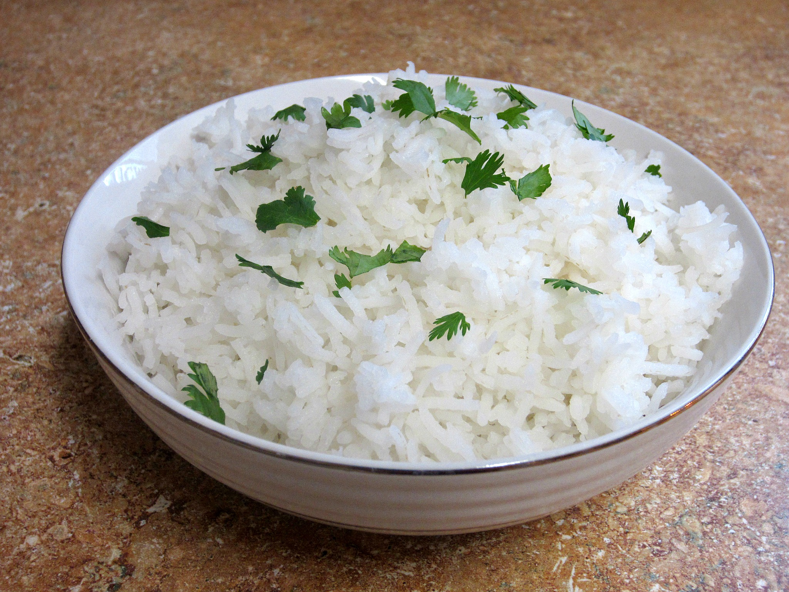

# Plain Basmati Rice

*The default rice for every Indian meal: long-grained, fragrant, fluffy, with each grain separate. A rinse, a soak, a measured simmer.*

**Serves:** 4

**Prep Time:** 5 minutes (plus 20 minutes soaking)

**Cook Time:** 15 minutes

## Overview
Plain basmati is the foundation of every Indian rice on a curry-house menu. Get it right and the pilaus, mushroom rices and lemon rices that build on it work; get it wrong and they all suffer. The three steps that matter are the rinse (until the water runs clear, to wash off the surface starch that makes rice gummy), the soak (20 minutes, to relax the grain so it cooks evenly), and the measured simmer (1 part rice to 1.5 parts water, covered and undisturbed, off the heat to rest before fluffing).

The technique is identical for any long-grain basmati; cheaper grades cook faster and break more easily, premium ages (often labelled "aged" or "extra long grain") cook a little longer and stay separate. Either works.

## Ingredients
- 300 g basmati rice
- 450 ml cold water
- ½ tsp fine salt
- 1 tsp ghee or neutral oil (optional, for gloss)

## Method

### Stage 1 - Rinse
1. Measure the rice into a bowl. Cover with cold water and swirl with your hand; the water will go milky.
1. Drain off the cloudy water and refill. Repeat 4-5 times until the water runs nearly clear when swirled. This removes the surface starch and is the single most important step.

### Stage 2 - Soak
1. Cover the rinsed rice with cold water by 2 cm and leave for 20 minutes. The grains absorb water and elongate slightly; they will be paler and pearlier when you drain them.
1. Drain.

### Stage 3 - Cook
1. Combine the drained rice, 450 ml cold water and salt in a heavy lidded saucepan. Stir once.
1. Bring to a boil over medium-high heat, uncovered. Watch closely; the moment the surface comes to a rolling boil, drop the heat to its lowest setting and clamp the lid on.
1. Cook 12 minutes without lifting the lid or stirring. The rice will absorb all the water and form steam channels through the surface.
1. Off the heat. Leave the pan covered for 5 minutes to rest. The residual steam finishes the cooking.

### Stage 4 - Fluff
1. Lift the lid. Drop the ghee or oil onto the surface (if using).
1. Run a fork gently through the rice, lifting from the bottom of the pan upwards, separating the grains. Do not stir or stir aggressively; both bruise the rice.
1. Serve immediately, or hold covered for up to 10 minutes before serving.

## Notes
- **The rinse is non-negotiable.** Five passes of cold water is the difference between separate grains and a sticky mass.
- **The 1:1.5 ratio assumes a tight lid.** A loose lid lets steam escape and the rice scorches. Heavy enamelled cast-iron pans are ideal.
- **The 5-minute rest is non-negotiable too.** Lifting the lid too early gives chalky rice; the steam needs that final five minutes to finish the centre of the grain.
- **No stirring during cooking.** Stirring breaks grains and releases starch. A single stir at the start is enough.
- **Aged basmati is worth the extra.** Premium aged basmati grains elongate dramatically and stay distinct; bulk-supermarket basmati is more variable.

## Variations
- **With whole spices:** drop a stick of cinnamon, 4 green cardamom pods, 4 cloves and a bay leaf into the pan with the rice and water for a lightly perfumed everyday rice.
- **Yellow basmati:** add a pinch of turmeric to the water for colour. Bright but flavour-neutral.
- **Lemon basmati:** stir in 1 tbsp lemon juice and a few curry leaves after fluffing for a faster lemon rice.

## Serving
Plain basmati works with every curry on the menu. Spoon a generous mound onto each plate and pour the curry over half; or pile the rice in a small bowl on the side and let people serve themselves.

## Storage
- Cooked basmati keeps 2 days in the fridge in a sealed container. Reheat with a tablespoon of water in the microwave or a covered pan.
- Day-old basmati is the foundation of any fried rice; the dried-out grains take on oil and spice cleanly. Always cool quickly and refrigerate within an hour of cooking to be safe with reheating.
