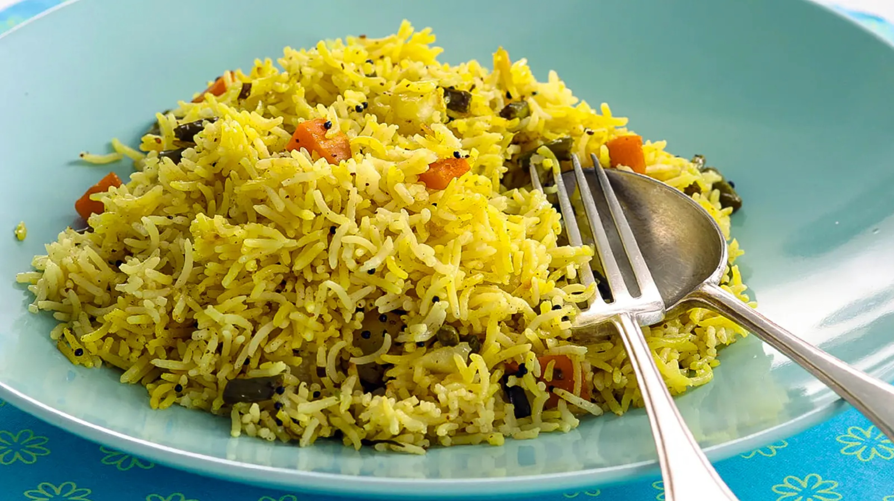

# Vegetable Rice

*Pilau with diced carrot, peas and sometimes sweetcorn. The family-meal default at any curry house.*

**Serves:** 4

**Prep Time:** 10 minutes

**Cook Time:** 20 minutes

## Overview
Vegetable rice (sometimes called pilau vegetable rice or just veg rice on a menu) is the family-table version of pilau: the same spiced base, the same long-grain basmati, but with a colourful scatter of small-dice vegetables folded through. Carrot for sweetness and orange flecks, peas for green and pop, sometimes sweetcorn for yellow, occasionally fine-dice red pepper. The vegetables go in early enough to cook fully and late enough to keep their colour bright.

This is the rice for when a group is sharing and people want something other than plain basmati or yellow pilau. It is also the rice that vegetarians eat as a centrepiece, with a daal and a side of cucumber on the table.

## Ingredients
- 300 g basmati rice (rinsed and soaked 20 minutes; see [Plain Basmati Rice](plain-basmati.md))
- 450 ml hot vegetable or chicken stock
- 1 small onion (finely sliced)
- 1 medium carrot (about 100 g, diced 5 mm)
- 100 g frozen peas
- 50 g frozen sweetcorn (optional)
- 2 tbsp ghee
- 1 cinnamon stick (5 cm)
- 4 green cardamom pods (cracked)
- 4 whole cloves
- 1 bay leaf
- ½ tsp salt
- ¼ tsp ground turmeric
- Small handful fresh coriander (chopped)

## Method

### Stage 1 - Start the pilau
1. Heat the ghee in a heavy lidded saucepan over medium heat. Add the cinnamon, cardamom, cloves and bay leaf. Stir 30 seconds, until aromatic.
1. Add the sliced onion. Cook 5-6 minutes, until soft and just gold at the edges.
1. Stir in the diced carrot. Cook another 2 minutes; the carrot should soften slightly without colouring.
1. Drain the soaked rice and add to the pan along with the salt and turmeric. Stir gently for 30-45 seconds to coat the grains in spiced ghee.
1. Pour in the hot stock. Stir once. Bring to a boil, then drop the heat to its lowest and clamp the lid on.
1. Cook 8 minutes.

### Stage 2 - Add peas and sweetcorn
1. Lift the lid briefly. Scatter the frozen peas (and sweetcorn, if using) evenly across the surface.
1. Clamp the lid back on. Cook another 4 minutes on lowest heat.

### Stage 3 - Rest and fluff
1. Off the heat. Leave the pan covered for 5 minutes.
1. Lift the lid. Run a fork gently through the rice, folding the peas and sweetcorn through the rice and carrot.
1. Scatter fresh coriander over the top.

## Notes
- **Cut the carrot small.** A 5 mm dice cooks at the same rate as the rice; bigger chunks come out under-done.
- **Frozen peas and sweetcorn go in late.** They are pre-cooked and only need to warm through. Added early they go grey and lose their bounce.
- **Turmeric over saffron.** Vegetable rice is the family rice, not the special rice. A pinch of turmeric for warm yellow gold is the right register; saffron is for the celebration rices.
- **Optional additions:** fine-dice red pepper (50 g, added with the carrot), green beans (50 g, fine-cut, added at the same time as the peas), or a small handful of cashews (toasted, scattered on top with the coriander).

## Serving
Vegetable rice is the all-purpose rice for a group meal. It works under any curry, holds a portion of dal beside it, or stands on its own with a bowl of raita and some pickles. The default for a curry-house family table.

## Storage
- Refrigerates 2 days. Reheat in a covered pan with a tablespoon of water on low heat for 5-6 minutes.
- Freezes 1 month. The peas keep their colour well; carrot softens slightly.
