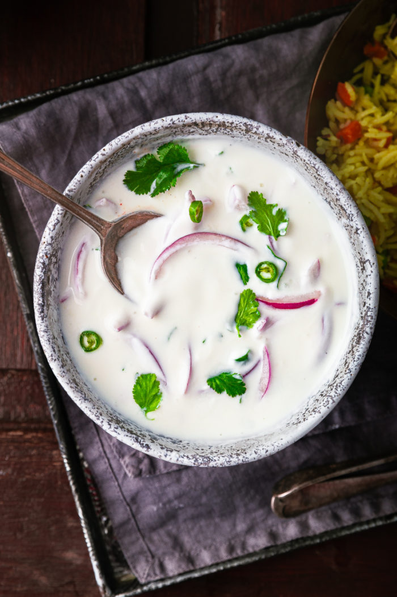

# Chilli and Red Onion Raita

*Raita is a traditional Indian accompaniment and cooling agent to serve with hot curries. It is also delicious served as a dip with poppadums. This version celebrates the peppery bite of red onion and the heat of fresh green chilli, balanced by cooling yoghurt.*

**Serves:** 4

**Prep Time:** 10 minutes

**Cook Time:** 2 minutes

## Overview
The raita with structural ambition: cool whisked yogurt anchored with finely chopped red onion, toasted cumin, a slit green chilli for heat, and a final scatter of thin onion slices and chilli powder on the surface for the proper Indian table look. Sharper and more present than the everyday cucumber raita, but still doing the same essential cooling work next to a hot curry. Toasted ground cumin (whole seeds toasted in a dry pan and ground) gives the earthy backbone; supermarket pre-ground cumin tastes pale and dusty in comparison. Full-fat natural yogurt is the traditional Indian base; low-fat yogurt thins out and weeps water on the plate. Served in a small bowl at the centre of the table for every diner to spoon from. Best eaten the same day; the onion sharpens and dominates by the next morning.

## Ingredients

### Base
- 1 garlic clove (small)
- 150 ml natural yoghurt (full-fat preferred)
- 1 red onion (large)
- 1 fresh green chilli (small, de-seeded)

### Spices & Aromatics
- 1 teaspoon cumin seeds
- 2 tablespoons fresh coriander (finely chopped)
- ½ tablespoon granulated sugar
- Salt to taste

### Garnish
- Paper-thin red onion slices (reserved for garnish)
- Extra fresh coriander leaves

## Method

### Stage 1 - Toast & Crush Cumin
1. Heat a small saucepan (no oil needed) and add the cumin seeds.
2. Dry-fry gently for 1-2 minutes, stirring frequently.
3. The cumin should release its aroma without burning.
4. Remove from heat and allow to cool for a few minutes.
5. Tip into a mortar and crush gently with a pestle to release oils further.
6. Don't crush completely; some seeds should remain intact.

### Stage 2 - Prepare Vegetables
1. Cut the large red onion in half.
2. Slice a few paper-thin slices from one half for garnish; set aside.
3. Finely chop the remaining onion very finely.
4. Crush the small garlic clove with the flat of a knife; chop very finely.
5. De-seed the green chilli and chop it very finely.

### Stage 3 - Combine Raita
1. Place the yoghurt in a serving bowl.
2. Fold in the finely chopped red onion.
3. Fold in the crushed garlic.
4. Fold in the finely chopped green chilli.
5. Add the crushed cumin seeds and their oils.
6. Stir in the fresh coriander.
7. Add the sugar and salt to taste.

### Stage 4 - Finish & Chill
1. Spoon into a serving bowl if not already there.
2. Cover and refrigerate until ready to serve.
3. Just before serving, top with the reserved paper-thin red onion slices.
4. Finish with extra fresh coriander.

## Notes
- **Yoghurt Quality:** Use natural, full-fat, unsweetened yoghurt; sweetened varieties ruin the balance.
- **Onion Prep:** Paper-thin slices of fresh red onion for garnish add visual appeal and textural contrast.
- **Cumin Toasting:** This brief dry-toasting awakens the spice's oils without bitterness.
- **Chill Before Serving:** Cold raita is far more refreshing and effective at cooling the palate.
- **Timing:** Make shortly before serving; flavors are brightest when fresh.
- **Garnish Last Minute:** Add the thin onion slices just before serving to keep them crisp.

## Variations
- **With Tomato:** Add ½ medium tomato (de-seeded and finely diced) for brightness.
- **Extra Heat:** Use 2 fresh green chillies for more serious spice.
- **Mint Addition:** Include 1 tablespoon fresh mint leaves for cooling herbal notes.
- **Pomegranate:** Scatter 2 tablespoons pomegranate seeds over the finished raita for sweetness and crunch.

## Serving
- **Serve with:** Any curry, biryani, tandoori dishes, grilled meats
- **Serve as:** Side dish, cooling accompaniment, or dip with poppadums
- **Garnish with:** Reserved red onion slices, extra coriander leaves, cumin seeds

## Storage
- Refrigerate in a covered container for up to 2 days
- Best served fresh within a few hours of preparation
- Do not freeze; yoghurt texture becomes grainy
