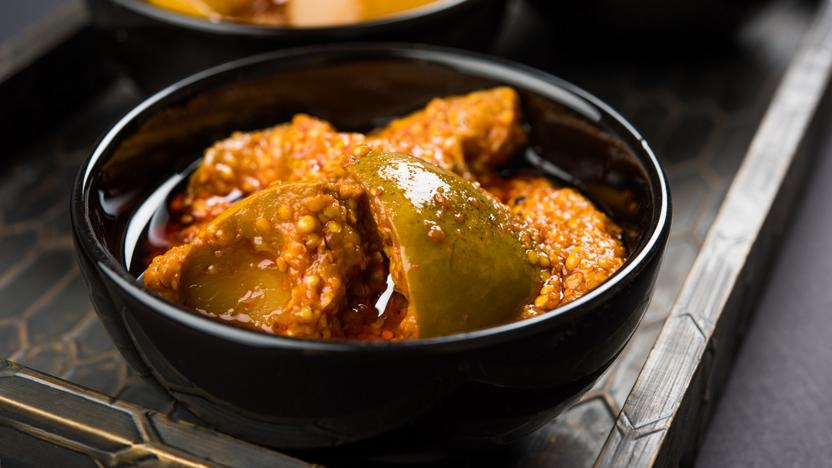

# Lime Pickle

*The sharp, hot, oily lime relish that arrives in a small bowl with the papadums. Three weeks to mature; lasts a year in the jar.*

**Makes:** about 750 ml (one large jar)

**Prep Time:** 30 minutes

**Cook Time:** 10 minutes

**Curing Time:** 3 weeks (minimum), 6 weeks (better)

## Overview
Indian lime pickle (nimbu ka achaar) is one of the loudest things on a curry-house table: hot, salty, sour, oily, with a faint bitterness from the lime peel that makes it taste alive on the tongue. A spoonful does what an entire mango chutney cannot; it cuts the richness of a curry the way vinegar cuts a chip, but with chilli heat and mustard-oil pungency layered in. The dip to reach for after the mango chutney, the one that defines whether someone actually enjoys hot food. The salt-and-sun cure is the home-cook standard across north India; quartered limes salted heavily and held in a glass jar in a warm sunny spot for two weeks, by which time the peel has gone translucent and tender. Mustard oil is the traditional fat for the tarka stirred in at the end, and substituting neutral oil loses the dish's defining pungency (kitchens without mustard oil can soften the loss with extra mustard seeds). The result keeps a year in the cupboard and improves for the first three months.

## Ingredients

### Stage 1 - Salt cure
- 12 small green limes (about 600 g; not lemons; small unwaxed Indian or Persian limes)
- 5 tbsp coarse sea salt (75 g)
- 1 tbsp ground turmeric

### Stage 2 - Tarka
- 200 ml mustard oil (or substitute with neutral oil plus 1 tbsp mustard seed extra)
- 2 tbsp black mustard seeds
- 1 tsp fenugreek seeds
- 1 tsp nigella (kalonji) seeds
- ½ tsp asafoetida (hing)
- 3 tbsp Kashmiri chilli powder (mild, for colour)
- 2 tsp hot red chilli powder (or to taste)
- 1 tbsp granulated sugar (optional, rounds the edges)

## Method

### Stage 1 - Cure the limes (Day 1)
1. Wash the limes thoroughly and dry them. Cut each lime into 8 wedges, removing any seeds.
1. Toss the wedges in a large bowl with the salt and turmeric until evenly coated.
1. Pack the lime wedges and any liquid into a clean, dry, sterilised glass jar. Seal.
1. Place the jar in a warm, sunny spot (a south-facing windowsill works in summer; an airing cupboard works year-round).

### Stage 2 - Cure (Days 2-14)
1. Shake the jar once a day. Each day the limes release more juice; by day three or four they should be partially submerged in their own brine.
1. The peel changes from bright green to dull yellow-green, then to translucent gold. The flesh softens.
1. After two weeks the peel should be tender enough to bite through without resistance. Taste a small piece; the bitterness should be gentle and the sourness deep. If still too bitter or too hard, continue for another week.

### Stage 3 - Make the tarka (Day 14 or later)
1. Heat the mustard oil in a heavy pan to almost smoking, then take off the heat and let it cool to medium. (This drives off the raw sharpness of mustard oil; skip if using neutral oil.)
1. Return to medium heat. Add the mustard seeds. When they pop (10-15 seconds), add the fenugreek and nigella.
1. After another 10 seconds, off the heat: stir in the asafoetida, Kashmiri chilli powder, hot chilli powder and sugar (if using). The oil should turn deep red.

### Stage 4 - Combine and cure further (Days 14-21+)
1. Pour the spiced oil over the cured limes in their jar. Stir gently with a clean spoon to coat every piece. The oil should sit a centimetre above the limes; if not, top up with more warmed mustard oil.
1. Seal the jar and return to the warm spot. Shake daily for another week. The pickle is ready after 7 more days; it is genuinely good after a month; it is at its peak after three.

## Notes
- **Glass jars only.** Lime pickle eats through plastic and reacts with most metals. A sterilised glass jar (boil for 10 minutes or run through a hot dishwasher) is essential, with a tight glass or plastic lid (not metal).
- **Salt is the preservative.** Do not reduce the salt thinking it will improve the pickle; the cure will fail and the limes will ferment unpleasantly.
- **Mustard oil is traditional.** It carries the pungent edge that defines Indian lime pickle. Substitute neutral oil if mustard oil is unavailable, but the result is noticeably milder.
- **The peel softens over time.** A young pickle (3 weeks old) has a slightly tough peel that is part of its character. After three months the peel is silky and the flavour is fully integrated.
- **Always use a clean dry spoon.** A wet or oily spoon introduces bacteria and shortens the pickle's life.

## Serving
- A tablespoon goes a long way. Serve with papadums (the classic trio bowl), alongside any rich curry as a sharpening relish, or on a cheese sandwich. A spoon on the side of a plate of dal and rice is enough to make a plain meal taste seasoned.

## Storage
- Sealed in its oil layer, in a clean dry cupboard: keeps a full year.
- Always make sure the limes are submerged under their oil; mould forms on any piece that pokes above the surface. Top up with warmed mustard oil if the level drops.
- Refrigeration is unnecessary and slightly damages the texture. The oil congeals; the pickle re-liquefies at room temperature.
