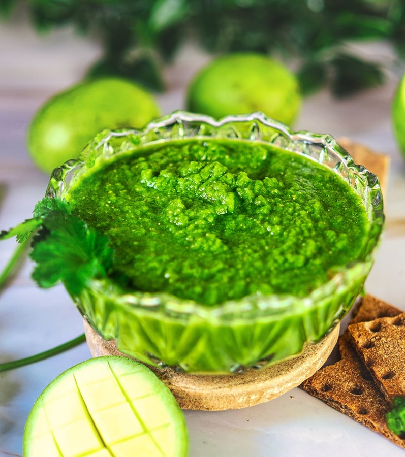

# Mint, Coriander, and Mango Chutney

*This simple chutney works really well with lamb seekh kebabs; the flavor combinations are fresh, interesting, and balanced. Green chillies, pungent raw garlic, and cooling mint blend together with smooth mango chutney into an herbaceous condiment with hidden depth.*

**Serves:** 4-6

**Prep Time:** 10 minutes

## Overview
A modern Indian-restaurant chutney that splices the bright green-herb chutney with the sweet mango chutney into one smooth condiment: fresh mint, coriander, raw garlic, green chilli and a generous spoon of shop-bought mango chutney blitzed into a pale green-flecked sauce that carries herbal brightness, sweet fruit and quiet heat in a single bite. The chutney sits naturally alongside lamb seekh kebabs, where the mint cuts the rich lamb, the garlic supports the spice, and the mango sweetness rounds the chilli. Patak's mango chutney is the traditional British curry-house brand and the right level of sweetness for this; chunky homemade mango chutney needs to be processed smooth first or the texture goes lumpy. Eat same-day for the brightest colour and flavour; keeps a few days refrigerated but the green fades.

## Ingredients
- Small bunch of fresh coriander (leaves only, about 30 grams)
- Large bunch of fresh mint (leaves only, about 40 grams)
- 200 ml smooth mango chutney (store-bought or homemade)
- 1-4 fresh green chillies (finely chopped, quantity to taste)
- 2 garlic cloves (finely chopped)
- 1 fresh lime (juice)
- Salt to taste

## Method

### Stage 1 - Prepare Herbs
1. Wash and thoroughly dry the coriander and mint bunches.
2. Pick off the leaves, discarding the stems (stems can be bitter).
3. Roughly chop the leaves into manageable pieces.
4. Measure out approximately 70 grams total of loosely packed herbs.

### Stage 2 - Blend Chutney
1. Place the fresh coriander and mint leaves in a blender or food processor.
2. Add the smooth mango chutney.
3. Add the finely chopped green chillies (start with 1, add more as desired).
4. Add the finely chopped garlic cloves.
5. Add the lime juice.
6. Blend until completely smooth and well combined.
7. The texture should be creamy and spoon-able, not runny.

### Stage 3 - Finish & Adjust
1. Season with salt to taste.
2. If too thick, thin with 1 tablespoon water at a time.
3. If too thin, blend in additional mango chutney.
4. Taste and adjust herbs, lime, or garlic to preference.
5. Transfer to a serving bowl.

## Notes
- **Herb Freshness:** Use very fresh herbs; the flavor depends entirely on their quality.
- **Mango Chutney Quality:** Use a good smooth mango chutney; it balances the fresh herbs beautifully.
- **Heat Control:** Green chillies vary in heat; start with 1 and add more to taste.
- **Lime Essential:** Fresh lime juice brightens everything; bottled lime juice won't work as well.
- **Raw Garlic:** The raw garlic is intentional, providing pungent depth that cooking would mellow.

## Variations
- **Add Ginger:** Include 1 small piece of fresh ginger (grated) with the garlic.
- **Reduce Mango:** Use only 150 ml mango chutney for a brighter, more herbal taste.
- **With Coconut:** Blend in 2 tablespoons desiccated coconut for tropical sweetness.
- **Add Pomegranate:** Stir in 2 tablespoons pomegranate seeds after blending for texture and tartness.

## Serving
- Serve with: Lamb seekh kebab, tandoori meats, samosas, pakora, grilled vegetables
- Garnish: Fresh mint leaf, lime wedge

## Storage
- Refrigerate in a covered container for up to 3 days
- Best served fresh; herbs fade over time
- Do not freeze; texture and flavor deteriorate
