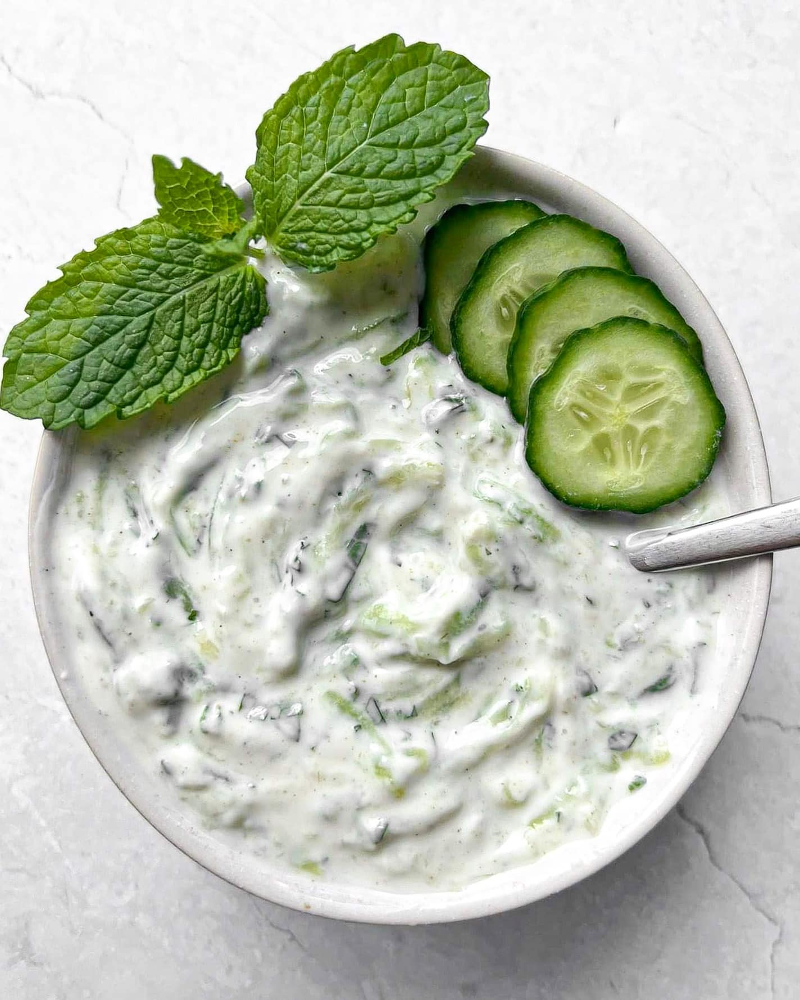

# Mint Raita

*Yoghurt, fresh mint, grated cucumber and a pinch of cumin. The cooling counterpoint to everything else on a curry-house table.*

**Serves:** 4 (makes about 300 ml)

**Prep Time:** 10 minutes

**Cook Time:** 0 minutes

## Overview
The curry-house standard raita is built for cooling, not for showing off. Plain full-fat yoghurt is whisked smooth, grated cucumber (squeezed dry, otherwise the raita weeps) is folded through, and a generous handful of chopped fresh mint is added. A pinch of toasted ground cumin and a touch of salt is the whole seasoning. The result is a bright, slightly tangy, mint-perfumed dip that takes the heat off a hot vindaloo and the richness off a buttery korma. It is also the dip of choice for onion bhaji, papadum and tandoori chicken.

This is the version you want on the table for everything. Indian household raitas range wider (with pomegranate, with boondi, with carrot) but the curry-house default is mint-and-cucumber.

## Ingredients
- 300 g full-fat natural or Greek-style yoghurt (not low-fat; the texture goes thin)
- ½ cucumber (about 150 g, grated coarsely)
- 1 small handful fresh mint leaves (about 15 g, finely chopped)
- ½ tsp ground cumin (toasted; see method)
- ¼ tsp fine salt
- Squeeze of lemon juice
- Pinch of sugar (to balance, optional)
- Pinch of mild chilli powder (to garnish, optional)

## Method

### Stage 1 - Toast and grind the cumin
1. Toast 1 tsp whole cumin seeds in a small dry pan over medium heat for 30-40 seconds, until fragrant and just darker. Pour onto a plate to cool, then grind to a powder. This makes a little extra; the surplus keeps a fortnight in a jar.

### Stage 2 - Prepare the cucumber
1. Coarsely grate the cucumber (skin on for a green flecking; off for a paler raita).
1. Pile the grated cucumber onto a clean tea towel, gather the corners and squeeze firmly over the sink. The cucumber releases a surprising amount of liquid; squeezing it out is what stops the raita going thin and weepy 20 minutes later.

### Stage 3 - Combine
1. Whisk the yoghurt in a bowl until smooth. Greek-style yoghurt may need a tablespoon of cold water to loosen.
1. Stir in the squeezed cucumber, chopped mint, ½ tsp toasted cumin, salt and lemon juice. Taste. Add a small pinch of sugar if the yoghurt is sharp.
1. Transfer to a serving bowl. Dust the top with a pinch of chilli powder and a final pinch of toasted cumin.

## Notes
- **Squeeze the cucumber.** This is the single difference between a good raita and a watery one. Do not skip.
- **Full-fat yoghurt only.** Low-fat goes thin and sour, and the cooling effect on the palate is half what you want.
- **Mint should be fresh and chopped at the last minute.** Dried mint can substitute (½ tsp); the flavour is rounder but less perfumed.
- **Some curry houses add finely chopped raw onion or a clove of grated garlic.** Both are valid; both shift the raita from cooling to assertive.

## Variations
- **Cucumber raita** (no mint): the gentler version; the same recipe minus the mint, with the cumin doing all the aromatic work.
- **Red-onion-and-chilli raita:** add 1 finely diced red onion and 1 finely chopped green chilli; omit the cucumber. Sharper and louder.
- **Boondi raita:** stir in a handful of crisp gram-flour boondi pearls (available at Indian grocers) at the moment of serving for a textural crunch.

## Serving
- Serve cold from the fridge. The raita's job is to cool, and a room-temperature raita is half as effective.

- Plate with onion bhaji, papadum, vegetable samosa, tandoori chicken, or alongside any hot curry. The portion size is generous; expect each diner to take a heaped tablespoon and to come back for more.

## Storage
- Refrigerate, covered, for up to 2 days. After that the cucumber softens and the mint goes brown.
- Do not freeze; the yoghurt separates.
