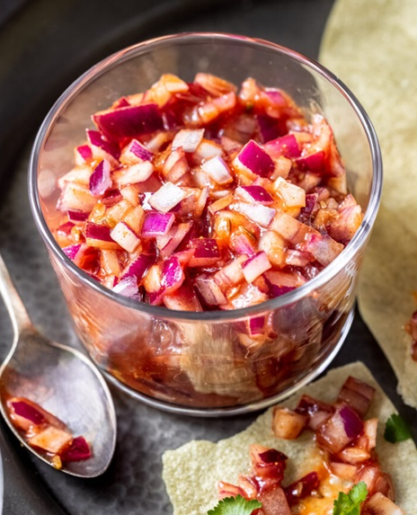

# Cold Onion Chutney

*Sliced onions served in a red sauce of tomato and spices. This fresh, cold chutney provides sharp, briny contrast to curries and grilled meats. Chilling the onions beforehand makes them crisp and refreshing; the spiced tomato base brings richness.*

**Serves:** 4-6

**Prep Time:** 10 minutes

**Cook Time:** 4 minutes

## Overview
The bright red onion chutney that turns up on every British curry-house table alongside the bowl of poppadums: paper-thin slices of raw red onion (chilled till crisp) tossed in a savoury tomato-and-spice mixture of tomato puree, mint sauce, ketchup, lemon juice, ground coriander and chilli powder, sometimes coloured with a touch of red food colouring for the restaurant-style look. The interplay between the cool sharp raw onion and the warm sweet-spiced sauce is what makes the chutney work, and the moment the onions sit too long in the sauce (more than an hour or two) they soften and the texture goes to mush. Mint sauce gives the canonical curry-house edge that distinguishes the dish from any Indian-home onion chutney. Eaten with poppadums to start the meal, or alongside tandoori meats and grilled starters.

## Ingredients

### Onion Base
- 1 onion (large, finely sliced, about 200 grams)
- Ice cubes (for chilling)

### Red Sauce
- 3 tablespoons tomato ketchup
- 1 tablespoon tomato purée
- 1 teaspoon chilli powder (or to taste)
- Pinch of salt
- 1 teaspoon roasted cumin seeds

## Method

### Stage 1 - Chill Onions
1. Finely slice the large onion into thin, paper-thin slices.
2. Place the sliced onions in a bowl of cold water.
3. Add a handful of ice cubes to keep the water very cold.
4. Cover the bowl and refrigerate for about 1 hour.
5. The cold, ice-water treatment will make the onions crisp and mellow slightly.

### Stage 2 - Make Red Sauce
1. In a mixing bowl, combine the tomato ketchup and tomato purée.
2. Add the chilli powder and salt.
3. Mix everything together until well combined and smooth.
4. Stir in the roasted cumin seeds.
5. Set aside.

### Stage 3 - Combine & Chill
1. After 1 hour, remove the onions from the ice water.
2. Drain thoroughly and pat completely dry with clean cloth or paper towels.
3. Place the dried onion slices in a new clean bowl.
4. Pour the red sauce over the onions.
5. Fold gently to coat all onion slices with sauce.
6. Cover and refrigerate for at least 45 minutes before serving to allow flavors to marry.
7. The onions should remain crisp and the sauce should coat them evenly.

## Notes
- **Onion Chilling:** This step is non-negotiable; it makes the raw onions much more pleasant and less harsh.
- **Paper Thin:** Slice onions as thin as possible; thick slices won't benefit from the chilling as much.
- **Drying:** Pat onions completely dry; excess water dilutes the sauce.
- **Roasted Cumin:** If you can't find roasted cumin seeds, quickly toast raw seeds in a dry pan for 1 minute, then cool.
- **Sauce Consistency:** The sauce should coat but not drown the onions; adjust ketchup/puree ratio as needed.

## Variations
**With Lime:** Add juice of ½ lime to the sauce for tartness.
**Garlic Addition:** Add 1 crushed garlic clove to the sauce for pungency.
**Coriander Finish:** Stir in 1 tablespoon fresh chopped coriander just before serving.
**Extra Heat:** Add ½ teaspoon more chilli powder if you prefer more spice.

## Serving
Serve with: Tandoori meats, kebabs, rotis, curries, grilled vegetables
Garnish: Fresh coriander leaves (optional)

## Storage
- Refrigerate in a covered container for up to 3 days
- Best served fresh; onions gradually soften over time
- Do not freeze; texture suffers significantly
