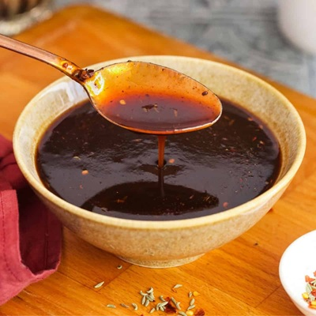

# Tamarind Chutney

*India's sweet-sour tamarind chutney: tamarind pulp simmered with jaggery.*

**Prep Time:** 15 minutes

**Yield:** Approximately 400 ml

## Overview
The dark sticky sweet-sour-spicy chutney that anchors Indian street-food cooking: tamarind pulp simmered with jaggery (the unrefined Indian palm sugar), ground cumin, ginger and chilli into a thick brown glossy sauce that doubles as both dip and dressing. Tamarind chutney is the traditional partner to pakora and samosa, the dark drizzle on every chaat plate from Mumbai's Juhu Beach to Delhi's Chandni Chowk, and the contrast to the bright green mint chutney that sits alongside it on every Indian restaurant table. Jaggery rather than refined sugar is essential. It gives the deep molasses-caramel undertone that white sugar can't match. Block tamarind soaked and strained gives the most authentic flavour; tamarind concentrate from a jar works as a shortcut but tastes one-dimensional. The chutney keeps for weeks in the fridge and improves with a few days' rest.

## Ingredients

### Base & Balance
- 1-2 tablespoons tamarind concentrate (paste)
- 2 tablespoons water
- 3 tablespoons sugar
- 4 tablespoons tomato ketchup
- 1 fresh lemon (juice)

### Fresh Elements
- 3 fresh green chillies (finely chopped)
- ½ medium onion (finely chopped)
- 3 spring onions (finely chopped greens and whites)
- 4 tablespoons fresh coriander (finely chopped)
- 1 carrot (large, grated)

### Spices
- 1 teaspoon Madras curry powder (or to taste)
- Salt to taste

## Method

### Stage 1 - Activate Tamarind
1. Place the tamarind concentrate in a small bowl.
2. Add 2 tablespoons warm water.
3. Stir vigorously until the tamarind dissolves and becomes smooth and liquid.
4. If very thick, add more water one tablespoon at a time.
5. Set aside.

### Stage 2 - Assemble Base
1. In a larger mixing bowl, combine the dissolved tamarind with the sugar.
2. Add the tomato ketchup.
3. Add the fresh lemon juice.
4. Stir everything together until well combined.
5. This forms the base of your chutney.

### Stage 3 - Add Fresh & Spiced Elements
1. Add the finely chopped green chillies to the tamarind base.
2. Add the finely chopped onion half.
3. Add the finely chopped spring onions (both white and green parts).
4. Add the fresh coriander.
5. Add the grated carrot.
6. Stir in the Madras curry powder.
7. Mix everything thoroughly until well combined.

### Stage 4 - Balance & Chill
1. Season with salt to taste.
2. Taste and adjust:
   - Too sour? Add a touch more sugar.
   - Not spicy enough? Add more curry powder.
   - Not sour enough? Add more lemon juice or tamarind.
3. Transfer to a serving bowl or sterilized jar.
4. Refrigerate for at least 1 hour before serving to allow flavors to marry.

## Notes
- **Tamarind Quality:** Use paste tamarind concentrate, not the dried pods. This ensures smooth, creamy texture.
- **Fresh Vegetables:** The freshness of vegetables is paramount; don't skip the carrot or onions.
- **Curry Powder:** Madras curry powder provides warmth and depth; adjust the amount to preference.
- **Flavor Balance:** This chutney should have all four flavors (sweet, sour, spicy, savory) in balance. Taste and adjust as needed.
- **Chill Before Serving:** Cold chutney is far more refreshing and allows flavors to develop.

## Variations
- **Spicier Heat:** Use 2 teaspoons Madras curry powder for more substantial spice.
- **Add Mint:** Include 1 tablespoon fresh mint leaves for cooling herbal notes.
- **Extra Ginger:** Add 1 teaspoon grated fresh ginger for warmth.
- **With Pomegranate:** Stir in 2 tablespoons pomegranate seeds for sweetness and texture.

## Serving
- Serve with: Pakora, samosas, chaat (Indian street food), rotis, curries
- Garnish: None needed; this is a condiment

## Storage
- Refrigerate in a covered container for up to 1 week
- The high sugar, salt, and acid content preserve the chutney
- Once prepared, flavors are best within 2-3 days
- Do not freeze; texture and freshness suffer significantly 

*This sweet, sour, savory, and spicy chutney is a must for any curry party. Tangy tamarind forms the base, balanced with sugar and brightened with lemon. Fresh vegetables and coriander provide texture and herbal notes. A complex condiment that's more than just a dipping sauce.*
