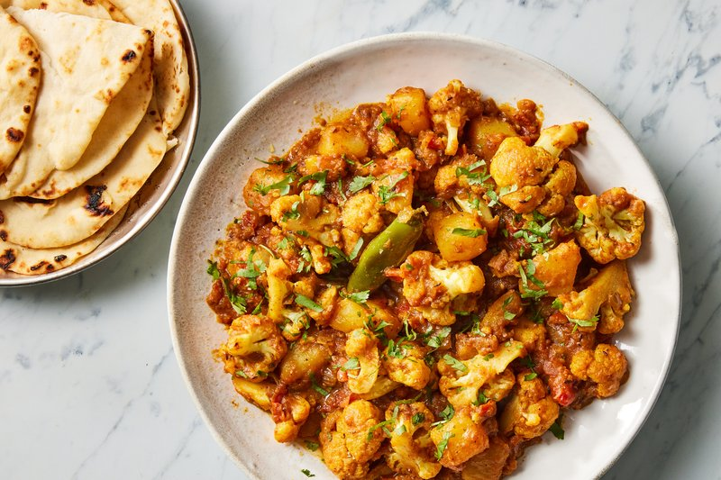

# Aloo Gobi

*North India's everyday dry curry: chunks of potato and cauliflower pan-fried with cumin, ginger, garlic, turmeric and a quick tomato sauce.*

**Serves:** 4 as a side

**Prep Time:** 15 minutes

**Cook Time:** 30 minutes

## Overview
Cumin seeds bloom in hot oil; chopped onion is fried until gold; ginger-garlic paste, turmeric, chilli and coriander toast briefly; tomato softens into a quick sauce. The potatoes go in first (they need longest), the cauliflower follows; both cook covered until tender, stirred occasionally. Garam masala and chopped coriander at the end.

## Ingredients

- 500 g floury potatoes (peeled, cut into 3 cm chunks)
- 1 cauliflower (medium, cut into florets, about 600 g prepared)
- 4 tablespoons vegetable oil (or ghee)
- 1 teaspoon cumin seeds
- 1 onion (medium, chopped)
- 1 thumb fresh ginger (grated)
- 4 garlic cloves (crushed)
- 1 green chilli (chopped, optional)
- 2 tomatoes (medium, chopped) or 4 tablespoons passata
- 1 teaspoon ground turmeric
- 1 teaspoon ground coriander
- 1 teaspoon Kashmiri chilli powder
- 1 teaspoon salt (to taste)
- 1 teaspoon [Garam Masala](../Spice-Mixes/garam-masala.md)
- 3 tablespoons fresh coriander (chopped)

## Method

### Stage 1 - Tempering
1. Heat the oil in a wide heavy pan over medium-high heat.
1. Add cumin seeds; sizzle 10 seconds.
1. Add onion; fry 7 minutes until pale gold.
1. Add ginger, garlic and green chilli; cook 1 minute.

### Stage 2 - Spices and tomato
1. Add turmeric, coriander and chilli powder; toast 30 seconds.
1. Add chopped tomato; cook 4 minutes until soft and the oil splits.

### Stage 3 - Potatoes
1. Add the potato chunks; toss to coat in the masala.
1. Sprinkle with the 1 teaspoon salt.
1. Cover; cook on medium-low 10 minutes, stirring once or twice, until the potatoes are half-cooked.

### Stage 4 - Cauliflower
1. Add the cauliflower florets; toss gently to coat.
1. Splash in 80 ml water if the pan is dry.
1. Cover; cook another 10 minutes, stirring carefully, until the cauliflower is just tender and the potatoes are cooked through.
1. Uncover; cook 3 minutes more if the pan is wet - the dish should be dry, not saucy.

### Stage 5 - Finish
1. Stir in garam masala.
1. Scatter fresh coriander.
1. Taste; adjust salt.

### Stage 6 - Serve
1. Plate hot. Eat with roti, paratha, or as part of a thali.

## Notes
- **Dry curry:** Aloo gobi is a sukhi sabzi (dry vegetable). It shouldn't pool gravy. If yours is wet, cook off uncovered.
- **Cauliflower size:** Florets of 3-4 cm cook in the right time. Big chunks stay raw at the centre; small florets disintegrate.
- **Floury potato:** Use floury (Maris Piper, King Edward, Russet). Waxy potatoes hold shape too well - the curry should have some give.

## Storage
- Refrigerate 3 days; reheats well in a covered pan.
- Doesn't freeze well - the potato turns mealy.
