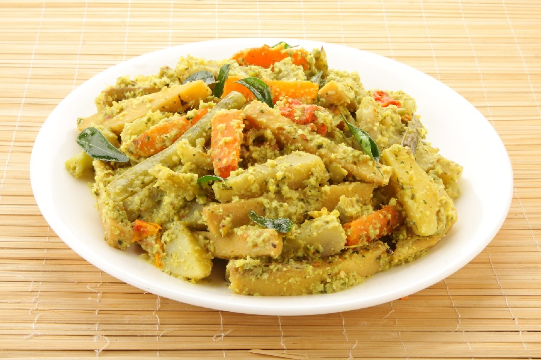

# Avial

*Kerala mixed vegetable curry with coconut, green chilli and yogurt. A sadya-staple where each vegetable keeps its identity in a fragrant white-green gravy.*

**Serves:** 4-6

**Prep Time:** 20 minutes

**Cook Time:** 25 minutes

## Overview
A handful of vegetables (drumstick, ash gourd, carrot, runner beans, green plantain) are cut into uniform 5 cm batons and cooked separately to keep their textures. Coconut is ground with cumin, green chilli and shallot into a paste, which is added to the cooked vegetables with thinned yogurt. The dish is warmed gently (never simmered) so the yogurt doesn't split, and finished with raw coconut oil and curry leaves.

## Ingredients

### Vegetables (use a mix of 4-5; aim for 600 g total)
- 1 green plantain (small, peeled, cut into 5 cm batons)
- 1 carrot (cut into 5 cm batons)
- 100 g runner beans (cut into 5 cm pieces)
- 150 g ash gourd (cut into 5 cm batons)
- 2 drumsticks (if available; cut into 5 cm pieces, or substitute with green pepper)
- ½ teaspoon turmeric
- 1 teaspoon salt
- 200 ml water

### Coconut paste
- 100 g fresh grated coconut (or 80 g desiccated, rehydrated in 4 tablespoons of warm water)
- 1 teaspoon cumin seeds
- 2-3 green chillies (slit)
- 4 shallots (or 1 small onion)

### To finish
- 200 g natural yogurt (loosened with 4 tablespoons of water)
- 2 tablespoons coconut oil (raw, not heated)
- 20 fresh curry leaves
- Salt to adjust

## Method

### Stage 1 - Cook the vegetables
1. Place the harder vegetables (plantain, carrot, drumstick) in a wide pot with the turmeric, salt and water.
1. Cover and cook for 5 minutes over medium heat.
1. Add the runner beans and ash gourd.
1. Cover and cook for another 5-6 minutes, until each vegetable is just tender but holds its shape.
1. Drain any excess water (most should have cooked off, leaving 50-80 ml).

### Stage 2 - Make the coconut paste
1. Place the grated coconut, cumin seeds, green chilli and shallots in a small blender or pestle and mortar.
1. Add 4 tablespoons of water.
1. Grind to a coarse paste.

### Stage 3 - Combine
1. Add the coconut paste to the pot of vegetables.
1. Stir gently to coat (be careful not to break the batons).
1. Warm over low heat for 3-4 minutes (the paste should heat through but not bubble hard).

### Stage 4 - Finish
1. Whisk the yogurt with 4 tablespoons of water until smooth and pourable.
1. Pull the pot off the heat.
1. Pour the yogurt over the vegetables and stir gently to combine.
1. Return to the lowest possible heat for 2 minutes to warm through (don't boil; yogurt splits over 90°C).
1. Taste and adjust salt.

### Stage 5 - Temper
1. Pour the raw coconut oil over the avial.
1. Scatter the curry leaves on top.
1. Stir once to combine.
1. Cover and rest for 5 minutes for the curry leaves to infuse.

## Notes
- **Uniform cuts:** Avial is judged on the look. All vegetables in 5 cm batons of similar width gives a tidy, restaurant-style plate.
- **Don't boil after the yogurt:** This is the cardinal rule. Yogurt splits at high temperature; avial should warm through, not simmer.
- **Raw coconut oil at the end:** Not for cooking, just for the perfume. Pouring it over off the heat is the Kerala finish.

## Storage
- Best eaten the day it's made.
- Refrigerate up to 2 days; the texture softens and the yogurt thins.
- Doesn't freeze.
