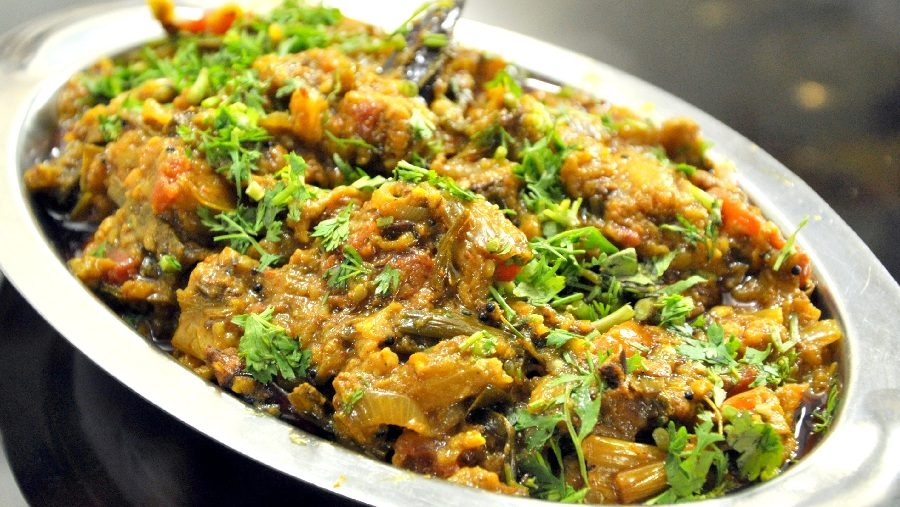

# Baingan Bharta

*Punjabi smoked aubergine mash, charred whole over an open flame for a deep smoky flavour, then folded into a tomato-onion masala. Eaten with roti or paratha.*

**Serves:** 4

**Prep Time:** 10 minutes

**Cook Time:** 35 minutes

## Overview
A whole aubergine is charred directly over a gas flame until the skin is blackened and the flesh inside is soft. The charred skin is peeled off and the flesh roughly mashed. A masala of onion, garlic, ginger, green chilli and tomato is cooked down to a thick base, and the smoky aubergine flesh is folded through with a finishing touch of garam masala and coriander. Vegetable-side or vegetarian main; the smoke is what makes it.

## Ingredients
- 1 aubergine (large, about 500 g)
- 2 tablespoons ghee (or oil)
- 1 teaspoon cumin seeds
- 1 onion (large, finely chopped)
- 4 garlic cloves (finely chopped)
- 25 g fresh ginger (finely grated)
- 2 green chillies (finely chopped)
- 2 ripe tomatoes (finely chopped)
- 1 teaspoon Kashmiri chilli powder
- 1 teaspoon ground coriander
- ½ teaspoon turmeric
- ½ teaspoon [Garam Masala](../Spice-Mixes/garam-masala.md)
- 1 teaspoon salt (to taste)
- A handful of coriander (chopped, plus extra to serve)

### To serve
- Roti (or paratha)
- A wedge of lime

## Method

### Stage 1 - Char the aubergine
1. Make 4-5 small slits in the aubergine with a knife (this lets steam escape).
1. Place the aubergine directly on a medium gas flame.
1. Cook for 12-15 minutes, turning every 2-3 minutes with tongs, until the skin is fully blackened on all sides and the flesh feels soft when pressed.
1. Place in a bowl, cover and rest for 5 minutes (this loosens the skin).

### Stage 2 - Peel and mash
1. Run cold water briefly over the aubergine and rub off the blackened skin (leave a few specks; they carry flavour).
1. Cut off the stem.
1. Chop the flesh roughly on a board with the back of a knife, then transfer to a bowl and mash with a fork.

### Stage 3 - Cook the masala
1. Heat the ghee in a wide pan over medium heat.
1. Add the cumin seeds and let sizzle for 15 seconds.
1. Add the chopped onion and a pinch of salt.
1. Cook for 8-10 minutes, stirring, until deep golden.
1. Stir in the garlic, ginger and green chilli; cook for 1 minute.
1. Add the chopped tomato, Kashmiri chilli, ground coriander, turmeric and salt.
1. Cook for 6-8 minutes, mashing the tomato with a spoon, until the oil separates from the masala at the edges.

### Stage 4 - Combine
1. Tip the mashed aubergine into the masala.
1. Stir well and cook for 8-10 minutes, mashing further as you go, until the mixture is thick and the flavours combined.
1. Stir in the garam masala and chopped coriander; taste and adjust salt.

### Stage 5 - Serve
1. Transfer to a bowl, scatter extra coriander on top and serve with warm roti or paratha and a squeeze of lime.

## Notes
- **Direct flame is the dish:** Oven-roasted aubergine is fine for baba ganoush but lacks the smoke that defines bharta. If you don't have a gas hob, use a chargrill pan and add ¼ teaspoon smoked paprika as a partial substitute.
- **Don't peel under heavy water:** Rinse briefly. Washing too aggressively rinses off the smokiness along with the char.
- **Texture matters:** Bharta is mashed, not pureed. Big bits of flesh and a coarse onion masala are the dish; a smooth puree is baba ganoush.

## Storage
- Refrigerate up to 3 days; tastes better the next day.
- Freezes well for 2 months.
