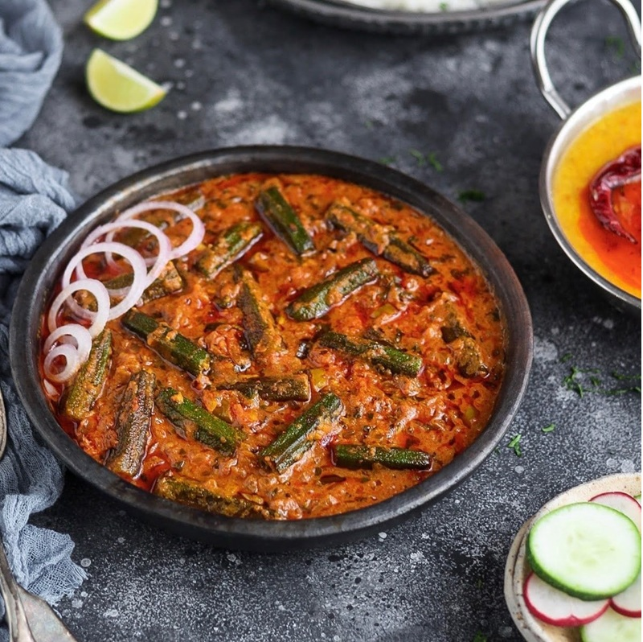

# Bhindi Masala

*North Indian okra dish: pods cooked dry with onion, tomato and spice until tender, with none of the slime that puts cooks off the vegetable. The technique is in the cut and the timing.*

**Serves:** 4

**Prep Time:** 15 minutes

**Cook Time:** 30 minutes

## Overview
The okra is washed, dried thoroughly and trimmed, then cut into 2 cm pieces. A dry-fry over high heat for 10 minutes cooks away the surface moisture that causes slime. Onion is then browned with whole cumin in a separate go, ginger and garlic added, tomato cooked down with the ground spices, and the dry-fried okra folded in for a final dry simmer. Finished with garam masala, amchur and coriander.

## Ingredients
- 500 g okra (small, fresh pods if possible)
- 3 tablespoons oil (mustard oil if available, otherwise vegetable or sunflower)
- 1 teaspoon cumin seeds
- 1 large onion (finely sliced)
- 4 garlic cloves (finely chopped)
- 25 g fresh ginger (finely grated)
- 2 green chillies (slit lengthways)
- 2 ripe tomatoes (finely chopped)
- 1 teaspoon Kashmiri chilli powder
- 1 teaspoon ground coriander
- ½ teaspoon turmeric
- 1 teaspoon amchur (dried mango powder, or 2 teaspoons lemon juice at the end)
- ½ teaspoon garam masala
- 1 teaspoon salt (to taste)

### To serve
- A handful of coriander (chopped)
- Roti or paratha

## Method

### Stage 1 - Prep the okra
1. Wash the okra and pat completely dry on a clean cloth or kitchen paper (wet okra is slimy okra; this is the most important step).
1. Trim the stem ends.
1. Cut into 2 cm pieces.

### Stage 2 - Dry-fry the okra
1. Heat 2 tablespoons of the oil in a wide pan over medium-high heat.
1. Add the okra in a single layer (work in two batches if needed).
1. Cook for 8-10 minutes, stirring every 1-2 minutes, until the okra is tender and any remaining stickiness has cooked off.
1. Lift the okra out and set aside.

### Stage 3 - Build the base
1. Add the remaining tablespoon of oil to the pan.
1. Add the cumin seeds and let sizzle for 15 seconds.
1. Add the sliced onion and a pinch of salt.
1. Cook for 8 minutes, stirring, until golden brown.
1. Stir in the garlic, ginger and green chilli; cook for 1 minute.

### Stage 4 - Cook the masala
1. Add the chopped tomato, Kashmiri chilli, ground coriander, turmeric and salt.
1. Cook for 6-8 minutes, stirring, until the tomato breaks down and the oil starts to separate from the masala.

### Stage 5 - Combine
1. Return the dry-fried okra to the pan.
1. Stir gently to coat in the masala (rough handling breaks the pieces).
1. Cook for 5 minutes over low heat to combine.
1. Stir in the amchur and garam masala; cook for 1 more minute.
1. Taste and adjust salt.

### Stage 6 - Serve
1. Scatter the chopped coriander over and serve with warm roti or paratha.

## Notes
- **Dry okra, no slime:** Drying every pod is the single trick that defines a good bhindi masala. If the okra is wet when it hits the oil, the mucilage cooks into the pan and the dish goes ropy.
- **High heat, no lid:** Bhindi cooks uncovered; trapped steam reintroduces the moisture you just dried off.
- **Mustard oil is traditional:** Heat it to smoking and pull off the heat for 30 seconds before adding ingredients (this knocks the raw mustard pungency back).

## Storage
- Refrigerate up to 2 days; reheats well but the okra softens.
- Doesn't freeze well.
