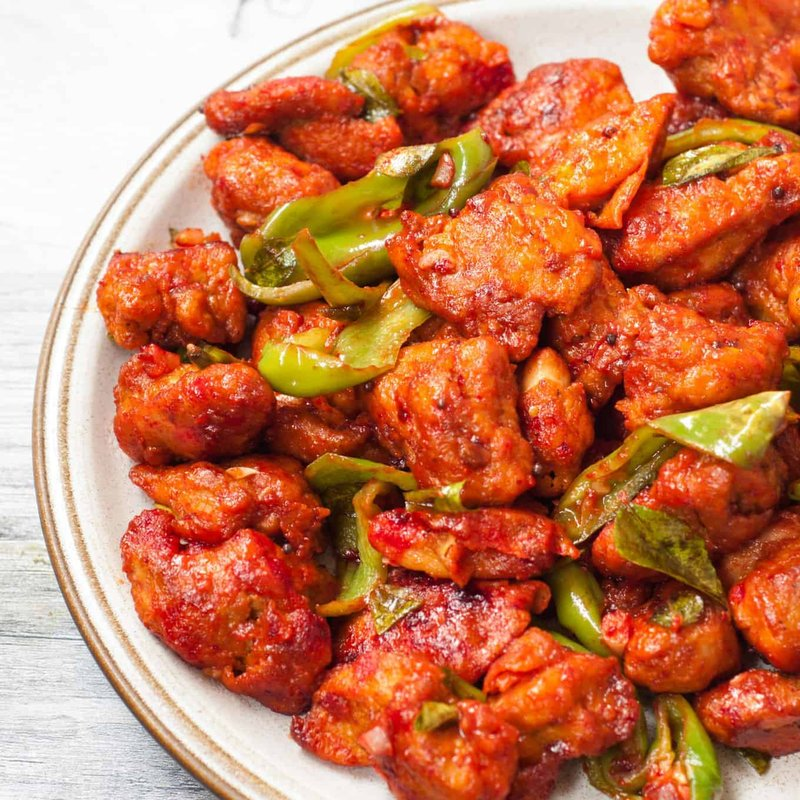

# Chicken 65

*Hyderabad's fierce chilli chicken: yogurt-marinated thigh cubes double-fried crisp, then tossed in a sputtering tempering of curry leaves.*

**Serves:** 4 as a starter

**Prep Time:** 20 minutes (plus 1 hour marinating)

**Cook Time:** 25 minutes

## Overview
Chicken thighs cube small; marinate for 1 hour in yogurt, ginger-garlic paste, Kashmiri chilli, garam masala and cornflour. Deep-fried in two stages, first to cook through, second to crisp. While the chicken rests, a hot tempering of curry leaves, garlic, dried chillies, soy and vinegar sputters in a wok. The fried chicken tosses through the tempering for 30 seconds and goes straight to the plate.

## Ingredients

### Marinade
- 600 g boneless chicken thighs (cut into 2-3 cm cubes)
- 4 tablespoons natural yogurt
- 2 tablespoons ginger-garlic paste
- 2 tablespoons Kashmiri chilli powder
- 1 teaspoon Kashmiri red food colour (optional - for the signature deep red)
- 1 teaspoon [Garam Masala](../Spice-Mixes/garam-masala.md)
- 1 teaspoon ground turmeric
- 1 teaspoon salt
- 1 tablespoon lemon juice
- 3 tablespoons cornflour
- 3 tablespoons plain flour
- 1 egg (large, lightly beaten)

### To fry
- 1 litre vegetable oil

### Tempering
- 2 tablespoons vegetable oil (from the fryer is fine)
- 3 dried Kashmiri red chillies (broken)
- 6 garlic cloves (very finely chopped)
- 2 green chillies (slit)
- 1 large sprig fresh curry leaves
- 1 tablespoon soy sauce (Hyderabad-style addition)
- 1 tablespoon white wine vinegar (or palm vinegar)
- 1 teaspoon Kashmiri chilli powder
- ¼ teaspoon ground black pepper

### To finish
- 1 red onion (small, sliced thin)
- 2 tablespoons fresh coriander (chopped)
- 2 limes (cut into wedges)

## Method

### Stage 1 - Marinate
1. Mix all marinade ingredients in a bowl with the chicken cubes.
1. Cover; refrigerate 1 hour.

### Stage 2 - First fry
1. Heat the oil to 165°C.
1. Fry the chicken in batches of 10-12 pieces, 3-4 minutes per batch, until cooked through and lightly coloured. Lift onto a rack.

### Stage 3 - Second fry
1. Heat the oil to 185°C.
1. Return all the chicken; fry another 2-3 minutes until deep gold and crisp. Lift onto a rack.

### Stage 4 - Tempering
1. Lift out a wok or wide pan; heat 2 tablespoons of oil over medium-high heat.
1. Add dried chillies and chopped garlic; sizzle 20 seconds until garlic just turns gold.
1. Add green chillies and curry leaves (stand back - the curry leaves spit hard).
1. Add soy sauce, vinegar, chilli powder and pepper; sizzle 5 seconds.

### Stage 5 - Toss
1. Add the fried chicken to the wok; toss hard 30 seconds to coat in the tempering. The chicken should be glossy red.
1. Remove from heat immediately - longer and the chicken goes soggy.

### Stage 6 - Serve
1. Tip onto a plate. Scatter sliced raw onion and coriander.
1. Eat immediately with lime wedges.

## Notes
- **Double-fry:** Single-fried chicken 65 goes soggy in seconds when it hits the tempering. Two-stage frying gives the crisp shell that holds against the sauce.
- **Food colour:** The signature blood-red colour comes from food colour. Skipping it is fine - the dish is still red from Kashmiri chilli, just less neon.
- **Toss fast, serve fast:** Don't let the chicken sit in the wet tempering. It's the wet-meets-crisp contrast that defines the dish.

## Storage
- Best fresh, eaten immediately.
- Refrigerate (cooked) 2 days; re-crisp at 200°C 8 minutes - it won't be the same.
