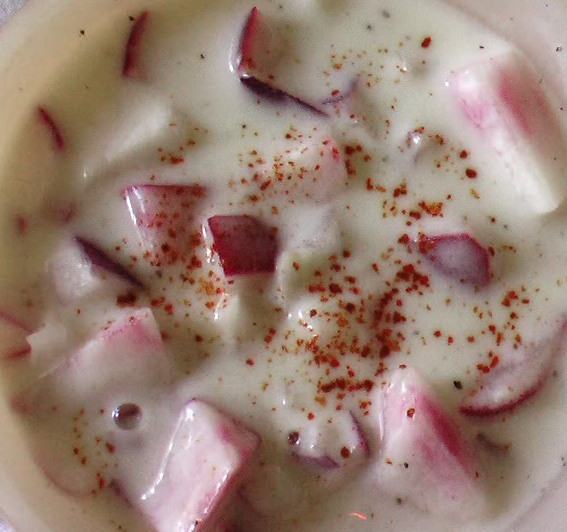

# Chilli and Red Onion Raita

*Raita is a traditional Indian accompaniment, a cooling agent to serve with hot curries. It is also delicious served as a dip with poppadums.*

**Serves:** 4

**Prep Time:** 10 minutes

**Cook Time:** 1 minute

## Overview
The raita with a sharper edge than the everyday cucumber version: cool whisked full-fat yogurt anchored with finely chopped red onion, toasted cumin, a slit green chilli for heat, and a final scatter of fresh coriander and chilli powder. The dish does the same essential cooling work next to a hot curry as plain raita, but the onion gives a peppery bite that stands up better to the bigger flavours of biryani, jalfrezi or vindaloo. Toasted ground cumin (whole seeds toasted in a dry pan and ground) gives the earthy backbone; supermarket pre-ground cumin tastes pale and dusty in comparison. The red onion benefits from a brief salt-and-rinse to mellow the raw sting. Full-fat natural yogurt is the traditional base; low-fat yogurt thins out and weeps water on the plate. Served in a small bowl at the centre of the table.

## Ingredients
- 1 teaspoon cumin seeds
- 1 red onion (large)
- 1 garlic clove (small)
- 1 fresh green chilli (small, de-seeded)
- 150 ml natural yoghurt
- 2 tablespoons coriander (freshly chopped)
- ½ tablespoon granulated sugar
- salt to taste

## Method
1. Heat a small pan and dry-fry the cumin seeds for a couple of minutes until they release their aroma, making sure that they do not burn.
1. Let the cumin seeds cool for a few minutes, then tip them into a mortar and crush them with a pestle.
1. Cut the red onion in half and cut a few paper thin slices as a garnish.
1. Chop the remaining onion very finely.
1. Crush the garlic, and finely chop the chilli.
1. Stir the onion, garlic and chilli into the yoghurt with the crushed cumin seeds and coriander.
1. Add the sugar and salt to taste.
1. Spoon the raita into a small bowl, cover and chill until ready to serve.
1. Garnish with the reserved onion slices and extra coriander before serving.
1. This will keep in the fridge for up to 2 days.

## Notes
- Dry-fry the cumin seeds over medium heat and watch them carefully, they go from fragrant to burnt very quickly.
- Let the cumin seeds cool completely before crushing, as hot seeds can be difficult to grind cleanly in a mortar.
- De-seeding the chilli keeps the heat mild; leave a few seeds in for more warmth.
- Chill the raita for at least 30 minutes before serving to allow the flavours to meld together.

## Serving
- Serve with: hot curries, biryanis, spiced lamb dishes, or as a dip with poppadums and flatbreads
- Temperature: chilled
- Amount: a small bowl or a few spoonfuls per person as a condiment

## Storage
- Keeps in the fridge for up to 2 days, covered or in an airtight container.
- Stir well before serving if the yoghurt has separated slightly on standing.
